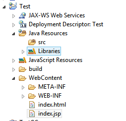
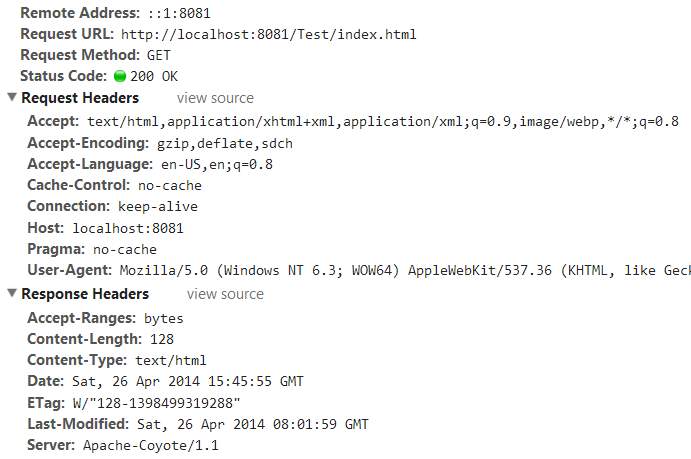
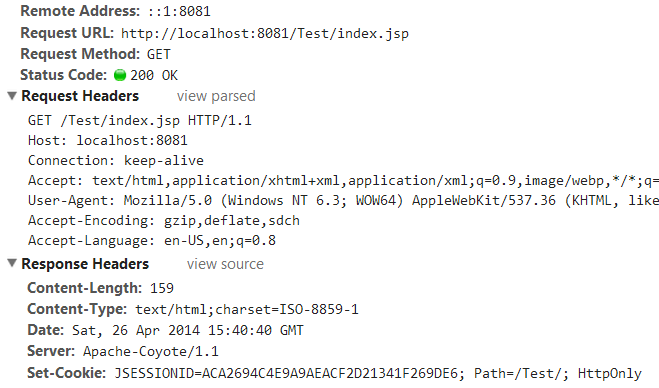
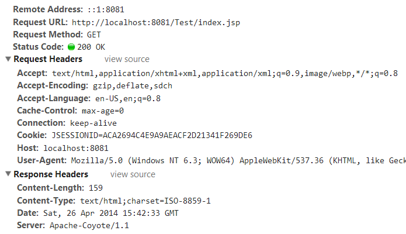
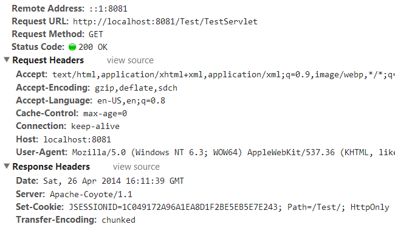
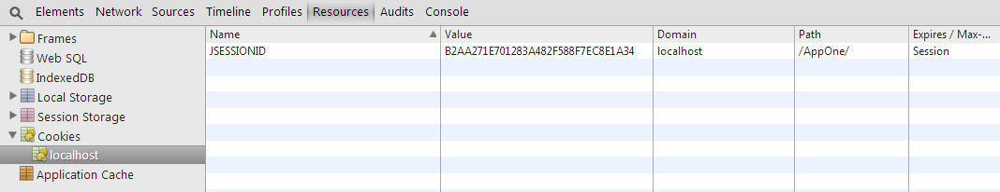
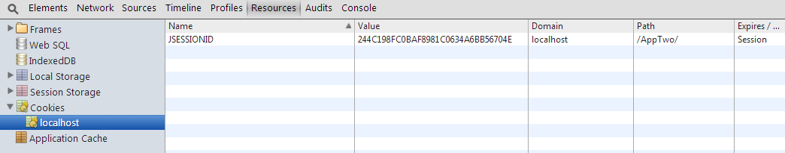
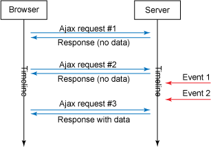
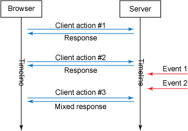
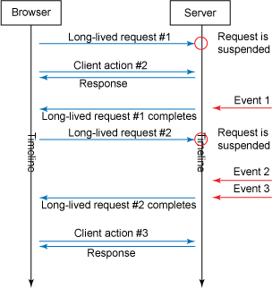

# HTTP, Sessions and Servlets

* TOC
{:toc}

## HTTP for Java Developer


The World Wide Web had humble beginnings, as a research project at the Swiss research institute, CERN.
The primary goal of the project was to allow hypertext documents to be electronically linked, so selecting a reference in one document to a second one would cause it to be retrieved.
To implement this system, some sort of mechanism was needed to allow a client computer to tell a server to send it a document.
To fill this function, the early developers of the Web created a new TCP/IP application layer protocol: the Hypertext Transfer Protocol (HTTP).


#### HTTP/0.9

The original version of HTTP was intended only for the transfer of hypertext documents and was designed to be very simple to make implementation of the fledgling Web easier.
In order to perform an HTTP 0.9 request, you had to open a new TCP connection, which was closed by the server after the response had been transmitted. To establish a new connection, TCP uses a three-way handshake, which requires an extra network roundtrip before data can be exchanged.

HTTP 0.9 is a very simple text-based protocol.
General structure of HTTP 0.9 request and response (when tracked through telnet):

Request:

```
GET /[url]
```


Response:

```
[HTML content]
Connection closed by foreign host.
```


#### HTTP/1.0

HTTP/1.0 transformed HTTP from a trivial request/response application to a true messaging protocol.
The HEAD and POST methods were added and the concept of header fields was introduced.

It described a complete message format for HTTP, and explained how it should be used for client requests and server responses. One of the most important changes in HTTP/1.0 was the generalization of the protocol to handle many types of different media, as opposed to strictly hypertext documents.

Request:

```
GET /[url] HTTP/1.0
[HTTP request headers]
```


Response:

```
HTTP/1.0 302 Found
[HTTP response headers]
[HTML content]
Connection closed by foreign host.
```


The HTTP 0.9 connections were called transitory connections due to their short-lived nature and the same model was maintained in the more widely-deployed HTTP/1.0. The advantage of this connection model is its conceptual simplicity; the problem with it is that it is inefficient when the client needs to make many requests to the same server. This is often the case with modern hypertext documents, which usually carry inline references to images and other media.

So now we have

```
n requests = n connection = 1 thread (from a pool of m threads)
```


#### HTTP/1.1

HTTP/1.1 introduces several significant improvements over version 1.0 of the protocol. The most significat one is the persistence support.

With transitory connections, each of these requests made by the client requires a new, distinct TCP connection to be set up between the client and server. Every connection takes server resources and network bandwidth (TCP handshake performed every time), so having to establish a new one for each file is woefully inefficient.

The solution to the inefficiency problem of transitory connections came in HTTP/1.1, which allows an HTTP client and server to set up a persistent connection.

The basic operation of HTTP is not changed; the main difference is that by default, the TCP connection is kept open after each request/response set, so that the next request and response can be exchanged immediately.
The connection is only closed when the client is done requesting all the documents it needs.

Persistent connections offer another important performance-enhancing option to HTTP clients: the ability to pipeline requests.
Suppose the client needs to send a request for files A, B and C to a server.
Since the requests for all of these files will be sent in the same TCP session, there is no need for the client to wait for a response to its request for A before sending the request for B. The client can send requests “rapid-fire”, one after the other.

#### How connection establishment happens in HTTP

1. Like most TCP/IP client/server protocols, the server in HTTP plays the passive role by listening for requests on a particular port number.

2. The default port number for HTTP is well-known TCP port number 80, and is used by Web browsers for most HTTP requests, unless a different port number is specified in the URL. The client initiates an HTTP connection by opening a TCP connection from itself to the server it wishes to contact.

3. Once the TCP connection is active, the client sends its first request message.Request specifies the verison of HTTP. HTTP 1.1 uses the header Connection: Keep-Alive by default to mean that the persistent connections should be used. An HTTP/1.1 client can override this by changing it to Connection: close header in its initial request.

4. The flow of requests and responses continues for as long as the client has requests.

5. The connection can be gracefully terminated by the client by including the Connection: close header in the last request it needs to send to the server.

So now we have

```
n requests = 1 connection = 1 thread (from a pool of m threads)
```


Happy ending? No.

Persistent connections brought in a new problem.


#### HTTP/1.1 and Java NIO

Each thread that is handling a connection stays alive until the connection is closed. That means each thread on server will reserve memory for itself even when it is sitting idle between client requests.

Experiments with high-profile Web servers have yielded numerical results revealing that memory consumption increases almost in direct proportion with the number of HTTP connections. The reason is that threads are relatively expensive in terms of memory use. Servers configured with a fixed number of threads can suffer the thread starvation problem, whereby requests from new clients are rejected once all the threads in the pool are taken.

Java SE 1.4 introduced Non-Blocking IO in the NIO libraries. These libraries use low-level operating system constructs to allow highly optimized code in the operating system to manage TCP connections. NIO uses the terminology concept called channels to mean a non-blocking stream.

Read about NIO:
[An awesome NIO tutorial](http://cs.brown.edu/courses/cs161/papers/j-nio-ltr.pdf)
[Another good one](http://tutorials.jenkov.com/java-nio/index.html)

So after NIO, we have


```
n http requests = 1 connection = m threads (from a pool of threads, m<=n )
```

Threads can be allocated to connections only when requests are being processed.

When a connection is idle between requests, the thread can be recycled, and the connection is placed in a centralized NIO select set to detect new requests without consuming a separate thread.

Along the same time of HTTP 1.x there came a need to keep track of multiple connections. Meaning we needed a kind of tracking between connections if it's coming from the same client.


## Understanding JSESSIONID


JSESSIONID is a ID generated by Servlet container like Tomcat or Jetty and used for session management in J2EE web application for http protocol.
The ID is sent to the client either within a cookie (default) or as part of the URL (called URLrewriting, used only if cookies are disabled on the browser).


### Why a ID?

*F5 white paper extract follows,*

HTTP (HyperText Transfer Protocol) was designed to support a stateless, requestresponse model of transferring data from a server to a client. Its first version, 1.0, supported a purely 1:1 request to connection ratio (that is, one request-response pair was supported per connection).

Its second version, 1.1, expanded that ratio to be N:1—that is, many requests per connection. This was done in order to address the growing complexity of web pages, including of the many objects and elements that need to be transferred from the server to the client.

Unfortunately, HTTP was not designed to be an application transport protocol. It was designed to transfer documents. Despite the fact that both documents and application protocols are generally text-based, the resemblance ends there. Applications require some way to maintain their state, while documents do not. Applications are built on logical flows and processes, both of which require that the application know where the user is during this time, and that requires state.

HTTP is stateless, so it seems obvious that HTTP would not be appropriate for delivering applications. But it has become the de facto application transport protocol of the web. In what is certainly one of the most widely accepted, useful hacks in technical history, HTTP was given the means by which state could be tracked throughout the use of an application. That “hack” is where sessions and cookies come into play.

Sessions are the way in which web and application servers maintain state.


### How JSESSIONID works?

When the first request (that demands a creation of session) arrives on a J2EE server, the server creates HTTPSession object and sends the sessionID to the browser. The browser then send the same sessionId for every subsequent requests.
Thus the stateless protocol becomes a stateful one.

Let's study how it works by experimenting.

Create a dynamic web application project in eclipse.
Create 2 files - index.html and index.jsp




index.jsp


```html
<!DOCTYPE html>
<html>
<head>
<meta http-equiv="Content-Type" content="text/html; UTF-8">
<title>Index</title>
</head>
<body>
JSP Page
</body>
</html>
```


index.html


```html
<!DOCTYPE html>
<html>
<head>
<meta charset="ISO-8859-1">
<title>Index</title>
</head>
<body>
HTML Page
</body>
</html>
```


web.xml


```xml
<?xml version="1.0" encoding="UTF-8"?>
<web-app xmlns:xsi="http://www.w3.org/2001/XMLSchema-instance" xmlns="http://java.sun.com/xml/ns/javaee" xsi:schemaLocation="http://java.sun.com/xml/ns/javaee http://java.sun.com/xml/ns/javaee/web-app_3_0.xsd" id="WebApp_ID" version="3.0">
<display-name>Test</display-name>
<welcome-file-list>
 <welcome-file>index.html</welcome-file>
 <welcome-file>index.jsp</welcome-file>
</welcome-file-list>
</web-app>
```


After deploying it on tomcat, hit your URL,


http://localhost:8081/Test/index.html


Check the HTTP headers and cookie using your browser debugger/console. Here is my chrome's debugger console.




Note that there is no JSESSION cookie created. In other words the server didn't send a cookie with JSESSIONID set.
This is because the server was not informed to start session management. (because it's a html page)

Now hit

http://localhost:8081/Test/index.jsp

Notice now that the browser received a cookie for the domain localhost which contains a key *JSESSIONID*.
Also notice the path `/Test/`.




Once the browser obtains jsessionId it sends it for every request that falls under {domain}/{context} in our case localhost/Test.

The server checks the incoming jsessionId and concludes that it is a HTTP request that belongs to the session identified by that jsessionId.

Try hitting either index.html or index.jsp which shows up the cookie.




There are 2 ways a request(from browser) notifies a container/server to start a new session.

1. Requesting a jsp page. (as we saw above)

   The container creates certain implicit objects for a JSP and one among those is the HTTPSession object. HTTPSession object holds the sessionId which is written to the response header. You can alter the default behaviour by adding this directive

   ```
   <%@ page session="false"%>
   ```

2. Requesting a servlet that has code to initiate the creation by calling,
   request.getSession() - returns a HTTPSession object if it already exists else creates a new one
   request.getSession(true) - same as above
   request.getSession(false) - returns a pre-existing session if it exits else doesn't create one.


Let's try the second case.

Write a servlet and within the same app and deploy.


```java
//Contents of TestServlet.java
protected void doGet(HttpServletRequest request, HttpServletResponse response) throws ServletException, IOException {
 response.getWriter().print("Servlet Response Ends Here");
 response.getWriter().flush();
 response.getWriter().close();
}
```


Now hitting URL http://localhost:8081/Test/TestServlet does not create HTTPSession.

Update doGet,


```java
protected void doGet(HttpServletRequest request, HttpServletResponse response) throws ServletException, IOException {
 request.getSession();
 response.getWriter().print("Servlet Response Ends Here");
 response.getWriter().flush();
 response.getWriter().close();
 //request.getSession(); //Cannot create a session after the response has been committed, 
 //will throw java.lang.IllegalStateException 
}
```


Now if you check, you will notice that the sever sends a JSESSIONID.




**How JSESSIONID is generated?**

J2EE specification doesn't state how it's to be generated. It's left to the container implementation.
Note that one thing is guaranteed,
A jsessionId is unique within a JVM at a point of time. The same jsessionId might get created again later but not while one already exists within the same JVM.


**Why we get the infamous JSP Compilation error: "Duplicate local variable session"?**

If you add the below line into a JSP, it will complain *Duplicate local variable session*

```java
HttpSession session = request.getSession();
```


This is because when jsp is compiled, implicit objects are created and that includes "session" variable that points to HttpSession.

To handle session creation by yourself in jsp code, use the directive,

```xml
<@ page session="false">
```


### Sharing JSESSIONID across applications on server


Why would we need to share JSESSIONID or any data across web applications within the same container(jvm)?

For small scale applications this wouldn't come as a necessity but as the applications grow and Modularity steps in. For eg: we would create separate projects for login/logout module and business logic module.

There are a number of ways you could do this - letting both applications share by reading and writing to a external database or cache, JMS, etc. But all these approaches are a overhead if you just need to share JSESSIONID and few variables related to that specific session.

I present 2 approaches on tomcat container.

- Programmatically managed
- Container managed

Before we start, create 2 web applications - AppOne and AppTwo.

index.jsp in AppOne


```jsp
<%@ page language="java" contentType="text/html; charset=ISO-8859-1"
 pageEncoding="ISO-8859-1"%>
<%@ page import="java.util.Map"%>
<%@ page import="java.util.HashMap"%>
<!DOCTYPE html>
<html>
<head>
<meta http-equiv="Content-Type" content="text/html; charset=ISO-8859-1">
<title>Index page</title>
</head>
<body>
 <form method="post" action="index.jsp">
<input type="text" name="in" /> <input type="submit" value="submit" />
 </form>
<%
  String inputdata = null;
  String cookieFromRequestHeader = request.getHeader("cookie");
  //in-coming cookie to server
  System.out.println("incoming cookie: "+cookieFromRequestHeader);
  inputdata = request.getParameter("in");
  System.out.println(inputdata); 
  if (inputdata != null) {
   session.setAttribute("a", inputdata);
  }
  //out-going cookie from server
  String cookieFromResponseHeader = response.getHeader("Set-Cookie");
  System.out.println("outgoing cookie: "+cookieFromResponseHeader);
 %>
 <a href="one.jsp">One</a>
<a href="/AppTwo/two.jsp">Two</a>
</body>
</html>
```


one.jsp in AppOne


```jsp
<%@ page language="java" contentType="text/html; charset=ISO-8859-1"
    pageEncoding="ISO-8859-1"%>
<%@ page import="java.util.Map" %>
<!DOCTYPE html>
<html>
<head>
<meta http-equiv="Content-Type" content="UTF-8">
<title>Page One</title>
</head>
<body>
<% 
String cookieFromRequestHeader = request.getHeader("cookie"); 
%>
Session Id: <%= request.getSession().getId() %>
Session attr 'a' : <%=request.getSession().getAttribute("a")%>
Cookie from request: <%= cookieFromRequestHeader %>
</body>
</html>
```


two.jsp in AppTwo


```jsp
<%@ page language="java" contentType="text/html; charset=ISO-8859-1"
    pageEncoding="ISO-8859-1"%>
<%@ page import="java.util.Map" %>
<!DOCTYPE html>
<html>
<head>
<meta http-equiv="Content-Type" content="text/html; charset=ISO-8859-1">
<title>Page Two</title>
</head>
<body>
<% 
String cookieFromRequestHeader = request.getHeader("cookie");
%>
Session Id: <%= request.getSession().getId() %>
Session attr 'a' : <%=request.getSession().getAttribute("a")%>
Cookie from request: <%= cookieFromRequestHeader %>
</body>
</html>
```


One both the applications are deployed on the server, hit http://localhost:8080/AppOne/index.jsp

System.out logs,
```
incoming cookie: null
null
outgoing cookie: JSESSIONID=B2AA271E701283A482F588F7EC8E1A34; Path=/AppOne/; HttpOnly
```

If you check the browser debugger console, you will notice the jsessionID set in the response headers from server
```
Set-Cookie: JSESSIONID=B2AA271E701283A482F588F7EC8E1A34; Path=/AppOne/; HttpOnly
```

Hitting the same url again,
```
incoming cookie: JSESSIONID=B2AA271E701283A482F588F7EC8E1A34
hello
outgoing cookie: null
```

Note that the server doesn't send the jsessionID every time to the client as that's unnecessary. The server maintains the sessionId within it's internal map and check if the incoming request has a session Id from that Map, Else it creates a new one and sends it.

If you check the browser debugger console, you will notice the jsessionID set in the request headers from browser
```
Cookie: JSESSIONID=B2AA271E701283A482F588F7EC8E1A34
Referer: http://localhost:8080/AppOne/index.jsp
Origin: http://localhost:8080
```


http://localhost:8080/AppOne/one.jsp


```
Session Id: B2AA271E701283A482F588F7EC8E1A34
Session attr 'a' : hello
Cookie from request: JSESSIONID=B2AA271E701283A482F588F7EC8E1A34
```

http://localhost:8080/AppTwo/two.jsp


```
Session Id: 244C198FC0BAF8981C0634A6BB56704E
Session attr 'a' : null
Cookie from request: null
```

As seen, the JSESSIONID are different for pages originating from different contexts, /AppOne and /AppTwo in our case.






Setting the sessionCookiePath

Setting the same sessionCookiePath for individual applications enables the sessionID to be set at this given context path level.

There are 3 ways you could do this.


1. Server level
2. In tomcat's server.xml add sessionCookiePath for all necessary applications

3. ```xml
   <context sessionCookiePath="/" docBase="AppOne" path="/AppOne" reloadable="true" source="org.eclipse.jst.jee.server:AppOne"/>
   <context sessionCookiePath="/" docBase="AppTwo" path="/AppTwo" reloadable="true" source="org.eclipse.jst.jee.server:AppTwo"/>
   ```

4. Application level
5. Declaratively add the following to the web.xml:

6. ```xml
   <session-config>
       <cookie-config>
           <path>/</path>
       </cookie-config>
   </session-config>
   ```

7. Program level
8. Use SessionCookieConfig which is available by

9. ```java
   getServletContext().getSessionCookieConfig().setPath("/");
   ```


I tried with the first option and it worked.


Then came the need of asynchronous client side requests and we came up with xhtml requests and responses.
Popularly the technique came to be known as AJAX.


### Sharing session attributes across applications

Using the previous projects AppOne and AppTwo let's try to store a session level attribute.

After storing a value for *in* request parameter on index.jsp.

Clicking [One](https://notes-from-a-dev.blogspot.com/2014/04/sharing-session-attributes-across.html) to open one.jsp.
```
Session Id: DCBA9501F134F2458DC16B6A336FFE89
Session attr 'a' : hello
Cookie from request: JSESSIONID=DCBA9501F134F2458DC16B6A336FFE89
```
Clicking [Two](https://notes-from-a-dev.blogspot.com/2014/04/sharing-session-attributes-across.html) to open AppTwo/two.jsp.
```
Session Id: DCBA9501F134F2458DC16B6A336FFE89
Session attr 'a' : null
Cookie from request: JSESSIONID=DCBA9501F134F2458DC16B6A336FFE89
```

Note that though the sessionID is shared, the attribute information is not transfered across to a different context. This is how J2EE specification requires containers to work. ServletContext is unique to a web application and HTTPSessions belong to individual contexts.

Here are 3 approaches I used to share session attributes.
- Using cookies
- Using shared application context
- Using single-signon

#### Approach 1 - Using cookies

This is the easiest approached provided you are not storing sensitive data.

Storing value in cookie

```javascript
if (inputdata != null) {
 session.setAttribute("a", inputdata);
 Cookie cookie = new Cookie("a",inputdata);
 cookie.setPath("/");
 response.addCookie(cookie);
}
```


Retrieving value from cookie

```javascript
Cookie cookie = null;
Cookie[] cookies = null;
// Get an array of Cookies associated with this domain
cookies = request.getCookies();
if( cookies != null ){
  out.println("<h2>
Found Cookies Name and Value</h2>
");
  for (int i = 0; i < cookies.length; i++){
  cookie = cookies[i];
  out.print("Name : " + cookie.getName( ) + ",  ");
  out.print("Value: " + cookie.getValue( )+" 
");
  }
}else{
  out.println("<h2>
No cookies founds</h2>
");
}
```


Below is the output of after using this approach.

one.jsp
```
Session Id: 53D3074F15F9DADE49174A1648E332D6
Session attr 'a' : hello
Cookie from request: JSESSIONID=53D3074F15F9DADE49174A1648E332D6; a=hello
Found Cookies Name and Value

Name : JSESSIONID, Value: 53D3074F15F9DADE49174A1648E332D6
Name : a, Value: hello
```

two.jsp
```
Session Id: 53D3074F15F9DADE49174A1648E332D6
Session attr 'a' : null
Cookie from request: JSESSIONID=53D3074F15F9DADE49174A1648E332D6; a=hello
Found Cookies Name and Value

Name : JSESSIONID, Value: 53D3074F15F9DADE49174A1648E332D6
Name : a, Value: hello
```


#### Approach 2 - Using shared application context

To access another application's context, in context.xml specify *crossContext* attribute value as true

```
<context  crossContext="true">
```


If you try to access another context without enabling crossContext, you will be greeted with Null pointer exception.

index.jsp

```jsp
<form method="post" action="index.jsp">
<input type="text" name="in" /> <input type="submit" value="submit" />
</form>
<%
 String inputdata = null;
 ServletContext context = getServletContext();
 Map map = (Map)context.getAttribute("map");
 if (map == null) {
  map = new HashMap<String, Object>();
 }
 inputdata = request.getParameter("in");
 System.out.println(inputdata);
 if (inputdata != null) {
  Map attr = new HashMap();
  attr.put("a", inputdata);
  map.put(request.getSession().getId(), attr);
  context.setAttribute("map", map);
 }
%>
<a href="one.jsp">One</a>
<a href="/AppTwo/two.jsp">Two</a>
```


one.jsp

```jsp
<% 
String cookieFromRequestHeader = request.getHeader("cookie"); 
%>
<% 
 Map map = (Map)getServletContext().getAttribute("map");
    System.out.println(map);
 Map attr = (Map)map.get(request.getSession().getId());
%>
Session Id: <%= request.getSession().getId() %>
Session attr 'a' : <%=attr.get("a") %>
Cookie from request: <%= cookieFromRequestHeader %>
```


two.jsp

```jsp
<% 
String cookieFromRequestHeader = request.getHeader("cookie");
%>
<% 
 Map map = (Map)getServletContext().getContext("/AppOne").getAttribute("map");
    System.out.println(map);
 Map attr = (Map)map.get(request.getSession().getId());
%>
Session Id: <%= request.getSession().getId() %>
Session attr 'a' : <%=attr.get("a") %>
Cookie from request: <%= cookieFromRequestHeader %> 
```


Below is the output of after using this approach.

one.jsp
```
Session Id: C24ADD6E0DAD48B7D8AEF1133BD82AFD
Session attr 'a' : hello
Cookie from request: JSESSIONID=C24ADD6E0DAD48B7D8AEF1133BD82AFD
```

two.jsp
```
Session Id: C24ADD6E0DAD48B7D8AEF1133BD82AFD
Session attr 'a' : hello
Cookie from request: JSESSIONID=C24ADD6E0DAD48B7D8AEF1133BD82AFD
{C24ADD6E0DAD48B7D8AEF1133BD82AFD={a=hello}}
```


#### Approach 3 - Using Single SignOn


```xml
<valve className="org.apache.catalina.authenticator.SingleSignOn"/>
```


## AJAX

Theory behind AJAX

Asynchronous JavaScript and XML (Ajax), a browser feature accessible in JavaScript, allows a script to make an HTTP request to a website behind the scenes, without the need for a page reload.

Ajax has been around more than a decade. Though the name includes XML, you can transfer nearly anything in an Ajax request. The most commonly used data is JSON, which is close to JavaScript syntax and consumes less bandwidth.

Browser's use a policy of same-origin. That is ajax requests can only be made to the same server from where http request originated.

To overcome this a technique known as JSONP came up.

#### JSONP

JSONP stands for JSON with Padding. (very poorly named technique)

Instead of using XMLHttpRequest we have to use script HTML tags, the ones you usually use to load JS files, in order for JS to get data from another domain.


```javascript
script = document.createElement("script");
script.type = "text/javascript";
script.src = "http://www.someWebApiServer.com/some-data?callback=my_callback";
```


Notice my_callback function over there? So - when JSONP server receives your request and finds callback parameter - instead of returning plain JS array it'll return this:


```javascript
my_callback({['some string 1', 'some data', 'whatever data']});
```

See where the profit is: now we get automatic callback (my_callback) that'll be triggered once we get the data.

HTTP protocol works on the principle that a server sends a response only when there is a request from a client. The client initiates it. The need for server to send continuous responses even after a client request became a very much necessity for asynchronous requests (AJAX).


## Reverse AJAX 

Why we needed reverse AJAX?

Lets consider a scenario - you have a servlet that is doing some processing, say finding prime numbers between ranges of tens (0-10, 10-100, 100-1000,...) and so on upto 10000000. So your output would be
2, 3, 5, 7
11, 13, 17, 19, ...
101, 103, ...
.....

It's obvious that the execution will take some time and once it's done we write into servlet output stream the whole response as shown above.

Any problems with this approach?

Yes.

1. Let's say it takes 2 mins for the complete execution but your server's HTTP  timeout setting might be less than this.
   Changing the global setting just for one of scenarios isn't justifiable.
2. Very poor end-user friendliness. The user might just staring at the page without any clue on whats happening.

Solution?

You need 2 things - the connection shouldn't timeout and the user should see some incremental response/output.

> Handling connection timeout

Remember - HTTP is request/response model. But we have HTTP sessions. So using sessions we can track between requests.

> Handling incremental output

You can not do this

```java
List primes = calculatePrimes(0,10); 
response.getWriter().write(primes);
response.getWriter().flush();
primes = calculatePrimes(10,100); 
response.getWriter().write(primes);
response.getWriter().flush();
```

HTTP and the servlet technology that sits upon HTTP doesn't support this.

But there could be a work around using some internal server API or something but as such it's a no.

But wait. We said client is going to make Ajax requests at intervals and if that's the case then we do not need to worry about this.

We then make use of the multiple ajax requests

```java
/calculatePrimes?range=0,10
/calculatePrimes?range=10,100
```

to send incremental output back.

Well this is not a straight forward solution and like this there are other approaches and collectively these are known as
**Reverse AJAX** or **COMET** .

### Reverse AJAX and different techniques

Reverse Ajax is essentially a concept: being able to send data from the server to the client.

There are various ways to achieve this

#### HTTP polling

Polling involves issuing a request from the client to the server to ask for some data.
This is obviously a mere Ajax HTTP request. To get the server events as soon as possible, the polling interval (time between requests) must be as low as possible.
There's a drawback: if this interval is reduced, the client browser is going to issue many more requests, many of which won't return any useful data, and will consume bandwidth and processing resources for nothing.



Advantages: It's really easy to implement and does not require any special features on the server side. It also works in all browsers.
Disadvantage: This method is rarely employed because it does not scale at all.

```java
@WebServlet("/events")
public final class PollingServlet extends HttpServlet {
 
 private final Random random = new Random();
 private final BlockingQueue messages = new LinkedBlockingQueue();
 private final Thread generator = new Thread("Event generator") {
  @Override
  public void run() {
   println("Listening thread started");
   while (!Thread.currentThread().isInterrupted()) {
    try {
     Thread.sleep(random.nextInt(8000));
    } catch (InterruptedException e) {
     Thread.currentThread().interrupt();
    }
    println("Inserting 1 msg into queue");
    messages.offer("At " + new Date());
   }
  }
 };

 @Override
 public void init() throws ServletException {
  generator.start();
 }

 @Override
 public void destroy() {
  generator.interrupt();
 }

 @Override
 protected void doGet(HttpServletRequest req, HttpServletResponse resp) throws ServletException, IOException {
  List messages = new LinkedList();
  println("Removing "+ this.messages.size() +" msgs from queue");
  this.messages.drainTo(messages);
  resp.setStatus(HttpServletResponse.SC_OK);
  resp.setContentType("application/json");
  resp.getWriter().write(new JSONArray(messages).toString());
  resp.getWriter().flush();
 }
 
 public static void println(String output) {
  System.out.println("[" + Thread.currentThread().getName() + "]" + output);
 }
}
```


```html
<html>
<head>
    <title>HTTP Polling</title>
    <script type="text/javascript" src="http://ajax.googleapis.com/ajax/libs/jquery/1.6.1/jquery.min.js"></script>
    <script type="text/javascript" src="http://jquery-json.googlecode.com/files/jquery.json-2.2.min.js"></script>
    <script type="text/javascript">
        jQuery(function($) {
            setInterval(function() {
                $('body').append('<span>[client] checking for events...</span><br/>');
                $.getJSON('events', function(events) {
                    if(events.length) {
                        $('body').append('<span style="color: blue;">[client] ' + events.length + ' events</span><br/>');
                    } else {
                        $('body').append('<span style="color: red;">[client] no event</span><br/>');
                    }
                    for (var i in events) {
                        $('body').append('<span>[event] ' + events[i] + '</span><br/>');
                    }
                });
            }, 2000);
        });
    </script>
</head>
<body style="font-family: monospace;">
</body>
</html>
```


Server logs:
```
[Event generator]Listening thread started
[http-nio-8080-exec-2]Removing 0 msgs from queue
[http-nio-8080-exec-3]Removing 0 msgs from queue
[Event generator]Inserting 1 msg into queue
[http-nio-8080-exec-4]Removing 1 msgs from queue
[http-nio-8080-exec-5]Removing 0 msgs from queue
[Event generator]Inserting 1 msg into queue
[http-nio-8080-exec-6]Removing 1 msgs from queue
[http-nio-8080-exec-7]Removing 0 msgs from queue
[Event generator]Inserting 1 msg into queue
[http-nio-8080-exec-8]Removing 1 msgs from queue
[Event generator]Inserting 1 msg into queue
[http-nio-8080-exec-9]Removing 1 msgs from queue
[Event generator]Inserting 1 msg into queue
[http-nio-8080-exec-10]Removing 1 msgs from queue
[http-nio-8080-exec-1]Removing 0 msgs from queue
[Event generator]Inserting 1 msg into queue
[http-nio-8080-exec-2]Removing 1 msgs from queue
[Event generator]Inserting 1 msg into queue
[http-nio-8080-exec-3]Removing 1 msgs from queue
[http-nio-8080-exec-4]Removing 0 msgs from queue
[Event generator]Inserting 1 msg into queue
[Event generator]Inserting 1 msg into queue
```


[client] checking for events...
[client] no event
[client] checking for events...
[client] no event
[client] checking for events...
[client] 1 events
[event] At Wed Aug 26 08:51:42 IST 2015
[client] checking for events...
[client] no event
[client] checking for events...
[client] 1 events
[event] At Wed Aug 26 08:51:46 IST 2015
[client] checking for events...
[client] no event
[client] checking for events...
[client] 1 events
[event] At Wed Aug 26 08:51:50 IST 2015

There are many things to note here.
- Since tomcat 8 uses NIO connector by default it uses threads from a pool and that's evident when you notice the thread names for different requests
- Note that in the example above client keeps polling infinitely and the server keeps queuing infinitely. Both shouldn't happen and should be handled in real
scenarios.

#### Piggyback

Piggyback polling is a much more clever method than polling since it tends to remove all non-needed requests (those returning no data).
There is no interval; requests are sent when the client needs to send a request to the server. The difference lies in the response, which is split into two parts: the response for the requested data and the server events if any occurred.



Advantages: With no requests returning no data since the client controls when it sends requests, you have less resource consumption. It also works in all browsers and does not require special features on the server side.
Disadvantage: You have no clue when the events accumulated on the server side will be delivered to the client because it requires a client action to request them.


```java
@WebServlet("/events")
public final class PiggybackServlet extends HttpServlet {

 private final Random random = new Random();
 private final BlockingQueue messages = new LinkedBlockingQueue();
 private final Thread generator = new Thread("Event generator") {
  @Override
  public void run() {
   println("Listening thread started");
   while (!Thread.currentThread().isInterrupted()) {
    try {
     Thread.sleep(random.nextInt(8000));
    } catch (InterruptedException e) {
     Thread.currentThread().interrupt();
    }
    println("Inserting 1 msg into queue");
    messages.offer("At " + new Date());
   }
  }
 };

 @Override
 public void init() throws ServletException {
  generator.start();
 }

 @Override
 public void destroy() {
  generator.interrupt();
 }

 @Override
 protected void doPost(HttpServletRequest req, HttpServletResponse resp) throws ServletException, IOException {
  System.out.println("FORM POSTED !");
  List messages = new LinkedList();
  this.messages.drainTo(messages);
  resp.setStatus(HttpServletResponse.SC_OK);
  resp.setContentType("application/json");
  try {
   resp.getWriter().write(new JSONObject().put("events", new JSONArray(messages)).put("formValid", true).toString());
  } catch (JSONException e) {
   throw new ServletException(e.getMessage(), e);
  }
  resp.getWriter().flush();
 }

 @Override
 protected void doGet(HttpServletRequest req, HttpServletResponse resp) throws ServletException, IOException {
  List messages = new LinkedList();
  println("Removing "+ this.messages.size() +" msgs from queue");
  this.messages.drainTo(messages);
  resp.setStatus(HttpServletResponse.SC_OK);
  resp.setContentType("application/json");
  resp.getWriter().write(new JSONArray(messages).toString());
  resp.getWriter().flush();
 }
 
 public static void println(String output) {
  System.out.println("[" + Thread.currentThread().getName() + "]" + output);
 }
}
```


```html
<html>
<head>
    <title>HTTP Piggy</title>
    <script type="text/javascript" src="http://ajax.googleapis.com/ajax/libs/jquery/1.6.1/jquery.min.js"></script>
    <script type="text/javascript" src="http://jquery-json.googlecode.com/files/jquery.json-2.2.min.js"></script>
    <script type="text/javascript">
        jQuery(function($) {

            function processEvents(events) {
                if (events.length) {
                    $('#logs').append('<span style="color: blue;">[client] ' + events.length + ' events</span><br/>');
                } else {
                    $('#logs').append('<span style="color: red;">[client] no event</span><br/>');
                }
                for (var i in events) {
                    $('#logs').append('<span>[event] ' + events[i] + '</span><br/>');
                }
            }

            $('#submit').click(function() {
                $('#logs').append('<span>[client] checking for events...</span><br/>');
                $.post('events', function(data) {
                    $('#logs').append('<span>[server] form valid ? ' + data.formValid + ' </span><br/>');
                    processEvents(data.events);
                });
            });

        });
    </script>
</head>
<body>
 <button id="submit">Submit form</button>
 <div id="logs" style="font-family: monospace;"></div>
</body>
</html>
```


Server logs:
```
[Event generator]Listening thread started
FORM POSTED !
[Event generator]Inserting 1 msg into queue
FORM POSTED !
[Event generator]Inserting 1 msg into queue
[Event generator]Inserting 1 msg into queue
FORM POSTED !
```


[client] checking for events...
[server] form valid ? true
[client] no event
[client] checking for events...
[server] form valid ? true
[client] 1 events
[event] At Wed Aug 26 09:18:45 IST 2015
[client] checking for events...
[server] form valid ? true
[client] 2 events
[event] At Wed Aug 26 09:18:50 IST 2015
[event] At Wed Aug 26 09:18:53 IST 2015


Note that I clicked the button 3 times.

## Async support - Servlet 3.0

Consider the scenario where a request could be blocked by a depleted JDBC connection pool, or a low-throughput Web service endpoint. Until the resource becomes available, the thread could be stuck with the pending request for a long time. It would be better to place the request in a centralized queue waiting for available resources and recycle that thread. This effectively throttles the number of request threads to match the capacity of the slow-running back-end routines. It also suggests that at a certain point during request processing (when the request is stored in the queue), no threads are consumed for the request at all.

Asynchronous support in Servlet 3.0 is designed to achieve this scenario through a universal and portable approach, whether Ajax is used or not.

The downside of the Servlet API 2.5 is that it only allows for handling messages in a synchronous way.
The HTTP request and response object have to be accessed within the scope of the request-handling thread.
This message-handling approach is sufficient for most classic use cases.

But what if the request handling thread needs to do a long-running task. An asynchronous servlet releases the request handling Thread back to the server pool and lets the long-running task to proceed in the background (another thread). This long running task takes with it a context object which can be used to intimate the server of the availability of the result and this result can then be relayed back to the client from the server.

This async support given by servlets enable efficient implementation of Comet/Server-push patterns.

Flow of events:

1. Container receives request

2. service() of the appropriate Servlet is invoked.

3. service() may delegate or dispatch

4. At some point in the execution, the code will call startAsync() on ServletRequest object. This returns a AsyncContext object.
   AsyncContext is the environment which the asynchronous execution code will have access to. Through this object, the async code gets access
   to request and response objects.

5. service() returns having left the asynchronous request to be executed in a parallel context (thread). The container will not commit
   and close the response automatically (which happens for sync/normal requests) instead it is deferred for a later time.

Flow of events for the async thread:

1. It executes what it's made for!!!

2. It uses request and response from the AsyncContext object to read and write.

3. Once all is finished we call either of the 2 on the context object:

   i) call complete() - is a signal to the container that the response could be committed and closed.
   ii) call dispatch() - similar to RequestDispatcher.forward(). A new request/response cycle is started.

   The dispatch() returns immediately but the resposne is not committed until the target of the dispatch completes its execution.

#### Differences between dispatch() and forward()

1. Dispatcher Type is set to ASYNC instead of FORWARD
2. Response buffers and headers are not re-setted, allowing content to be carried over.
3. It is legal to dispatch() even if the response has already been committed.

If the code doesn't call complete/dispatch within a configurable timeout, the container will abort the original request,
ensuring that the client gets some kind of response.

AsyncListener class could be used to listen on the 4 possible events:
- start,
- complete,
- timeout,
- error


The following examples are modifications of tomcat examples.

**Example: Async0.java**

- servlet does startAsync()
- background thread calls ctx.dispatch()


```java
package async;


import java.io.IOException;


import javax.servlet.AsyncContext;
import javax.servlet.ServletException;
import javax.servlet.annotation.WebServlet;
import javax.servlet.http.HttpServlet;
import javax.servlet.http.HttpServletRequest;
import javax.servlet.http.HttpServletResponse;


@WebServlet(urlPatterns = "/async0", asyncSupported = true)
public class Async0 extends HttpServlet {


  private static final long serialVersionUID = 1L;


  @Override
  protected void service(final HttpServletRequest request, final HttpServletResponse response) throws ServletException, IOException {


    Boolean status = (Boolean) request.getAttribute("dispatch");


    println("status attr: " + status);


    if (Boolean.TRUE == status) {


      println("Received dispatch, completing on the worker thread.");
      response.getWriter().write("Dispatch received. Worker thread completed \n");
      response.getWriter().flush();


    } else {


      response.getWriter().write("Before starting job \n");
      response.getWriter().flush();


      final AsyncContext actx = request.startAsync();
      actx.setTimeout(Long.MAX_VALUE);


      Thread thread = new Thread(new HeavyTask(actx));
      thread.start();
      request.setAttribute("dispatch", Boolean.TRUE);


      response.getWriter().write("After starting job \n");
      response.getWriter().flush();
    }
  }


  class HeavyTask implements Runnable {
    AsyncContext actx;


    HeavyTask(AsyncContext actx) {
      this.actx = actx;
    }


    @Override
    public void run() {
      try {
        Thread.currentThread().setName("Job-Thread-" + actx.getRequest().getParameter("job"));
        for (int i = 0; i < 7; i++) {
          actx.getResponse().getWriter().write("Doing work (" + i + ")\n");
          Thread.sleep(1000);
          println("work " + i + " completed");
        }
        println("Job finished now dispatching...");
        actx.dispatch();
      } catch (InterruptedException e) {
        e.printStackTrace();
      } catch (IllegalStateException e) {
        e.printStackTrace();
      } catch (IOException e) {
        e.printStackTrace();
      }
    }
  }


  public static void println(String output) {
    System.out.println("[" + Thread.currentThread().getName() + "]" + output);
  }
}
```


Now hit

```
http://127.0.0.1:8080/Async/async0?job=1
```


Console output:

```
[http-nio-8080-exec-1]status attr: null
[Job-Thread-1]work 0 completed
[Job-Thread-1]work 1 completed
[Job-Thread-1]work 2 completed
[Job-Thread-1]work 3 completed
[Job-Thread-1]work 4 completed
[Job-Thread-1]work 5 completed
[Job-Thread-1]work 6 completed
[Job-Thread-1]Job finished now dispatching...
[http-nio-8080-exec-2]status attr: true
[http-nio-8080-exec-2]Received dispatch, completing on the worker thread.
```


Note how the request handling thread [http-nio-8080-exec-1] is released and then later a different thread [http-nio-8080-exec-2] is used to continue the processing.

Now try hitting 2 browsers at the same time.

```
http://127.0.0.1:8080/Async/async0?job=1
http://127.0.0.1:8080/Async/async0?job=2
```


Console output:

```
[http-nio-8080-exec-6]status attr: null
[Job-Thread-1]work 0 completed
[Job-Thread-1]work 1 completed
[http-nio-8080-exec-7]status attr: null
[Job-Thread-1]work 2 completed
[Job-Thread-2]work 0 completed
[Job-Thread-1]work 3 completed
[Job-Thread-2]work 1 completed
[Job-Thread-1]work 4 completed
[Job-Thread-2]work 2 completed
[Job-Thread-1]work 5 completed
[Job-Thread-2]work 3 completed
[Job-Thread-1]work 6 completed
[Job-Thread-1]Job finished now dispatching...
[http-nio-8080-exec-8]status attr: true
[http-nio-8080-exec-8]Received dispatch, completing on the worker thread.
[Job-Thread-2]work 4 completed
[Job-Thread-2]work 5 completed
[Job-Thread-2]work 6 completed
[Job-Thread-2]Job finished now dispatching...
[http-nio-8080-exec-9]status attr: true
[http-nio-8080-exec-9]Received dispatch, completing on the worker thread.
```


We see this on the web page.

```
Before starting job
After starting job
Doing work (0)
Doing work (1)
Doing work (2)
Doing work (3)
Doing work (4)
Doing work (5)
Doing work (6)
Dispatch received. Worker thread completed
```


To compare this to a synchronous handling we write Sync0.java which is a plain non-async servlet.

**Example: Sync0.java**


```java
package async;


import java.io.IOException;


import javax.servlet.ServletException;
import javax.servlet.annotation.WebServlet;
import javax.servlet.http.HttpServlet;
import javax.servlet.http.HttpServletRequest;
import javax.servlet.http.HttpServletResponse;


@WebServlet(urlPatterns = "/sync0")
public class Sync0 extends HttpServlet {


  private static final long serialVersionUID = 1L;


  @Override
  protected void service(final HttpServletRequest request, final HttpServletResponse response) throws ServletException, IOException {
    
    Boolean status = (Boolean) request.getAttribute("dispatch");
    
    println("'status' attr: "+status);
    
    if (Boolean.TRUE == status) {
      //this condition will never run
      println("Received dispatch, completing on the worker thread.");
      response.getWriter().write("Dispatch received. Worker thread completed \n"); 
      response.getWriter().flush();
      
    } else {
      
      response.getWriter().write("Before starting job \n");
      response.getWriter().flush();
        
      Thread thread = new Thread(new HeavyTask(request, response));
      thread.start();
      request.setAttribute("dispatch", Boolean.TRUE);
      
      response.getWriter().write("After starting job \n");
      response.getWriter().flush();
    }
  }
  
  class HeavyTask implements Runnable {
    HttpServletRequest req;
    HttpServletResponse res;
    
    HeavyTask(HttpServletRequest req, HttpServletResponse res) {
      this.req = req;
      this.res = res;
    }
    
    @Override
    public void run() {
      try {
        Thread.currentThread().setName("Job-Thread-" + req.getParameter("job"));
        for(int i=0; i<7; i++) {
          res.getWriter().write("Doing work ("+i+")\n");
          Thread.sleep(1000);
          println("work "+i+" completed");
        }
        println("Job finished now dispatching...");
      } catch (InterruptedException e) {
        e.printStackTrace();
      } catch (IllegalStateException e) {
        e.printStackTrace();
      } catch (IOException e) {
        e.printStackTrace();
      }
    }
  }
  
  public static void println(String output){
    System.out.println("["+Thread.currentThread().getName()+"]"+output);
  }
}
```


Hit 2 browsers at the same time.


```
[http-nio-8080-exec-5]'status' attr: null
[Job-Thread-1]work 0 completed
[Job-Thread-1]work 1 completed
[Job-Thread-1]work 2 completed
[http-nio-8080-exec-6]'status' attr: null
[Job-Thread-1]work 3 completed
[Job-Thread-1]work 0 completed
[Job-Thread-1]work 4 completed
[Job-Thread-1]work 1 completed
[Job-Thread-1]work 5 completed
[Job-Thread-1]work 2 completed
[Job-Thread-1]work 6 completed
[Job-Thread-1]Job finished now dispatching...
[Job-Thread-1]work 3 completed
[Job-Thread-1]work 4 completed
[Job-Thread-1]work 5 completed
[Job-Thread-1]work 6 completed
[Job-Thread-1]Job finished now dispatching...
```


Nothing much different here.

But whats displayed on browser?

On one browser,

```
Doing work (1)
Doing work (2)
Doing work (3)
Before starting job
After starting job
```


On another browser,

```
Before starting job
After starting job
```


Notice that whatever has been written into the stream at that point of time comes through but the rest is lost. The output various based on lots of factors.


Let's consider another example

**Example: Async1.java**

- servlet does startAsync()
- background thread calls dispatch(/path/to/jsp)
- this is similar to request dispatcher


```java
package async;


import java.io.IOException;


import javax.servlet.AsyncContext;
import javax.servlet.ServletException;
import javax.servlet.annotation.WebServlet;
import javax.servlet.http.HttpServlet;
import javax.servlet.http.HttpServletRequest;
import javax.servlet.http.HttpServletResponse;


@WebServlet(urlPatterns = "/async1", asyncSupported = true)
public class Async1 extends HttpServlet {


  private static final long serialVersionUID = 1L;


  @Override
  protected void service(final HttpServletRequest request, final HttpServletResponse response) throws ServletException, IOException {


    response.getWriter().write("Before starting job \n");
    response.getWriter().flush();


    final AsyncContext actx = request.startAsync();
    actx.setTimeout(Long.MAX_VALUE);


    Thread thread = new Thread(new HeavyTask(actx));
    thread.start();


    response.getWriter().write("After starting job \n");
    response.getWriter().flush();
  }


  class HeavyTask implements Runnable {
    AsyncContext actx;


    HeavyTask(AsyncContext actx) {
      this.actx = actx;
    }


    @Override
    public void run() {
      try {
        Thread.currentThread().setName("Job-Thread-" + actx.getRequest().getParameter("job"));
        for (int i = 0; i < 7; i++) {
          actx.getResponse().getWriter().write("Doing work (" + i + ")\n");
          Thread.sleep(1000);
          println("work " + i + " completed");
        }
        println("Job finished now dispatching...");
        actx.dispatch("/async1.jsp");
      } catch (InterruptedException e) {
        e.printStackTrace();
      } catch (IllegalStateException e) {
        e.printStackTrace();
      } catch (IOException e) {
        e.printStackTrace();
      }
    }


  }


  public static void println(String output) {
    System.out.println("[" + Thread.currentThread().getName() + "]" + output);
  }
}
```


async1.jsp


```jsp
<%@page session="false"%>
Output from async1.jsp Type is
<%=request.getDispatcherType()%>

<%
  System.out.println("["+Thread.currentThread().getName()+"]"+"Inside Async 1");
  if (request.isAsyncStarted()) {
    request.getAsyncContext().complete();
  }
%>

Completed async request at
<%=new java.sql.Date(System.currentTimeMillis())%>
```


Hitting the url

```
http://127.0.0.1:8080/Async/async1?job=1
```


And we see this output,


```
Before starting job
After starting job
Doing work (0)
Doing work (1)
Doing work (2)
Doing work (3)
Doing work (4)
Doing work (5)
Doing work (6)

Output from async1.jsp Type is
ASYNC

Completed async request at
2015-08-09
```


**Example: Async2.java**

- servlet does startAsync()
- background thread calls writes and calls complete()
- this is similar to the normal flow of a servlet but in normal servlets the method just returns and that means everything that needed to be written into the stream has been written but now as it happens asynchronously the container needs to be notified that the request-response cycle has ended. And for this we explicitly calls a method called complete()


```java
package async;


import java.io.IOException;


import javax.servlet.AsyncContext;
import javax.servlet.ServletException;
import javax.servlet.annotation.WebServlet;
import javax.servlet.http.HttpServlet;
import javax.servlet.http.HttpServletRequest;
import javax.servlet.http.HttpServletResponse;


@WebServlet(urlPatterns = "/async2", asyncSupported = true)
public class Async2 extends HttpServlet {


  private static final long serialVersionUID = 1L;


  @Override
  protected void service(final HttpServletRequest request, final HttpServletResponse response) throws ServletException, IOException {


    response.getWriter().write("Before starting job \n");
    response.getWriter().flush();


    final AsyncContext actx = request.startAsync();
    actx.setTimeout(Long.MAX_VALUE);


    Thread thread = new Thread(new HeavyTask(actx));
    thread.start();


    response.getWriter().write("After starting job \n");
    response.getWriter().flush();
  }


  class HeavyTask implements Runnable {
    AsyncContext actx;


    HeavyTask(AsyncContext actx) {
      this.actx = actx;
    }


    @Override
    public void run() {
      try {
        Thread.currentThread().setName("Job-Thread-" + actx.getRequest().getParameter("job"));
        for (int i = 0; i < 7; i++) {
          actx.getResponse().getWriter().write("Doing work (" + i + ")\n");
          Thread.sleep(1000);
          println("work " + i + " completed");
        }
        println("Job finished now dispatching...");
        actx.complete();
      } catch (InterruptedException e) {
        e.printStackTrace();
      } catch (IllegalStateException e) {
        e.printStackTrace();
      } catch (IOException e) {
        e.printStackTrace();
      }
    }
  }


  public static void println(String output) {
    System.out.println("[" + Thread.currentThread().getName() + "]" + output);
  }
}
```


Instead of manually creating threads we could give the thread creating task to the container itself.


```java
final AsyncContext actx = request.startAsync();
actx.setTimeout(Long.MAX_VALUE);
actx.start(new HeavyTask(actx));
```


### Non-blocking IO - Servlet 3.1

Asynchronous Processing provides a mechanism to execute application-specific blocking operations in a new thread, returning the thread associated with the request immediately to the container. Even if you use asynchronous processing for all the application-specific blocking operations inside your service methods, threads associated with client requests can be momentarily sitting idle because of input/output considerations.

For example, if a client is submitting a large HTTP POST request over a slow network connection, the server can read the request faster than the client can provide it. Using traditional I/O, the container thread associated with this request would be sometimes sitting idle waiting for the rest of the request.

Java EE provides nonblocking I/O support for servlets and filters when processing requests in asynchronous mode. The following steps summarize how to use nonblocking I/O to process requests and write responses inside service methods.

1. Put the request in asynchronous mode as described in Asynchronous Processing.

2. Obtain an input stream and/or an output stream from the request and response objects in the service method.

3. Assign a read listener to the input stream and/or a write listener to the output stream.

4. Process the request and the response inside the listener's callback methods.


```java
package async;


import java.io.IOException;


import javax.servlet.AsyncContext;
import javax.servlet.AsyncEvent;
import javax.servlet.AsyncListener;
import javax.servlet.ServletException;
import javax.servlet.ServletInputStream;
import javax.servlet.ServletOutputStream;
import javax.servlet.annotation.WebServlet;
import javax.servlet.http.HttpServlet;
import javax.servlet.http.HttpServletRequest;
import javax.servlet.http.HttpServletResponse;


@WebServlet(urlPatterns = "/asyncn", asyncSupported = true)
public class AsyncN extends HttpServlet {


	private static final long serialVersionUID = 1L;


	@Override
	protected void service(final HttpServletRequest request, final HttpServletResponse response) throws ServletException, IOException {


		println("Before starting job");
		
		// cannot call getWriter here


		final AsyncContext actx = request.startAsync();
		actx.setTimeout(Long.MAX_VALUE);
		
		// set up async listener for fun
		actx.addListener(new AsyncListener() {
            @Override
            public void onComplete(AsyncEvent event) throws IOException {
                println("AsyncServletNIO onComplete() called");
            }


            @Override
            public void onError(AsyncEvent event) {
                println("AsyncServletNIO onError() " + event.getThrowable());
            }


            @Override
            public void onStartAsync(AsyncEvent event) {
                println("AsyncServletNIO onStartAsync()");
            }


            @Override
            public void onTimeout(AsyncEvent event) {
                println("AsyncServletNIO onTimeout()");
            }
        }, request, response);


        final ServletInputStream is = request.getInputStream();
        final ServletOutputStream os = response.getOutputStream();


        // Start NIO Mode!! Can not use regular servlet input stream read/write after this
        // AsyncReadListener for clients that are slow to write data, 
        // and an AsyncWriteListener for clients that are slow to read data.
        is.setReadListener(new AsyncReadListener(actx, is, os));
        
		println("After starting job");


	}


	public static void println(String output) {
		System.out.println("[" + Thread.currentThread().getName() + "]" + output);
	}
}
package async;


import java.io.IOException;
import java.util.Queue;
import java.util.concurrent.LinkedBlockingQueue;


import javax.servlet.AsyncContext;
import javax.servlet.ReadListener;
import javax.servlet.ServletInputStream;
import javax.servlet.ServletOutputStream;


public class AsyncReadListener implements ReadListener {


    private final AsyncContext ac;
    private final ServletInputStream is;
    private final ServletOutputStream os;


    final Queue<String> queue = new LinkedBlockingQueue<String>();


    public AsyncReadListener(AsyncContext ac, ServletInputStream is, ServletOutputStream os) {
        this.ac = ac;
        this.is = is;
        this.os = os;
    }


    @Override
    public void onDataAvailable() throws IOException {
        println("AsyncReadListener: data available ");


        int len = -1;
        byte[] b = new byte[32];
        StringBuilder sb = new StringBuilder();


        // The ReadListener will be invoked again when
        // the input#isReady is changed from false to true
        while (is.isReady() && (len = is.read(b)) != -1) {
            String data = new String(b, 0, len);
            println("Reading data: "+data);
            sb.append(data);
        }
        queue.add(sb.toString());
    }


    @Override
    public void onAllDataRead() throws IOException {
        println("AsyncReadListener: All data read.. ");


        // now all data are read, set up a WriteListener to write
        os.setWriteListener(new AsyncWriteListener(ac, queue, os));
    }


    @Override
    public void onError(Throwable t) {
        println("AsyncReadListener onError() " + t);
        t.printStackTrace();
        ac.complete();
    }
    public static void println(String output) {
		System.out.println("[" + Thread.currentThread().getName() + "]" + output);
	}
}
package async;


import java.io.IOException;
import java.util.Queue;


import javax.servlet.AsyncContext;
import javax.servlet.ServletOutputStream;
import javax.servlet.WriteListener;


public class AsyncWriteListener implements WriteListener {
    
    private final AsyncContext ac;
    private final Queue<String> queue;
    private final ServletOutputStream os;
    private static final String header = "<html lang=\"en-US\" xmlns=\"http://www.w3.org/1999/xhtml\"><body>Hello";
    private static final String footer = "</body></html>";
    private boolean writeHeader;
    
    public AsyncWriteListener(AsyncContext ac, Queue<String> queue, ServletOutputStream os) {
        this.ac = ac;
        this.queue = queue;
        this.os = os;
        writeHeader = true;
    }
    
    @Override
    public void onWritePossible() throws IOException {
        println("AsyncWriteListener: onWritePossible.. ");
        if ( writeHeader ) {
            os.println(header);
            writeHeader = false;
        }
        
        while (queue.peek() != null && os.isReady()) {
            String data = queue.poll();
            os.print(data);
        }
        
        // complete the async process when there is no more data to write
        if (queue.peek() == null) {
            os.println(footer);
            ac.complete();
        }
    }
    
    @Override
    public void onError(Throwable t) {
        println("AsyncWriteListener onError() " + t);
        t.printStackTrace();
        ac.complete();
    }
    
    public static void println(String output) {
		System.out.println("[" + Thread.currentThread().getName() + "]" + output);
	}
}
```


Make a post request to the url using ajax or client's like postman.

http://localhost:8080/Async/asyncn
With payload data: This is a good day for people like us.

Response:

```xml
<html lang="en-US" xmlns="http://www.w3.org/1999/xhtml">
<body>Hello
This is a good day for people like us.</body>
</html>
```


And we see this output,


```sh
[http-nio-8080-exec-5]Before starting job
[http-nio-8080-exec-5]After starting job
[http-nio-8080-exec-5]AsyncReadListener: data available 
[http-nio-8080-exec-5]Reading data: This is a good day for people li
[http-nio-8080-exec-5]Reading data: ke us.
[http-nio-8080-exec-5]AsyncReadListener: All data read.. 
[http-nio-8080-exec-5]AsyncWriteListener: onWritePossible.. 
[http-nio-8080-exec-5]AsyncServletNIO onComplete() called
```


## Reverse AJAX - New school

### Comet

Comet is a web application model where a request is sent to the server and kept alive for a long time until a time-out or a server event occurs.
When the request is completed, another long-lived Ajax request is sent to wait for other server events. With Comet, web servers can send the data to the client without having to explicitly request it.

The big advantage of Comet is that each client always has a communication link open to the server.
The server can push events on the clients by immediately committing (completing) the responses when they arrive, or it can even accumulate and send bursts.
Because a request is kept open for a long time, special features are required on the server side to handle all of these long-lived requests.




### Long Polling Technique:

The long polling mode involves techniques that open a connection.
The connection is kept open by the server, and, as soon as an event occurs, the response is committed and the connection is closed. Then, a new long-polling connection is reopened immediately by the client waiting for new events to arrive.
(Request #2 in above image)


The basic life cycle of an application using "long polling" is as follows:

1. The client makes an initial request and then waits for a response (usually expected time to process data on the server).
2. The server defers its response until an update is available, or a particular status or timeout has occurred.
3. When an update is available, the server sends a complete response to the client.
4. The client typically sends a new long poll request, either immediately or after a pause to allow an acceptable latency period.

There are 2 ways to implement long polling:

#### 1. Script tags

The goal is to append a script tag in your page to get the script executed.
The server will: suspend the connection until an event occurs, send the script content back to the browser, and then reopen another script tag to get the next events.
Advantages: Because it's based on HTML tags, this technique is very easy to implement and works across domains (by default, XMLHttpRequest does not allow requests on other domains or sub-domains).
Disadvantages: Similar to the iframe technique, error handling is missing, and you can't have a state or the ability to interrupt a connection.

#### 2. XMLHttpRequest long polling

The second, and recommended, the method to implement Comet is to open an Ajax request to the server and wait for the response.
The server requires specific features on the server side to allow the request to be suspended.
As soon as an event occurs, the server sends back the response in the suspended request and closes it, exactly like you close the output stream of a servlet response.
The client then consumes the response and opens a new long-lived Ajax request to the server.

Advantages: It's easy to implement on the client side with a good error-handling system and timeout management. This reliable technique also allows a round-trip between connections on the server side, since connections are not persistent (a good thing, when you have a lot of clients on your application). It also works on all browsers; you only make use of the XMLHttpRequest object by issuing a simple Ajax request.

Disadvantage: Like all techniques we've discussed, this one still relies on a stateless HTTP connection, which requires special features on the server side to be able to temporarily suspend it. I'm running on Tomcat 8 which supports Servlets 3.1 spec in other words it supports Asynchronous processing.


```java
@WebServlet(asyncSupported=true, urlPatterns="/events")
public final class ReverseAjaxServlet extends HttpServlet {

    private final Queue<asynccontext> asyncContexts = new ConcurrentLinkedQueue<asynccontext>();

    private final Random random = new Random();
    private final Thread generator = new Thread("Event generator") {
        @Override
        public void run() {
         println("Listening thread started");
            while (!Thread.currentThread().isInterrupted()) {
                try {
                    Thread.sleep(random.nextInt(7000));
                    while (!asyncContexts.isEmpty()) {
                     println("Removing asyncContext from queue");
                     //removing only one at a time
                        AsyncContext asyncContext = asyncContexts.poll(); 
                        HttpServletResponse peer = (HttpServletResponse) asyncContext.getResponse();
                        peer.getWriter().write(new JSONArray().put("At " + new Date()).toString());
                        peer.setStatus(HttpServletResponse.SC_OK);
                        peer.setContentType("application/json");
                        asyncContext.complete();
                    }
                } catch (InterruptedException e) {
                    Thread.currentThread().interrupt();
                } catch (IOException e) {
                    throw new RuntimeException(e.getMessage(), e);
                }
            }
        }
    };

    @Override
    public void init() throws ServletException {
        generator.start();
    }

    @Override
    public void destroy() {
        generator.interrupt();
    }

    @Override
    protected void doGet(HttpServletRequest req, HttpServletResponse resp) throws ServletException, IOException {
        AsyncContext asyncContext = req.startAsync();
        asyncContext.setTimeout(0);
        println("Inserting asyncContext into queue");
        asyncContexts.offer(asyncContext);
    }
    
    public static void println(String output) {
  System.out.println("[" + Thread.currentThread().getName() + "]" + output);
 }
}
```


```html
<html>
<head>
    <title>HTTP Polling</title>
    <script type="text/javascript" src="http://ajax.googleapis.com/ajax/libs/jquery/1.6.1/jquery.min.js"></script>
    <script type="text/javascript" src="http://jquery-json.googlecode.com/files/jquery.json-2.2.min.js"></script>
    <script type="text/javascript">
        jQuery(function($) {

            function processEvents(events) {
                if (events.length) {
                    $('#logs').append('<span style="color: blue;">[client] ' + events.length + ' events</span><br/>');
                } else {
                    $('#logs').append('<span style="color: red;">[client] no event</span><br/>');
                }
                for (var i in events) {
                    $('#logs').append('<span>[event] ' + events[i] + '</span><br/>');
                }
            }

            function long_polling() {
                $.get('events', function(events) {
                    processEvents(events);
                    long_polling();
                });
            }

            long_polling();

        });
    </script>
</head>
<body>
<div id="logs" style="font-family: monospace;">
</div>
</body>
</html>
```


[client] 1 events
[event] At Thu Aug 27 08:41:52 IST 2015
[client] 1 events
[event] At Thu Aug 27 08:41:57 IST 2015
[client] 1 events
[event] At Thu Aug 27 08:41:57 IST 2015
[client] 1 events
[event] At Thu Aug 27 08:42:02 IST 2015


[Event generator]Listening thread started
[http-nio-8080-exec-3]Inserting asyncContext into queue
[Event generator]Removing asyncContext from queue
[http-nio-8080-exec-5]Inserting asyncContext into queue
[Event generator]Removing asyncContext from queue
[http-nio-8080-exec-7]Inserting asyncContext into queue
[Event generator]Removing asyncContext from queue
[http-nio-8080-exec-9]Inserting asyncContext into queue
[Event generator]Removing asyncContext from queue
[http-nio-8080-exec-1]Inserting asyncContext into queue
[Event generator]Removing asyncContext from queue


### HTTP Streaming Technique:

The server keeps a request open indefinitely; that is, it never terminates the request or closes the connection,
even after it pushes data to the client. (request #1 in image)

The basic life cycle of an application using "HTTP streaming" is as follows:

1. The client makes an initial request and then waits for a response.
2. The server defers the response to a poll request until an update is available, or a particular status or timeout has occurred.
3. Whenever an update is available, the server sends it back to the client as a part of the response.
4. The data sent by the server does not terminate the request or the connection. The server returns to step 3.

There are 2 ways to implement streaming:

#### 1. Forever Iframes

The Forever Iframes technique involves a hidden Iframe tag put in the page with its src attribute pointing to the servlet path returning server events.
Each time an event is received, the servlet writes and flushes a new script tag with the JavaScript code inside.
The iframe content will be appended with this script tag that will get executed.

Advantages: Simple to implement, and it works in all browsers supporting iframes.
Disadvantages: There is no way to implement reliable error handling or to track the state of the connection because all connection and data are handled by the browser through HTML tags. You then don't know when the connection is broken on either side.


#### 2.Multi-part XMLHttpRequest

The second technique, which is more reliable, is to use the multi-part flag supported by some browsers (such as Firefox) on the XMLHttpRequest object.
An Ajax request is sent and kept open on the server side. Each time an event comes, a multi-part response is written through the same connection.

On the server side, things are a little more complicated. You must first set up the multi-part request and then suspend the connection.

Advantage: Only one persistent connection is opened. This is the Comet technique that saves the most bandwidth usage.
Disadvantage: The multi-part flag is not supported by all browsers. Some widely used libraries, such as CometD in Java, reported issues in buffering.

For example, chunks of data (multi-parts) may be buffered and sent only when the connection is completed or the buffer is full, which can create higher latency than expected.

Below code utilizes Asynchronous servlets. I'm running on Tomcat 8 which supports Servlets 3.1 spec, in other words it supports Asynchronous processing.


```java
@WebServlet(asyncSupported = true, urlPatterns="/events")
public final class ReverseAjaxServlet extends HttpServlet {

    private final Queue<asynccontext> asyncContexts = new ConcurrentLinkedQueue<asynccontext>();
    private final String boundary = "0.1.2.3.4.5.6.7.8.9"; // generated

    private final Random random = new Random();
    private final Thread generator = new Thread("Event generator") {
        @Override
        public void run() {
            while (!Thread.currentThread().isInterrupted()) {
                try {
                    Thread.sleep(random.nextInt(5000));
                    for (AsyncContext asyncContext : asyncContexts) {
                     println("Removing asyncContext from queue");
                        HttpServletResponse peer = (HttpServletResponse) asyncContext.getResponse();
                        peer.getOutputStream().println("Content-Type: application/json");
                        peer.getOutputStream().println();
                        peer.getOutputStream().println(new JSONArray().put("At " + new Date()).toString());
                        peer.getOutputStream().println("--" + boundary);
                        peer.flushBuffer();
                    }
                } catch (InterruptedException e) {
                    Thread.currentThread().interrupt();
                } catch (IOException e) {
                    throw new RuntimeException(e.getMessage(), e);
                }
            }
        }
    };

    @Override
    public void init() throws ServletException {
        generator.start();
    }

    @Override
    public void destroy() {
        generator.interrupt();
    }

    @Override
    protected void doGet(HttpServletRequest req, HttpServletResponse resp) throws ServletException, IOException {
        AsyncContext asyncContext = req.startAsync();
        asyncContext.setTimeout(0);
        println("Inserting asyncContext into queue");
        resp.setContentType("multipart/x-mixed-replace;boundary=\"" + boundary + "\"");
        resp.setHeader("Connection", "keep-alive");
        resp.getOutputStream().print("--" + boundary);
        resp.flushBuffer();

        asyncContexts.offer(asyncContext);
    }
    
    public static void println(String output) {
  System.out.println("[" + Thread.currentThread().getName() + "]" + output);
 }
}
```


```html
<html>
<head>
    <title>HTTP Streaming</title>
    <script type="text/javascript" src="http://ajax.googleapis.com/ajax/libs/jquery/1.6.1/jquery.min.js"></script>
    <script type="text/javascript" src="http://jquery-json.googlecode.com/files/jquery.json-2.2.min.js"></script>
    <script type="text/javascript">
        jQuery(function($) {

            if (!('XMLHttpRequest' in window && 'multipart' in window.XMLHttpRequest.prototype)) {
                alert('Comet Http Streaming is not supported in your browser !');
                throw new Error('Comet Http Streaming is not supported in your browser !');
            }

            function processEvents(events) {
                if (events.length) {
                    $('#logs').append('<span style="color: blue;">[client] ' + events.length + ' events</span><br/>');
                } else {
                    $('#logs').append('<span style="color: red;">[client] no event</span><br/>');
                }
                for (var i in events) {
                    $('#logs').append('<span>[event] ' + events[i] + '</span><br/>');
                }
            }

            var xhr = $.ajaxSettings.xhr();
            xhr.multipart = true;
            xhr.open('GET', 'events', true);
            xhr.onreadystatechange = function() {
                if (xhr.readyState == 4) {
                    processEvents($.parseJSON(xhr.responseText));
                }
            };
            xhr.send(null);

        });
    </script>
</head>
<body>
 <div id="logs" style="font-family: monospace;"></div>
</body>
</html>
```


This didn't work as expected. I opened a question in SO: [How to Comet http streaming](http://stackoverflow.com/questions/32240544/comet-http-streaming-check)

For comet to work, we need support on browsers and also on the server. jQuery and Dojo provides libraries to do it.
Also some container specific libraries exist like CometProcessor (in Tomcat), Continuations (Jetty), etc.

Finally, got a solution working. Looks like I was overdoing it. The below code works fine and serves my purpose.


```java
@WebServlet(urlPatterns = "/async21", asyncSupported = true)
public class Async21 extends HttpServlet {

 private static final long serialVersionUID = 1L;

 @Override
 protected void service(final HttpServletRequest request, final HttpServletResponse response) throws ServletException, IOException {
  response.setContentType("text/html");

  response.getWriter().write("Before starting job 
");
  response.getWriter().flush();

  final AsyncContext actx = request.startAsync();
  actx.setTimeout(Long.MAX_VALUE);
  actx.start(new HeavyTask(actx, request.getParameter("clientID")));

 }

 class HeavyTask implements Runnable {
  AsyncContext actx;
  String user;
  HeavyTask(AsyncContext actx, String clientID) {
   this.actx = actx;
   this.user = clientID;
  }

  @Override
  public void run() {
   try {
    Thread.currentThread().setName("Job-Thread-" + actx.getRequest().getParameter("user"));
    for (int i = 0; i < 7; i++) {
     actx.getResponse().getWriter().write("Doing work (" + i + ") for client "+user+"
");
     actx.getResponse().getWriter().flush();
     Thread.sleep(1000);
     println("work " + i + " completed");
    }
    println("Job finished now dispatching...");
    actx.complete();
   } catch (InterruptedException e) {
    e.printStackTrace();
   } catch (IllegalStateException e) {
    e.printStackTrace();
   } catch (IOException e) {
    e.printStackTrace();
   }
  }
 }

 public static void println(String output) {
  System.out.println("[" + Thread.currentThread().getName() + "]" + output);
 }
}
```


```html
<%@ page language="java" contentType="text/html; charset=UTF-8"
 pageEncoding="UTF-8"%>
<!DOCTYPE html>
<html>
<head>
<title>Insert title here</title>
</head>
<body>
 Enter user identification here: <input id="clientID" type="text" /><br />
 <a href="#" onclick="fetchFromServer();">start</a><br />
 <div id="myDiv"></div>
</body>
<script>

 function getAjaxClient() {

  var client = null;
  try {
   // Firefox, Opera 8.0+, Safari
   client = new XMLHttpRequest();
  } catch (e) {
   // Internet Explorer
   try {
    client = new ActiveXObject("Msxml2.XMLHTTP");
   } catch (e) {
    client = new ActiveXObject("Microsoft.XMLHTTP");
   }
  }
  return client;
 };

 function fetchFromServer() {
  this.ajax = getAjaxClient();

  try {
   var params = escape("user") + "=" + document.getElementById("clientID").value;
   var url = "async21?" + params;
   this.ajax.onreadystatechange = handleMessage;
   this.ajax.open("GET", url, true); //true means async, which is the safest way to do it

   //  Before we needed to set all these but on newer browsers its not needed
   //  this.ajax.setRequestHeader("Connection", "Keep-Alive");
   //  this.ajax.setRequestHeader("Keep-Alive", "timeout=999, max=99");
   //  this.ajax.setRequestHeader("Transfer-Encoding", "chunked");

   //send the GET request to the server
   this.ajax.send(null);
  } catch (e) {
   alert(e);
  }
 };

 function handleMessage() {
  //states are:
  // 0 (Uninitialized) The object has been created, but not initialized (the open method has not been called).
  // 1 (Open) The object has been created, but the send method has not been called.
  // 2 (Sent) The send method has been called. responseText is not available. responseBody is not available.
  // 3 (Receiving) Some data has been received. responseText is not available. responseBody is not available.
  // 4 (Loaded)
  try {
   if (this.readyState == 0) {
    console.log("ready state 0");
   } else if (this.readyState == 1) {
    console.log("ready state 1");
   } else if (this.readyState == 2) {
    console.log("ready state 2");
   } else if (this.readyState == 3) {
    
    var myDiv = document.getElementById("myDiv");
    if (this.status == 200) {
     console.log("ready state 3");
     //for chunked encoding, we get the newest version of the entire response here, 
     //rather than in readyState 4, which is more usual.
     //so we don't do this
     myDiv.innerHTML = myDiv.innerHTML + "<br>"
       + (this.responseText);
     //instead
     myDiv.innerHTML = this.responseText;
     
    } else {
     console.log("ready state 3 not ready");
    }
   } else if (this.readyState == 4) {
    var myDiv = document.getElementById("myDiv");
    if (this.status == 200) {
     //the connection is now closed.
     console.log("ready state 4");
     //start again - we were just disconnected!
    } else {
     console.log("ready state 4 not ready");
    }
   }
  } catch (e) {
   alert(e);
  }
 };
</script>
</html>
```


Note: removing the flush() method on the writer will cause the output to buffer and send only when it's completed. This helps in improving latency.

## Server Sent Events (SSE)


Server Sent Events enables efficient server-to-client streaming of text-based event data.

Ya, that's the single line definition. But it does explain quite a lot.


- Server-to-Client

  Yay!!!. Now this is a Comet technique. Well, not exactly but yes this is uni-directional from server to client.

- Streaming

  This is no new technology per se. It works on XHR Streaming behind the scenes. It works only on **HTTP GET** method However, unlike dealing XHR streaming on our own, the browser handles all the connection management and message parsing.

- Text-Based

  This is useful only for text based data. Using this for binary encoded base64 data is not efficient.

- Event Data

  SSE is amazing for event based data but you could also use it for non-event based. But hey it says Server Sent EVENTS.


SSE is most useful when user doesn't need to interact/modify the incoming events/messages.


To meet this goal, SSE introduces two components:

- EventSource API interface in the browser, which allows the client to receive push notifications from the server as DOM events, and
- EventStream data format, which is used to deliver the individual updates.

Note that no additional server side technology is need. Your async servlets just needs to send data in the "event stream" data format.

To know about Async servlets check above sections

#### EventSource API

The EventSource interface abstracts all the low-level connection establishment and message parsing behind a simple browser API.


```javascript
var source = new EventSource("/path/to/stream-url");
source.addEventListener("foo", function (event) { 
processFoo(event.data);
});
```


Features:

1. There are 3 built in events - message, error, open. There is not close event. You can define custom events as seen above.
2. Provides auto-reconnect and tracking of the last seen message


#### EventStream Data format

Once client initiates a regular HTTP request, the server responds with a custom "text/event-stream" content-type, and then streams the UTF-8 encoded event data.

Few examples:


```
data: First message is a simple string.
```


```
event: hellomsg
data: First message is a simple string.
```


```
id: 23
event: foobar
data: {"message": "JSON payload"}
```


This is the data format criteria:

1. Event payload is the value of one or more adjacent data fields.
2. Event may carry an optional ID and an event type string.
3. Event boundaries are marked by newlines.

On the receiving end, the EventSource interface parses the incoming stream by looking for newline separators, extracts the payload from data fields, checks for optional ID and type, and finally dispatches a DOM event to notify the application. If a type is present, then a custom DOM event is fired, and otherwise the generic "onmessage" callback is invoked.


Let's see a sample application involving SSE.


**Note: All examples that follow are hosted on [Github-SSE](https://github.com/john77eipe/SSE)**


We have a Weather data application that accepts a city and it's temperature.
All clients that are connected receive the changed data.

**Version 1 - Simple app**

The code is heavily commented.


```java
/**
 * Basic version
 * @author johne
 *
 */
@WebServlet(urlPatterns = "/Weather/v1", asyncSupported = true)
public class WeatherDataStream extends HttpServlet {


	private static final long serialVersionUID = 1L;
	// Keeps all open connections from browsers
	private Set<AsyncContext> asyncContexts = new HashSet<AsyncContext>();


	protected void doGet(HttpServletRequest request, HttpServletResponse response)
			throws ServletException, IOException {
        
		
		// Check that it is SSE request
		if ("text/event-stream".equals(request.getHeader("Accept"))) {
			log("--SSE REQUEST--");
			// send streaming data to all open connections
			// Set header fields
			response.setContentType("text/event-stream");
			response.setHeader("Cache-Control", "no-cache");
			response.setHeader("Connection", "keep-alive");
			response.setCharacterEncoding("UTF-8");
			


			// Start asynchronous context and add listeners to remove it in case
			// of errors
			final AsyncContext ac = request.startAsync();
			
			
			ac.addListener(new AsyncListener() {
				@Override
				public void onComplete(AsyncEvent event) throws IOException {
					log("--ASYNC EVENT COMPLETE-- ");
					asyncContexts.remove(event.getAsyncContext());
				}


				@Override
				public void onError(AsyncEvent event) throws IOException {
					log("--ASYNC EVENT ERROR--");
					asyncContexts.remove(event.getAsyncContext());
				}


				@Override
				public void onStartAsync(AsyncEvent event) throws IOException {
					log("--ASYNC EVENT START--");
				}


				@Override
				public void onTimeout(AsyncEvent event) throws IOException {
					log("--ASYNC EVENT TIMEOUT--");
					asyncContexts.remove(event.getAsyncContext());
				}
			});
			// Put context in a map
			asyncContexts.add(ac);
			log("Event Registration for connection obj: "+ac.toString());
		}
	}


	protected void doPost(HttpServletRequest request, HttpServletResponse response)
			throws ServletException, IOException {
		log("--WEATHER POST DATA RECEIVED--");
		log("Current set of connections: " + asyncContexts);
		WeatherToken token = new WeatherToken(request.getParameter("city"), request.getParameter("temp"));
		
		// Sends the message to all the asyncContext's response
		for (AsyncContext asyncContext : asyncContexts) {
			log("Sending MSG to connection obj: " + asyncContext);
			boolean errorStatus = sendMessage(asyncContext.getResponse().getWriter(), token);
			if (errorStatus) {
				throw new RuntimeException("Connection closed by client");
			}
		}
	}


	private boolean sendMessage(PrintWriter writer, WeatherToken token) {
		writer.println("event: city");
		writer.print("data: ");
		writer.println(token.getType()+":"+token.getData());
		writer.println(); 			//new line marks an event boundary
		return writer.checkError(); //checkError() calls writer.flush();
	}


	@Override
	public void destroy() {
		log("--SERVLET DESTROYED--");
		for(AsyncContext asyncContext: asyncContexts){
			asyncContext.complete();
		}
		super.destroy();
	}


	@Override
	public void init(ServletConfig config) throws ServletException {
		log("--SERVLET INITIALIZED--");
		super.init(config);
	}


	public void log(String output) {
		System.out.println(LocalDateTime.now() +" [" + Thread.currentThread().getName() + "]" + output);
	}
}


class WeatherToken {
	private String tokenType;
	private String tokenValue;


	public WeatherToken(String data, String type) {
		this.tokenValue = data;
		this.tokenType = type;
	}


	public String getType() {
		return tokenType;
	}


	public String getData() {
		return tokenValue;
	}
}
```


```html
<body>
	<h3>Climate Temperature Toolbox</h3>
	<input type="button" value="start" id="start" />
	Send Weather Data for your home city: 
	<br /><br />
	City: <input type="text" id="home-city" />
	Celsius: <input type="text" id="home-temperature" />
	<input type="button" value="send" id="send" />
	<br />
	Weather Data from other cities:
	<ul id="cities">
	</ul>
<script>


//self executing function here
(function() {
	// your page initialization code here
	// the DOM will be available here
	document.getElementById("start").addEventListener("click", startEventStream);
	document.getElementById("send").addEventListener("click", sendHomeTemperature);
})();


function startEventStream() {
	console.log("startEventStream()");
	// Check that browser supports EventSource 
	if (window.EventSource) {
	    // Subscribe to url to listen
	    var source = new EventSource('Weather/v1');


		// The pre-existing events defined by EventSource API - message, open, error
	    
		// This code listens for incoming messages from the server that do not have an event field on them
	    // If you are not planning to  just data then this event listener alone will suffice
	    source.addEventListener("message", function(e) {
		    console.log("Invalid message without event field:" + e.data);
	    }, false);


	    source.addEventListener("open", function(e) {
		    console.log("Event stream connection opened");
	    }, false);


	    source.addEventListener("error", function(e) {
		    console.log("Event stream connection error");
	    }, false);
	    
	    // Define what to do when server sent custom event of type city
	    source.addEventListener("city", function(e) {
		    console.log(e.data);
	        var el = document.getElementById("cities"); 
	        el.innerHTML += "<li>" + e.data + "</li>";
	    }, false);
	    
	} else {
	    alert("Your browser does not support EventSource!");
	}
}


function sendHomeTemperature(){
    // Init http object
    var http = createXHRConnection();


    if(http) {
	    // Prepare data
	    var parameters = "city=" + encodeURIComponent(document.getElementById("home-city").value.trim()) + 
	    	"&temp="+encodeURIComponent(document.getElementById("home-temperature").value.trim());
	
	    http.open("POST", "Weather/v1", true);
	    http.setRequestHeader("Content-type", "application/x-www-form-urlencoded");
	    http.send(parameters);
    }
    return false;
}


function createXHRConnection() { 
	var http = false;
    if (typeof ActiveXObject != "undefined") {
        try {
            http = new ActiveXObject("Msxml2.XMLHTTP");
        } catch (ex) {
            try {
                http = new ActiveXObject("Microsoft.XMLHTTP");
            } catch (ex2) {
                http = false;
            }
        }
    } else if (window.XMLHttpRequest) {
        try {
            http = new XMLHttpRequest();
        } catch (ex) {
            http = false;
        }
    }


    if (!http) {
        alert("Unable to connect!");
        return;
    }
    return http;
}


</script>
</body>
```


Let's see different scenarios of execution

**Scenario 1: Time out is triggered from server side every 30 seconds**

See this sample execution (note the time in chrome's developer console and logs given after)


<iframe width="640" height="480" src="https://www.youtube.com/embed/jpKqKaQJXtg" frameborder="0" allowfullscreen=""></iframe>


Server log:

```
21:41:37.520 [http-nio-8080-exec-3]--SERVLET INITIALIZED--
21:41:37.522 [http-nio-8080-exec-3]--SSE REQUEST--
21:41:37.527 [http-nio-8080-exec-3]Event Registration for connection obj: org.apache.catalina.core.AsyncContextImpl@57a78329
21:41:54.193 [http-nio-8080-exec-4]--WEATHER POST DATA RECEIVED--
21:41:54.193 [http-nio-8080-exec-4]Current set of connections: [org.apache.catalina.core.AsyncContextImpl@57a78329]
21:41:54.194 [http-nio-8080-exec-4]Sending MSG to connection obj: org.apache.catalina.core.AsyncContextImpl@57a78329
21:42:07.578 [http-nio-8080-exec-5]--ASYNC EVENT TIMEOUT--
21:42:10.589 [http-nio-8080-exec-6]--SSE REQUEST--
21:42:10.589 [http-nio-8080-exec-6]Event Registration for connection obj: org.apache.catalina.core.AsyncContextImpl@599b6456
21:42:22.600 [http-nio-8080-exec-7]--WEATHER POST DATA RECEIVED--
21:42:22.600 [http-nio-8080-exec-7]Current set of connections: [org.apache.catalina.core.AsyncContextImpl@599b6456]
21:42:22.601 [http-nio-8080-exec-7]Sending MSG to connection obj: org.apache.catalina.core.AsyncContextImpl@599b6456
21:42:36.053 [http-nio-8080-exec-8]--WEATHER POST DATA RECEIVED--
21:42:36.053 [http-nio-8080-exec-8]Current set of connections: [org.apache.catalina.core.AsyncContextImpl@599b6456]
21:42:36.054 [http-nio-8080-exec-8]Sending MSG to connection obj: org.apache.catalina.core.AsyncContextImpl@599b6456
21:42:40.657 [http-nio-8080-exec-9]--ASYNC EVENT TIMEOUT--
21:42:43.666 [http-nio-8080-exec-10]--SSE REQUEST--
21:42:43.666 [http-nio-8080-exec-10]Event Registration for connection obj: org.apache.catalina.core.AsyncContextImpl@6ce8d8f8
21:43:13.725 [http-nio-8080-exec-1]--ASYNC EVENT TIMEOUT--
21:43:13.731 [http-nio-8080-exec-1]--ASYNC EVENT COMPLETE--
```


Console log:

```
startEventStream()
home.jsp:63 Event stream connection opened
home.jsp:72 100:Boston
Weather/v1:1 GET http://localhost:8080/ServerSentEvents/Weather/v1 net::ERR_INCOMPLETE_CHUNKED_ENCODING
home.jsp:67 Event stream connection error
home.jsp:63 Event stream connection opened
home.jsp:72 200:Boston
home.jsp:72 300:Boston
Weather/v1:1 GET http://localhost:8080/ServerSentEvents/Weather/v1 net::ERR_INCOMPLETE_CHUNKED_ENCODING
home.jsp:67 Event stream connection error
home.jsp:67 Event stream connection error
```


**Scenario 2: Client reconnects in case of disruption within 3 seconds**

See this sample execution (note the time in chrome's developer console and logs)


<iframe width="640" height="480" src="https://www.youtube.com/embed/I4OKu80xFH8" frameborder="0" allowfullscreen=""></iframe>


```
21:47:57.233 [http-nio-8080-exec-9]--SSE REQUEST--
21:47:57.233 [http-nio-8080-exec-9]Event Registration for connection obj: org.apache.catalina.core.AsyncContextImpl@1c2ec20f
21:48:04.667 [http-nio-8080-exec-10]--WEATHER POST DATA RECEIVED--
21:48:04.668 [http-nio-8080-exec-10]Current set of connections: [org.apache.catalina.core.AsyncContextImpl@1c2ec20f]
21:48:04.668 [http-nio-8080-exec-10]Sending MSG to connection obj: org.apache.catalina.core.AsyncContextImpl@1c2ec20f
Aug 23, 2016 9:48:23 PM org.apache.catalina.core.StandardContext reload
INFO: Reloading Context with name [/ServerSentEvents] has started
21:48:23.280 [ContainerBackgroundProcessor[StandardEngine[Catalina]]]--SERVLET DESTROYED--
21:48:23.282 [http-nio-8080-exec-1]--ASYNC EVENT COMPLETE--
Aug 23, 2016 9:48:23 PM org.apache.catalina.loader.WebappClassLoaderBase clearReferencesThreads
WARNING: The web application [ServerSentEvents] appears to have started a thread named [Abandoned connection cleanup thread] but has failed to stop it. This is very likely to create a memory leak. Stack trace of thread:
java.lang.Object.wait(Native Method)
java.lang.ref.ReferenceQueue.remove(ReferenceQueue.java:143)
com.mysql.jdbc.AbandonedConnectionCleanupThread.run(AbandonedConnectionCleanupThread.java:43)
Aug 23, 2016 9:48:23 PM org.apache.jasper.servlet.TldScanner scanJars
INFO: At least one JAR was scanned for TLDs yet contained no TLDs. Enable debug logging for this logger for a complete list of JARs that were scanned but no TLDs were found in them. Skipping unneeded JARs during scanning can improve startup time and JSP compilation time.
Aug 23, 2016 9:48:23 PM org.apache.catalina.core.StandardContext reload
INFO: Reloading Context with name [/ServerSentEvents] is completed
21:48:26.308 [http-nio-8080-exec-10]--SERVLET INITIALIZED--
21:48:26.308 [http-nio-8080-exec-10]--SSE REQUEST--
21:48:26.310 [http-nio-8080-exec-10]Event Registration for connection obj: org.apache.catalina.core.AsyncContextImpl@6610b388
21:48:50.620 [http-nio-8080-exec-2]--WEATHER POST DATA RECEIVED--
21:48:50.621 [http-nio-8080-exec-2]Current set of connections: [org.apache.catalina.core.AsyncContextImpl@6610b388]
21:48:50.622 [http-nio-8080-exec-2]Sending MSG to connection obj: org.apache.catalina.core.AsyncContextImpl@6610b388
```


**Scenario 3: Multiple clients connecting to Server**

See this sample execution


<iframe width="640" height="480" src="https://www.youtube.com/embed/L7PxNatv6Hg" frameborder="0" allowfullscreen=""></iframe>


```
21:59:10.281 [http-nio-8080-exec-14]--SSE REQUEST--
21:59:10.281 [http-nio-8080-exec-14]Event Registration for connection obj: org.apache.catalina.core.AsyncContextImpl@2f05474f
21:59:13.623 [http-nio-8080-exec-15]--SSE REQUEST--
21:59:13.623 [http-nio-8080-exec-15]Event Registration for connection obj: org.apache.catalina.core.AsyncContextImpl@4b8a93fd
21:59:19.042 [http-nio-8080-exec-11]--WEATHER POST DATA RECEIVED--
21:59:19.042 [http-nio-8080-exec-11]Current set of connections: [org.apache.catalina.core.AsyncContextImpl@4b8a93fd, org.apache.catalina.core.AsyncContextImpl@2f05474f]
21:59:19.042 [http-nio-8080-exec-11]Sending MSG to connection obj: org.apache.catalina.core.AsyncContextImpl@4b8a93fd
21:59:19.042 [http-nio-8080-exec-11]Sending MSG to connection obj: org.apache.catalina.core.AsyncContextImpl@2f05474f
21:59:29.450 [http-nio-8080-exec-16]--WEATHER POST DATA RECEIVED--
21:59:29.450 [http-nio-8080-exec-16]Current set of connections: [org.apache.catalina.core.AsyncContextImpl@4b8a93fd, org.apache.catalina.core.AsyncContextImpl@2f05474f]
21:59:29.450 [http-nio-8080-exec-16]Sending MSG to connection obj: org.apache.catalina.core.AsyncContextImpl@4b8a93fd
21:59:29.451 [http-nio-8080-exec-16]Sending MSG to connection obj: org.apache.catalina.core.AsyncContextImpl@2f05474f
21:59:40.472 [http-nio-8080-exec-17]--ASYNC EVENT TIMEOUT--
21:59:43.698 [http-nio-8080-exec-20]--ASYNC EVENT TIMEOUT--
21:59:43.838 [http-nio-8080-exec-18]--SSE REQUEST--
21:59:43.839 [http-nio-8080-exec-18]Event Registration for connection obj: org.apache.catalina.core.AsyncContextImpl@7e0bc6a2
21:59:46.732 [http-nio-8080-exec-19]--SSE REQUEST--
21:59:46.732 [http-nio-8080-exec-19]Event Registration for connection obj: org.apache.catalina.core.AsyncContextImpl@5a895a77
22:00:13.922 [http-nio-8080-exec-12]--ASYNC EVENT TIMEOUT--
22:00:13.923 [http-nio-8080-exec-12]--ASYNC EVENT COMPLETE-- 
22:00:16.815 [http-nio-8080-exec-13]--ASYNC EVENT TIMEOUT--
22:00:16.817 [http-nio-8080-exec-13]--ASYNC EVENT COMPLETE-- 
```


You might have noticed is the net::ERR_INCOMPLETE_CHUNKED_ENCODING error in the chrome console when the server times out a Async context.

This can be ignored.

Looking at it, the way the default setup works is -

"Based on the connection time out value in this case 30 seconds, the server times out. This is the point when client decides to send a new request if the server has sent data/events at least once within the past 30 seconds, else, client closes the connection. Anytime when client faces a disconnection in the communication, it automatically tries to reconnect based on the retry value, the default being 3 seconds."


Things to ponder over.

> When should you change the server side time out value? Should you change the default 30 seconds?

> Client reconnects after 3 seconds? Is this necessary?

These values should be thoughtfully kept based on your scenario.

We will see how these can be modified, if a situation arises.


```java
//changes retry value
response.getWriter().println("retry: 10000\n");
//changes asyncContext timeout value
ac.setTimeout(Integer.MAX_VALUE);
```


If you are running with this configuration, then you will notice that you would need a mechanism to manually close the connection either from client or server side.

To cancel a stream from the client, simply call: source.close();
To cancel a stream from the server, respond with a non "text/event-stream" Content-Type or return an HTTP status other than 200 OK (e.g. 404 Not Found).


**Version 2 - Client side closing, Modified timeout and retry**


```java
// tell the browser if connection
// fails to reopen it after 10 seconds
response.getWriter().println("retry: 10000\n");


// Start asynchronous context and add listeners to remove it in case
// of errors
final AsyncContext ac = request.startAsync();
log("Default timeout for this asyncContext: "+ac.getTimeout());
// The timeout will expire if neither the complete() method nor any of the dispatch methods are called on the
// asyncContext. 
// this value times out the connection
ac.setTimeout(Integer.MAX_VALUE);
log("Changed timeout for this asyncContext: "+ac.getTimeout());
```


```html
<body>
	<h3>Climate Temperature Toolbox</h3>
	<input type="button" value="start" id="start" />
	<input type="button" value="stop" id="stop" />
	Send Weather Data for your home city: 
	<br /><br />
	City: <input type="text" id="home-city" />
	Celsius: <input type="text" id="home-temperature" />
	<input type="button" value="send" id="send" />
	<br />
	Weather Data from other cities:
	<ul id="cities">
	</ul>
<script>


//self executing function here
(function() {
	// your page initialization code here
	// the DOM will be available here
	document.getElementById("start").addEventListener("click", startEventStream);
	document.getElementById("send").addEventListener("click", sendHomeTemperature);
	document.getElementById("stop").addEventListener("click", stopEventStream);
})();


function stopEventStream() {
	console.log("stopEventStream()");
	window.evntSrc.close();
}
```


Note that you will get a

```
java.lang.RuntimeException: Connection closed by client
```

if you try sending events after a connection is closed.

The tricky point here is since it's done manually, the server doesn't trigger a ASYNC EVENT TIMEOUT => the async object is still there in the Set of asyncContexts.

So in most cases it's better to keep a value between 30 to 50 sec as async time out value and an intelligent algorithm to manually change the retry value based on the time of day/week.


**Version 3 - Using event ids to automatically track**

Remember that I mentioned about event id tracking feature of SSE.

The server is allowed to associate an arbitrary ID string with each message. The browser automatically remembers the last seen ID and will automatically append a "Last-Event-ID" HTTP header with the remembered value when issuing a reconnect request.


```java
private AtomicInteger counter = new AtomicInteger(1);
private boolean sendMessage(PrintWriter writer, WeatherToken token) {
		writer.print("id: ");
		writer.println(counter.getAndIncrement());
		writer.println("event: city");
		writer.print("data: ");
		writer.println(token.getType()+":"+token.getData());
		writer.println(); 			//new line marks an event boundary
		return writer.checkError(); //checkError() calls writer.flush();
	}
```


**Version 4 - Using event ids to keep track of last 5 events alone**

You need a manual tracking of messages/events if you need to do any of this
- send last 5 messages to a newly connected client
- send a max of last 5 messages missed in case of reconnection. (Note that the default feature sends the missed out events but this is a case when we are in need to modify the default setting - I haven't tried this)


```java
@WebServlet(urlPatterns = "/Weather/v4", asyncSupported = true)
public class WeatherDataStream extends HttpServlet {


	private static final long serialVersionUID = 1L;
	// Keeps all open connections from browsers
	private Set<AsyncContext> asyncContexts = new HashSet<AsyncContext>();
	// Temporary store for messages when arrived
	private Queue<WeatherToken> tokenQueue = new CircularFifoQueue<WeatherToken>(5);
    private AtomicInteger counter = new AtomicInteger(1);


	protected void doGet(HttpServletRequest request, HttpServletResponse response)
			throws ServletException, IOException {
        
		
		// Check that it is SSE request
		if ("text/event-stream".equals(request.getHeader("Accept"))) {
			log("--SSE REQUEST--");
			// send streaming data to all open connections
			// Set header fields
			response.setContentType("text/event-stream");
			response.setHeader("Cache-Control", "no-cache");
			response.setHeader("Connection", "keep-alive");
			response.setCharacterEncoding("UTF-8");
			
			// tell the browser if connection
            // fails to reopen it after 10 seconds
            response.getWriter().println("retry: 10000\n");


			// Start asynchronous context and add listeners to remove it in case
			// of errors
			final AsyncContext ac = request.startAsync();
			ac.setTimeout(60000);
			
			// Parse Last-Event-ID header field which should contain last event received
	        String lastMsgId = request.getHeader("Last-Event-ID");
	        
            long lastId = 0;
            try {
                lastId = Long.parseLong(lastMsgId);
                log("Last-Event-ID: "+lastId);
            } catch (NumberFormatException e) {
                // Do nothing as we have default value
            }
            if (lastId >= 0) {
                // Send all messages that are not send - e.g. with higher id
                for (WeatherToken token : tokenQueue) {
                    if (token.getId() > lastId) {
                        sendMessage(response.getWriter(), token);
                    }
                }
            }	        
			ac.addListener(new AsyncListener() {
				@Override
				public void onComplete(AsyncEvent event) throws IOException {
					log("--ASYNC EVENT COMPLETE--");
					asyncContexts.remove(event.getAsyncContext());
				}


				@Override
				public void onError(AsyncEvent event) throws IOException {
					log("--ASYNC EVENT ERROR--");
					asyncContexts.remove(event.getAsyncContext());
				}


				@Override
				public void onStartAsync(AsyncEvent event) throws IOException {
					log("--ASYNC EVENT START--");
				}


				@Override
				public void onTimeout(AsyncEvent event) throws IOException {
					log("--ASYNC EVENT TIMEOUT--");
					asyncContexts.remove(event.getAsyncContext());
				}
			});
			// Put context in a map
			asyncContexts.add(ac);
			log("Event Registration for connection obj: "+ac.toString());
		}
	}


	protected void doPost(HttpServletRequest request, HttpServletResponse response)
			throws ServletException, IOException {
		log("--WEATHER POST DATA RECEIVED--");
		log("Current set of connections: " + asyncContexts);
		WeatherToken token = new WeatherToken(request.getParameter("city"), request.getParameter("temp"), counter.getAndIncrement());
		tokenQueue.add(token);
		// Sends the message to all the asyncContext's response
		for (AsyncContext asyncContext : asyncContexts) {
			log("Sending MSG to connection obj: " + asyncContext);
			sendMessage(asyncContext.getResponse().getWriter(), token);
		}
	}


	private boolean sendMessage(PrintWriter writer, WeatherToken token) {
		writer.print("id: ");
		writer.println(token.getId());
		writer.println("event: city");
		writer.print("data: ");
		writer.println(token.getType()+":"+token.getData());
		writer.println(); 			//new line marks an event boundary
		return writer.checkError(); //checkError() calls writer.flush();
	}


	@Override
	public void destroy() {
		log("--SERVLET DESTROYED--");
		for(AsyncContext asyncContext: asyncContexts){
			asyncContext.complete();
		}
		super.destroy();
	}


	@Override
	public void init(ServletConfig config) throws ServletException {
		log("--SERVLET INITIALIZED--");
		super.init(config);
	}


	public void log(String output) {
		System.out.println(LocalDateTime.now() +" [" + Thread.currentThread().getName() + "]" + output);
	}
}


class WeatherToken {
	private int id;
	private String tokenType;
	private String tokenValue;


	public WeatherToken(String data, String type, int id) {
		this.id = id;
		this.tokenValue = data;
		this.tokenType = type;
	}


	public String getType() {
		return tokenType;
	}


	public String getData() {
		return tokenValue;
	}
	
	public int getId() {
		return id;
	}
}
```