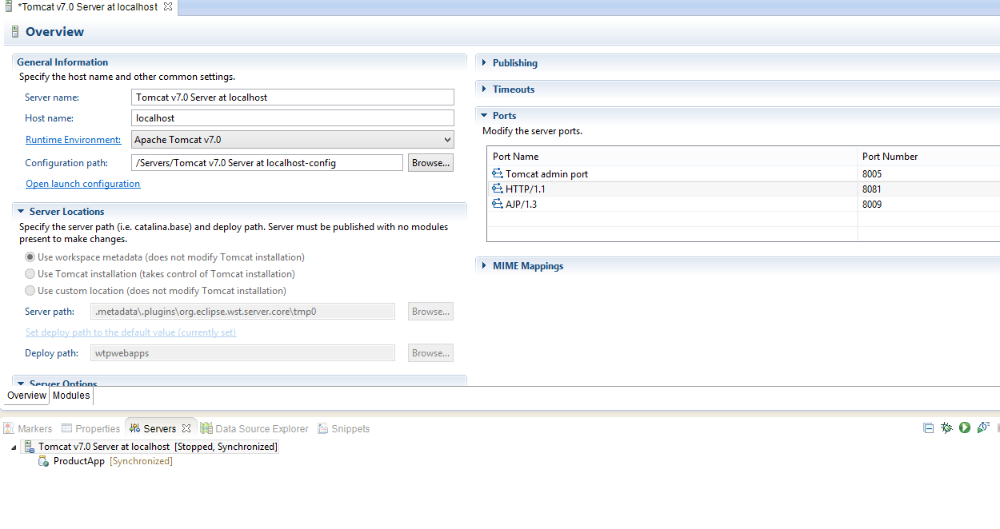

# JDBC

[TOC]


# Introduction and History - JDBC

Starting with JDBC Installing oracle 11g. 

There are 2 ways one could make JDBC connection. 

1. Class managed 
2. Container managed 

And also from connections perspective there are 

1. singular connections  
2. pooled connections 


We will see combinations of all 4 types.

But before all that we need a DBMS software, a database created using it, few tables to operate on and finally the JDBC driver that helps our java programs to connect with the DBMS software. There is one more thing that is inclusive and it's the JDBC API that comes along with the JDK installation. 


## History of JDBC API 

JDBC (Java DataBase Connectivity) provides standard library for accessing relational databases. 

### JDBC 1.0

The first version of JDBC was released as part of JDK 1.1 on Feb, 1997. 

### JDBC 2.0

Then came JDBC 2.0.

 JDBC 2.0 represented the partitioning of the JDBC API into core package and standard extension. With the core JDBC package fulfilling functionality present in JDBC 1.2 guaranteeing backward compatibility and the standard extension package containing new functionality distributed separately of the JDK. 

The new functionality of the standard extension package was placed under Java's javax.sql package and it included features like: JNDI support for JDBC Data Sources, connection pooling, rowsets and distributed transactions.

### JDBC 3.0

Then came JDBC 3.0.

 JDBC 3.0 represented the inclusion of the standard extension package (i.e. javax.sql) into the JDK itself (i.e. java.sql), as well as additional enhancements to the API's overall functionality. 

Among the enhancements present in JDBC 3.0 over JDBC 2.0 are:   

- Better connection pooling, 
- Increased support for SQL99 features (SQL99 is database industry standard for SQL language), 
- Updated metadata APIs, 
- Named parameters in Callable statements in order to support parameter names in stored procedures, 
- as well as new and updated data types. 

New features of the JDBC 3.0 include:   

- Retrieving auto-generated keys, 
- integration support for the Java Connector Architecture(JCA), 
- ResultSet hold-ability, 
- PreparedStatement pooling, 
- as well as savepoints for transactions. 

### JDBC 4.0

Now we have JDBC 4.0.

 JDBC 4.0 represents the latest version of the JDBC API and forms part of the JDK 6.0 (i.e. Java SE 6). 

Among the enhancements present in JDBC 4.0 over JDBC 3.0 are:   

- Enhanced driver and connection management, 
- increased support for SQL2003 (successor to SQL99), 
- better exception handling, as well as new and updated dat a types. 

New features of the JDBC 4.0 include:   

- SQLXML and XML support, 
- as well as support for national character set conversion -- supported through SQL2003.

JDBC 4.1 supports Java SE 7, 4.2 supports SE 8 and 4.3 supports SE 9. 


## JDBC API - What/How/Why

JDBC API defines interfaces and classes for writing database applications in Java by making database connections. 

This API standardizes : 

1. The way to establish the connection to the database 
2. Approach to initiate queries 
3. The data structure of query result 

JDBC classes are located in `java.sql` package. 

Let's look into the package and see what it says. The key to understanding any API documentation is knowing where to start. 

### Driver API 

- this is an interface that every driver class must implement. 
- DBMS drivers released by dbms vendors implement this interface. 
- A Driver class is loaded, by creating an instance of itself.` Class.forName("foo.bah.myDriver")` 
- DriverManager doesn't stop you from loading multiple drivers but when it receives a connection request, it will ask each driver in turn to try to connect to the target URL (connection urls are explained later). 
- The Driver that succeeds handles the connection request. 

Have a look at Driver API Documentation [here](http://docs.oracle.com/javase/6/docs/api/java/sql/Driver.html). 

### DriverManager API 

- The DriverManager provides a basic service for managing a set of JDBC drivers. 
- When getConnection() is called the DriverManager will attempt to locate a suitable driver from amongst those loaded at initialization and those loaded explicitly using the same classloader as the current applet or application. 
- Note that when we do `Class.forName("foo.bah.myDriver")` the JVM uses the same classloader used by the program to load the Driver class. 

Have a look at DriverManager API Documentation [here](http://docs.oracle.com/javase/7/docs/api/java/sql/DriverManager.html).

## JDBC Drivers & Types

What is a JDBC driver? 

The JDBC API defines the Java interfaces and classes that programmers use to connect to databases and send queries. A JDBC driver implements these interfaces and classes for a particular DBMS vendor. 

For eg: 

Oracle releases JDBC drivers for it's famous Oracle Database. These drivers are available as jars that could be used by any java application. 

To make it even more clearer, if you check the **JDBC API** Docs we see that [Driver](http://docs.oracle.com/javase/7/docs/api/java/sql/Driver.html) is a interface but if we check **Oracle Driver API** Docs we find [OracleDriver](http://docs.oracle.com/cd/E11882_01/appdev.112/e13995/toc.htm) class that provides a implementation for Driver interface.

 A Java program that uses the JDBC API loads the specified driver class `Class.forName("oracle.jdbc.OracleDriver")` for a particular DBMS (say, Oracle DB) before it actually connects to a database. The JDBC DriverManager class then sends all JDBC API calls to the loaded driver.

### Driver Types 

JDBC Drivers are divided into four types 

1. JDBC-ODBC bridge driver (removed from JDBC 4.3+)
2. Native-API / partly Java Driver 
3. Net-protocol/ all java driver 
4. Native protocol/ all java driver 
  

#### JDBC-ODBC bridge driver


- is a database driver implementation that employs the ODBC driver to connect to the database. 

- The driver converts JDBC method calls into ODBC function calls.  
- The driver is platform-dependent as it makes use of ODBC which in turn depends on native libraries of the underlying operating system the JVM is running upon. 
- Almost any database for which ODBC driver is installed, can be accessed. 
- Performance overhead since the calls have to go through the jdbc Overhead bridge to the ODBC driver, then to the native db connectivity interface 
- Platform dependent 
- The ODBC driver needs to be installed on the client machine. 
- Not suitable for applets, because the ODBC driver needs to be installed on the client. 

Example: Sun provides a JDBC-ODBC Bridge driver: sun.jdbc.odbc.JdbcOdbcDriver


#### Native-API (Partly) Java Driver


- is a database driver implementation that uses the client-side libraries of the database. 
- As there is no implementation of jdbc-odbc bridge, its considerably faster than a type 1 driver. 
- The vendor client library needs to be installed on the client machine. 
- Not all databases have a client side library 
- This driver is platform dependent 
- This driver supports all java applications except Applets 

Example: Oracle's OCI driver 

The JDBC OCI driver, written in a combination of Java and C, converts JDBC invocations to calls to OCI, using native methods to call C-entry points. These calls communicate with the database using SQL*Net.


#### Net-protocol (All) Java Driver


- also known as the Pure Java Driver for Database Middleware, is a database driver implementation which makes use of a middle tier between the calling program and the database. 
- Like type 4 drivers, the type 3 driver is written entirely in Java 
- Since the communication between client and the middleware server is database independent, there is no need for the database vendor library on the client 
- The middleware server (which can be a full fledged J2EE Application server) can provide typical middleware services like caching (of connections, query results, etc.), load balancing, logging, and auditing. 
- A single driver can handle any database, provided the middleware supports it. 
- Requires database-specific coding to be done in the middle tier. 

Example: Oracle JDBC Server-Side Thin Driver - not strictly a type 3 driver runs inside Oracle Database and accesses a remote database or a different session on the same database. 


#### Native-protocol (All) Java Driver


- is a database driver implementation that converts JDBC calls directly into a vendor-specific database protocol. 
- Written completely in Java, type 4 drivers are thus platform independent. They install inside the Java Virtual Machine of the client. 
- This provides better performance than the type 1 and type 2 drivers as it does not have the overhead of conversion of calls into ODBC or database API calls. 
- Unlike the type 3 drivers, it does not need associated software to work. 
- As the database protocol is vendor specific, the JDBC client requires separate drivers, usually vendor supplied, to connect to different types of databases.


## Steps and Pre-requisites for JDBC

### Pre-requisites

All the examples that follows uses type-4 driver. 

All examples are either web applications or standalone java applications. 

1. Install a DBMS software. I installed oracle 11g 
2. Download jdbc driver. In our case it's orcale thin driver. I downloaded ojdbc6.jar 
3. Create a sample table 

First check if oracle service is running. If not run the "Start Database" command line program that is available if you had installed Oracle express edition on windows. 

Click Start, point to Programs (or All Programs), point to Oracle Database 10g Express Edition, and then select Start Database. 

Alternative: Find and run StartDB.bat file from oracle installtion location. For me it was under `C:\oraclexe\app\oracle\product\11.2.0\server\bin` 

If you have ORACLE SQL command line configured, then open it and type in your username and password. 

If you hadn't created any new users then SYSTEM will be your username and password is what you had set during the installation. 

```shell
SQL>conn SYSTEM 
Enter password: *******
```

If you are unable to find the cmd line application the open the windows command prompt and type in `sqlplus` 

If you are wondering why a database creation is missing, it's because Oracle 11g installs a database by default. It's named XE. You could check this by running the following query in the command line. 

```shell
SQL> select global_name from global_name; 
GLOBAL_NAME 
---------------------------------------------- 
XE
```

To display existing tables: 

```sql
SQL> SELECT owner, table_name FROM dba_tables;
```

 assuming that you have access to the DBA_TABLES data dictionary view. Else, 

```sql
SQL>SELECT owner, table_name FROM all_tables;
```

displays tables your account have access to. 

```sql
SQL>SELECT table_name FROM user_tables;
```

 displays tables that you own.

I created a table as follows,

```sql
SQL> create table products (id INT NOT NULL, title VARCHAR2(25) NOT NULL); 
SQL> desc products; 
Name Null? Type 
----------------------------------------- -------- ---------------------------- 
ID NOT NULL NUMBER(38) 
TITLE NOT NULL VARCHAR2(25) 
SQL> insert into products values(1, 'ipad'); 
1 row created. 
SQL> insert into products values(2, 'galaxytab'); 
1 row created. 
SQL> commit;
```

4. Node down the connection parameters

   Take note of connection parameters which is later used in our application to make connections.

   To connect to database we need to know 3 things

   - know the driver class name `(oracle.jdbc.OracleDriver)`
   - username/password for the oracle instance `(SYSTEM/password)`
   - connection url
     it takes the form
     `protocol:hostname:port:database instance`
     In mycase, the
     \- driver is oracle thin driver and
     \- hostname is localhost
     \- port is the default port, 1521
     \- database instance is XE
     So our final url is,
     `jdbc:oracle:thin:@localhost:1521:XE`

   Easiest way to find driver class name and connection url is to browse through the jdbc driver documentation - [OracleDriver](http://docs.oracle.com/cd/E11882_01/appdev.112/e13995/oracle/jdbc/OracleDriver.html).

5. Simple web server/container.

   I used tomcat 7.

   If oracle service is already running, you might find difficulties starting tomcat because Oracle XE starts a web application within itself for administrative purposes.

   Change the port for tomcat by double-clicking tomcat server in eclipse.

   
   I changed port for HTTP from 8080 to 8081. You could change it to any port that's not in use.


### Steps in making JDBC connections

Steps:

**1. Load the driver**

Two approaches are available.

**Approach I**

The most common approach to register a driver is to use Java's Class.forName() method to dynamically load the driver's class file into memory, which automatically registers it. This method is preferable because it allows you to make the driver registration configurable and portable.

```java
try {
	Class.forName("oracle.jdbc.OracleDriver");
}
catch(ClassNotFoundException ex) {
  System.out.println("Error: unable to load driver class!");
  System.exit(1);
}
//You can use getInstance() method to work around noncompliant JVMs, but then you'll have to code for two //extra Exceptions as follows:
try {
	Class.forName("oracle.jdbc. OracleDriver").newInstance();
}
catch(ClassNotFoundException ex) {
  System.out.println("Error: unable to load driver class!");
  System.exit(1);
}catch(IllegalAccessException ex) {
  System.out.println("Error: access problem while loading!");
  System.exit(2);
}catch(InstantiationException ex) {
  System.out.println("Error: unable to instantiate driver!");
  System.exit(3);
}
```


**Approach II:**

The second approach you can use to register a driver is to use the static DriverManager.registerDriver() method.

You should use the registerDriver() method if you are using a non-JDK compliant JVM, such as the one provided by Microsoft.

The following example uses registerDriver() to register the Oracle driver:

```java
try {
  Driver myDriver = new oracle.jdbc.OracleDriver();
  DriverManager.registerDriver( myDriver );
}
catch(ClassNotFoundException ex) {
  System.out.println("Error: unable to load driver class!");
  System.exit(1);
}
```


**2. Get the connection using the driver manager**

DriverManager.getConnection() methods:

- getConnection(String url)
- getConnection(String url, Properties prop)
- getConnection(String url, String user, String password)


**Using a database URL:**

```java
getConnection(String url, String user, String password)
```


The most commonly used form of getConnection() requires you to pass a database URL, a username, and a password:

```java
String URL = "jdbc:oracle:thin:@localhost:1521:XE";
String USER = "SYSTEM";
String PASS = "password"
Connection conn = DriverManager.getConnection(URL, USER, PASS);
```

In this case, the database URL includes the username and password and has the following general form:

`jdbc:oracle:driver:username/password@database`
So the above connection can be created as follows:

```java
String URL = "jdbc:oracle:thin:SYSTEM/password@localhost:1521:XE";
Connection conn = DriverManager.getConnection(URL);

getConnection(String url, Properties prop)
```


**Using a database URL and a Properties object:**

If you have more parameters to be passed for a getConnection call use a properties object. A Properties object holds a set of keyword-value pairs. It's used to pass driver properties to the driver during a call to the getConnection() method.

```java
import java.util.*;

String URL = "jdbc:oracle:thin:@localhost:1521:XE";
Properties info = new Properties( );
info.put( "user", "SYSTEM" );
info.put( "password", "password" );

Connection conn = DriverManager.getConnection(URL, info);
```

Check out the driver documentation [here](http://docs.oracle.com/cd/E11882_01/appdev.112/e13995/oracle/jdbc/OracleDriver.html)
to know more about properties recognized by Oracle JDBC drivers.

**3. Executing SQL statements**

JDBC API proves a interface called Statement that represents a SQL statement.

```java
Statement stmt = conn.createStatement();
```

ResultSet objects are usually returned after executing SQL statements.

By default, only one ResultSet object per Statement object can be open at the same time. Therefore, if the reading of one ResultSet object is interleaved with the reading of another, each must have been generated by different Statement objects. All execution methods in the Statement interface implicitly close a statment's current ResultSet object if an open one exists.

There are three different kinds of statements:

**Statement:** Used to implement simple SQL statements with no parameters.
**PreparedStatement:** (Extends Statement.) Used for precompiling SQL statements that might contain input parameters.
**CallableStatement:** (Extends PreparedStatement.) Used to execute stored procedures that may contain both input and output parameters.

**4. Executing Queries**

**execute:**
If you dont know which method to be used for executing SQL statements, this method can be used.
This will return a boolean. TRUE indicates the result is a ResultSet and FALSE indicates it has the int value which denotes number of rows affected by the query.

```java
stmt.execute("select * from products");
ResultSet rs = stmt.getResultSet();
```

**executeQuery:**
This is used generally for reading the content of the database.
The output will be in the form of ResultSet.
Generally SELECT statement is used.

```java
ResultSet rs = stmt.executeQuery("select * from products");
```

**executeUpdate:**
This is generally used for altering the databases.
Generally DROP TABLE or DATABASE, INSERT into TABLE, UPDATE TABLE, DELETE from TABLE statements will be used in this.
The output will be in the form of int. This int value denotes the number of rows affected by the query.

```java
int r = stmt.executeUpdate("truncate products");
if(r==0)
//unsuccessful
else
//successful
```

**5. Closing JDBC connections:**

At the end of your JDBC program, it is required explicitly close all the connections to the database to end each database session. However, if you forget, Java's garbage collector will close the connection when it cleans up stale objects.
Relying on garbage collection, especially in database programming, is very poor programming practice. You should make a habit of always closing the connection with the close() method associated with connection object.

To ensure that a connection is closed, you could provide a finally block in your code. A finally block always executes, regardless if an exception occurs or not.
To close above opened connection you should call close() method as follows: `conn.close();`


# JDBC Applications


## Simple JDBC application

JDBC singular connection using DriverManager - Stand alone Java application


```java
package com.prodapps;

import java.sql.Connection;
import java.sql.DriverManager;
import java.sql.ResultSet;
import java.sql.SQLException;
import java.sql.Statement;

public class Test {
 public static void main(String[] args) throws SQLException {
  Connection conn = null;
  Statement stmt = null;
  try {
   Class.forName("oracle.jdbc.OracleDriver");
   conn = DriverManager
   .getConnection("jdbc:oracle:thin:@localhost:1521:XE",
   "SYSTEM", "password");
   stmt = conn.createStatement();
   ResultSet rs = stmt
   .executeQuery("select * from products where id=1");
   while (rs.next()) {
    System.out.println((rs.getInt("id")));
    System.out.println((rs.getString("title")));
   }
  } catch (SQLException e) {
   e.printStackTrace();
  } catch (ClassNotFoundException e) {
   e.printStackTrace();
  } finally {
   if (stmt != null)
   stmt.close();
   if (conn != null)
   conn.close();
  }
 }
}
```


Output:

```
1
ipad
```


## JDBC Web application - using Driver Manager

Lets try to create a web application that uses JDBC.

This sample assumes that you have basic knowledge about servlets and JSPs.

Steps,

\- Create a "dynamic web application in eclipse".
\- Create java package - "com.prodapps"
\- Copy the ojdbc6.jar into WEB-INF/lib folder.


As shown above create 

- `Product.java` and 
- `ProductServlet.java` 

within `com.prodapps` package.
Also create` index.jsp` file under WebContent.

Note: If you find that web.xml file is missing then, right click the project -> Java EE tools -> Generate Deployment Descriptor Stub.

Now oracle database is a object-relational database management system (ORDBMS). 

**ORDBMS** is a RDBMS but with an object-oriented database model: objects, classes and inheritance are directly supported in database schemas and in the query language.

Meaning,

1. An entity(table schema) is synonymous with Java class.
2. Entity has attributes (columns) and Java classes has instance variables/attributes.
3. Record (each row) represents a real world entity which is synonymous with Java objects.

This opens the door to a whole new idea of **ORM - Object relational Mapping**.

There are tens of ORM frameworks available but we won't be using any. 

Nevertheless we would map records to java objects the simple, easy way.

**Product.java**

```java
//since our products schema involves only 2 attributes id and title, we design this java bean class which acts as a data transfer object (DTO) 
//DTO's are java class that represent the data present in our database tables

package com.prodapps;

public class Product {
 private int id;
 private String title;
 public void setId(int id) {
  this.id = id;
 }
 public int getId() {
  return id;
 }
 public void setTitle(String title) {
  this.title = title;
 }
 public String getTitle() {
  return title;
 }
 @Override
 public String toString() {
  return "Product [id=" + id + ", title=" + title + "]";
 }
}
```


**ProductServlet.java**


```java
//Let's write our servlet that handles the JDBC code. I'm writing these //following J2EE 1.5 specification 

package com.prodapps;

import java.io.IOException;
import java.sql.Connection;
import java.sql.DriverManager;
import java.sql.ResultSet;
import java.sql.SQLException;
import java.sql.Statement;

import javax.servlet.RequestDispatcher;
import javax.servlet.ServletException;
import javax.servlet.annotation.WebServlet;
import javax.servlet.http.HttpServlet;
import javax.servlet.http.HttpServletRequest;
import javax.servlet.http.HttpServletResponse;

/**
 * Servlet implementation class ProductServlet
 */

@WebServlet(description = "This is primary product servlet", urlPatterns = { "/ProductServlet" })
public class ProductServlet extends HttpServlet {
 private Connection conn=null;
 private static final long serialVersionUID = 1L;
       

    public ProductServlet() {
        super();
       
    }


 protected void doGet(HttpServletRequest request, HttpServletResponse response) throws ServletException, IOException {
  System.out.println("doGet");
  response.setContentType(request.getContentType());
  conn = createConnection();
  try {
   Statement stmt = conn.createStatement();
   ResultSet rs = stmt.executeQuery("select * from products where id=1");
   Product product = new Product();
   while(rs.next()){
    product.setId(rs.getInt("id"));
    product.setTitle(rs.getString("title"));
    System.out.println(product);
   }
   request.setAttribute("product", product);
   stmt.close();
   closeConnection();
   RequestDispatcher dispatch = request.getRequestDispatcher("/index.jsp");
   dispatch.forward(request, response);
  } catch (SQLException e) {
   e.printStackTrace();
  }
  
 }

 public Connection createConnection(){
  if(conn==null){
    try {
          Class.forName("oracle.jdbc.OracleDriver");
          System.out.println("oracle.jdbc.OracleDriver");
          conn = DriverManager.getConnection("jdbc:oracle:thin:@localhost:1521:XE", "SYSTEM", "password");
    }catch(SQLException e){
     e.printStackTrace();
    } catch (ClassNotFoundException e) {
    e.printStackTrace();
   }
  }
  return conn;
 }
 public void closeConnection(){
  if(conn!=null){
   try {
    conn.close();
   } catch (SQLException e) {
    e.printStackTrace();
   }
  }
 }

}
```


Finally we write a jsp file, **index.jsp**

```jsp
<%@ page import="com.prodapps.*" %>  
<%@page  
      language="java" contentType="text/html; charset=ISO-8859-1"  
      pageEncoding="ISO-8859-1"%>  
 <html>  
 <head>  
 <title>index</title>  
 <meta http-equiv="Content-Type" content="text/html; charset=ISO-8859-1">  
 </head>  
 <body>  
 <%  
 Product p = (Product)request.getAttribute("product");  
 %>  
 Product id: <%= p.getId() %><br />  
 Product title: <%= p.getTitle() %>  
 </body>  
 </html>
```

Build the project and publish on Tomcat server.

Hit this url on your browser.

http://localhost:8081/ProductApp/ProductServlet


Output:

```
Product id: 1
Product title: ipad
```


Download the project [here](https://drive.google.com/file/d/0B3BdXBOb1P1RRnFzR3M4R3NGMzA/edit?usp=sharing)

## JDBC Web application - connection rollbacks & other scenarios

Main purpose of creating Web applications is to serve user requests concurrently.

### Concurrency

Let's try emulating concurrency.

Requests from different browser windows on the same machine are considered different. So opening 2 browser windows and hitting the url simultaneously will do the trick.

Since we cannot use 2 windows simultaneously (at the exact same time), we modify our program as follows:

```java
package com.prodapps;

import java.io.IOException;
import java.sql.Connection;
import java.sql.DriverManager;
import java.sql.ResultSet;
import java.sql.SQLException;
import java.sql.Statement;

import javax.servlet.RequestDispatcher;
import javax.servlet.ServletException;
import javax.servlet.annotation.WebServlet;
import javax.servlet.http.HttpServlet;
import javax.servlet.http.HttpServletRequest;
import javax.servlet.http.HttpServletResponse;

/**
 * Servlet implementation class ProductServlet
 */

@WebServlet(description = "This is primary product servlet", urlPatterns = { "/ProductServlet" })
public class ProductServlet extends HttpServlet {
 private Connection conn=null;
 private static final long serialVersionUID = 1L;
       

    public ProductServlet() {
        super();
       
    }


 protected void doGet(HttpServletRequest request, HttpServletResponse response) throws ServletException, IOException {
  System.out.println("doGet");
  response.setContentType(request.getContentType());
  String caseID = request.getParameter("caseID");
  try {
   conn = createConnection();
   conn.setAutoCommit(false);
   if(caseID.equals("1")){
    Statement stmt = conn.createStatement();
    stmt.executeUpdate("insert into products values('3','htc')");
    System.out.println("3");
    try {
     Thread.sleep(100);
    } catch (InterruptedException e) {
     System.out.println("interrupted");
    }
    stmt.executeUpdate("insert into products values('4','nexus')");
    System.out.println("4");
    try {
     Thread.sleep(10);
    } catch (InterruptedException e) {
     System.out.println("interrupted");
    }
    conn.commit();
   }else{
    Statement stmt = conn.createStatement();
    stmt.executeUpdate("insert into products values('5','galaxy')");
    System.out.println("5");
    try {
     Thread.sleep(2000);
    } catch (InterruptedException e) {
     System.out.println("interrupted");
    }
    
    stmt.executeUpdate("insert into products values('6','xolo')");
    System.out.println("6");
    try {
     Thread.sleep(10);
    } catch (InterruptedException e) {
     System.out.println("interrupted");
    }
    conn.rollback();
   }
   RequestDispatcher dispatch = request.getRequestDispatcher("/index.jsp");
   dispatch.forward(request, response);
  } catch (SQLException e) {
   e.printStackTrace();
  }finally {
   closeConnection();
  }
  
 }

 public Connection createConnection() throws SQLException{
  if(conn==null||conn.isClosed()){
    try {
          Class.forName("oracle.jdbc.OracleDriver");
          conn = DriverManager.getConnection("jdbc:oracle:thin:@localhost:1521:XE", "SYSTEM", "password");
    }catch(SQLException e){
     e.printStackTrace();
    } catch (ClassNotFoundException e) {
    e.printStackTrace();
   }
  }
  return conn;
 }
 public void closeConnection(){
  if(conn!=null){
   try {
    conn.close();
   } catch (SQLException e) {
    e.printStackTrace();
   }
  }
 }

}
```


Note that we have changed the query to insert values into the table.

In this scenario we don't have any use of Product.java nor the jsp file since our focus is on how JDBC behaves for parallel requests.

You can download this sample [here](https://drive.google.com/file/d/0B3BdXBOb1P1RTk8yRGtfal9LQms/edit?usp=sharing)

We read in a request parameter (caseID) and based on the parameters value we insert values into the table.

```pseudocode
if caseID == 1 
	then we insert (3, htc) and (4, nexus) and commit(save).
else 
	insert(5, galaxy) and (6, xolo) and then rollback(undo).
```

By default all insertion/updation are auto-committed, ie. we don't have to call commit to save it to the database.

But in real-time transactions when there are multiple inserts/updates, it has to follow ACID principle.

This will make sense if we take a real-time scenario like money transfer between bank accounts. Suppose money needs to be transferred from account A to B.

We have 2 operations -

1. Deduct amount from A
2. Add amount to B

Now if any one operation fails and the other succeeds then the data is spoiled.

#### How connection rollback works

In JDBC, 

- transaction is a logical unit of work. 
- transaction involves multiple SELECT, INSERT, UPDATE and DELETE statements.
- All transactional work is handled at the Connection object level.
- All Statement objects under a connection are a part of the transaction.

This means is that if an application creates three Statement objects and uses each object to make changes to the database, when a commit or rollback call happens, the work for all three statements either becomes permanent or is discarded. 

The commit and rollback SQL statements are used to finalize transactions when working purely with SQL.

To simulate our concurrent situation we open 2 instances of our favorite browser.


Hitting

http://localhost:8081/ProductApp/ProductServlet?caseID=2

first and then immediately

http://localhost:8081/ProductApp/ProductServlet?caseID=1

simulates the concurrent situtation.

We get a Closed Connection - SQL exception if you see the logs.

Let's check the table.

```sql
SQL> select * from products;

ID TITLE
---------- -------------------------
1 ipad
2 galaxytab
5 galaxy
3 htc
4 nexus
```


The record

```
5 galaxy
```

isn't supposed to be there.

#### What happened?

Let's analyze the logs to see what happened.

```l
doGet
5
doGet
3
4
SEVERE: Servlet.service() for servlet jsp threw exception
java.lang.NullPointerException
at org.apache.jsp.index_jsp._jspService(index_jsp.java:77)
...
at com.prodapps.ProductServlet.doGet(ProductServlet.java:77)
SEVERE: Servlet.service() for servlet [com.prodapps.ProductServlet] in context with path [/ProductApp] threw exception [java.lang.NullPointerException] with root cause
java.lang.NullPointerException
at org.apache.jsp.index_jsp._jspService(index_jsp.java:77)
...
at com.prodapps.ProductServlet.doGet(ProductServlet.java:77)
java.sql.SQLException: Closed Connection
...
at com.prodapps.ProductServlet.doGet(ProductServlet.java:67)
```


When the servletcontainer, like Apache Tomcat starts up, it will deploy and load all web applications. When a web application gets loaded, the container creates servletcontext object and then the webapp's web.xml will be parsed and every Servlet, Filter and Listener found in web.xml will be created once and kept in server's memory. The respective constructors of those objects are run.

The child element(of element) in web.xml indicates that this servlet should be loaded (instantiated and have its init() called) on the startup of the web application. 

The optional contents of these element must be an integer indicating the order in which the servlet should be loaded.

- value >= 0 means that the servlet is loaded when the web-app is deployed or when the server starts.
- value < 0 means servlet is loaded whenever the container feels like - i.e it could be when the first request comes or when the container starts. When is not specified, the container initializes the servlet when the first request comes.

Is it possible to write a argument constructor in a servlet?

yes, you can but it is useless since you cannot pass arguments since Java lacks proper constructor via reflection.

> "According to the servlets (2.4) specification, the servlets are instantiated by the servlet engine by invoking the no-arg constructor."

Only one instance of servlet per web-application runs in a container but multiple threads are created to handle the concurrent user requests.

When first request (caseID=2) hits the ProductServlet, a thread is picked from a pool created by the container or a new thread is created and started. The thread executes doGet method.

Inside doGet we create a connection object if it doesn't exists else we re-use the connection that's existing.

Since connection object is declared as a instance variable, only one reference exits for the servlet object. And thus there is only one reference for the whole web application too because there is only one instance of servlet per web application.

The code executes the "else" block and inserts (5, galaxy). Then the tread sleeps for 1 sec.

Meanwhile the user hits the url again with request parameter, caseID=1. Another thread is created and the doGet method runs. Now, conn object exits already and it's reused.

(3, htc) and (4, nexus) are entered into the database with a 10 millisecond gap in-between. The values are saved into db by calling commit() and then the doGet method completes after closing the connection.

Now the first thread resumes. And it runs

```java
stmt.executeUpdate("insert into products values('6','xolo')");
```


But the connection object is already closed. So, our program throws a closed connection exception or sometimes a null pointer exception also.

Now, let's try the same example by sleeping the first condition 5 seconds.

```java
protected void doGet(HttpServletRequest request, HttpServletResponse response) throws ServletException, IOException {
  System.out.println("doGet");
  response.setContentType(request.getContentType());
  String caseID = request.getParameter("caseID");
  try {
   conn = createConnection();
   conn.setAutoCommit(false);
   if(caseID.equals("1")){
    Statement stmt = conn.createStatement();
    stmt.executeUpdate("insert into products values('3','htc')");
    System.out.println("3");
    try {
     Thread.sleep(5000);
    } catch (InterruptedException e) {
     System.out.println("interrupted");
    }
    stmt.executeUpdate("insert into products values('4','nexus')");
    System.out.println("4");
    try {
     Thread.sleep(10);
    } catch (InterruptedException e) {
     System.out.println("interrupted");
    }
    conn.commit();
   }else{
    Statement stmt = conn.createStatement();
    stmt.executeUpdate("insert into products values('5','galaxy')");
    System.out.println("5");
    try {
     Thread.sleep(2000);
    } catch (InterruptedException e) {
     System.out.println("interrupted");
    }
    
    stmt.executeUpdate("insert into products values('6','xolo')");
    System.out.println("6");
    try {
     Thread.sleep(10);
    } catch (InterruptedException e) {
     System.out.println("interrupted");
    }
    conn.rollback();
   }
   RequestDispatcher dispatch = request.getRequestDispatcher("/index.jsp");
   dispatch.forward(request, response);
  } catch (SQLException e) {
   e.printStackTrace();
  }finally {
   closeConnection();
  }
```


Hitting

http://localhost:8081/ProductApp/ProductServlet?caseID=2

first and then immediately

http://localhost:8081/ProductApp/ProductServlet?caseID=1

Again throws closed-connection exception as expected.


```
doGet
5
doGet
3
6
java.sql.SQLException: Closed Connection

Which means after (5, galaxy) is entered, the 2nd request comes which reused conn object. Executes and adds (3, htc) and then sleeps for 5 seconds. JVM swaps the sleeping thread with our first thread that is now ready to run. First thread executes and adds (6, xolo) and rollbacks all previous transactions and closes the connection.

Now the 2nd thread continues and tries to execute (4, nexus) but the connection is closed and hence the sql exception.

Let's check the table.

SQL> select * from products;

ID TITLE
---------- -------------------------
1 ipad
2 galaxytab
```


In both the above scenarios, you may not get the same output as above as how threads compete and run among themselves cannot be accurately predicted.


Let's see what happens if connection is initialized in init().


```java
@WebServlet(description = "This is primary product servlet", urlPatterns = { "/ProductServlet" })
public class ProductServlet extends HttpServlet {
 private Connection conn=null;
 private static final long serialVersionUID = 1L;
       

    public ProductServlet() {
        super();
    }
    
    @Override
    public void init() throws ServletException {
     super.init();
     System.out.println("init");
      try {
         Class.forName("oracle.jdbc.OracleDriver");
         conn = DriverManager.getConnection("jdbc:oracle:thin:@localhost:1521:XE", "SYSTEM", "password");
         conn.setAutoCommit(false);
   }catch(SQLException e){
    e.printStackTrace();
   } catch (ClassNotFoundException e) {
   e.printStackTrace();
  }
 }


 protected void doGet(HttpServletRequest request, HttpServletResponse response) throws ServletException, IOException {
  System.out.println("doGet");
  response.setContentType(request.getContentType());
  String caseID = request.getParameter("caseID");
  try {
   if(caseID.equals("1")){
    Statement stmt = conn.createStatement();
    stmt.executeUpdate("insert into products values('3','htc')");
    System.out.println("3");
    try {
     Thread.sleep(100);
    } catch (InterruptedException e) {
     System.out.println("interrupted");
    }
    stmt.executeUpdate("insert into products values('4','nexus')");
    System.out.println("4");
    try {
     Thread.sleep(10);
    } catch (InterruptedException e) {
     System.out.println("interrupted");
    }
    conn.commit();
   }else{
    Statement stmt = conn.createStatement();
    stmt.executeUpdate("insert into products values('5','galaxy')");
    System.out.println("5");
    try {
     Thread.sleep(2000);
    } catch (InterruptedException e) {
     System.out.println("interrupted");
    }
    
    stmt.executeUpdate("insert into products values('6','xolo')");
    System.out.println("6");
    try {
     Thread.sleep(10);
    } catch (InterruptedException e) {
     System.out.println("interrupted");
    }
    conn.rollback();
   }
   RequestDispatcher dispatch = request.getRequestDispatcher("/index.jsp");
   dispatch.forward(request, response);
  } catch (SQLException e) {
   e.printStackTrace();
  }
  
 }

 @Override
 public void destroy() {
  super.destroy();
  System.out.println("destroy");
  try {
   conn.close();
  } catch (SQLException e) {
   e.printStackTrace();
  }
 }
}
```


You again get indeterminate/incorrect results because init runs just once and the connection object is shared across requests/threads.


```sql
SQL> select * from Products;

ID TITLE
---------- -------------------------
1 ipad
2 galaxytab
5 galaxy
3 htc
4 nexus
```


As we have seen sharing connection object across transactions is evil. It leads to indeterminate behaviour and corrupts the data.

#### Solution?

Create a **<u>new connection for every transaction</u>**. 

In other words, let each request uses it's own connection object.

## JDBC application - (unique) connections

This doesn't involve many changes from our previous servlet. All we had to do is move the connection object declaration into doGet method and modify createConnection() method.


```java
@WebServlet(description = "This is primary product servlet", urlPatterns = { "/ProductServlet" })
public class ProductServlet extends HttpServlet {
 
 private static final long serialVersionUID = 1L;
       

    public ProductServlet() {
        super();
       
    }


 protected void doGet(HttpServletRequest request, HttpServletResponse response) throws ServletException, IOException {
  System.out.println("doGet");
  response.setContentType(request.getContentType());
  String caseID = request.getParameter("caseID");
  Connection conn = null;
  try {
   conn = createConnection();
   conn.setAutoCommit(false);
   if(caseID.equals("1")){
    Statement stmt = conn.createStatement();
    stmt.executeUpdate("insert into products values('3','htc')");
    System.out.println("3");
    try {
     Thread.sleep(100);
    } catch (InterruptedException e) {
     System.out.println("interrupted");
    }
    stmt.executeUpdate("insert into products values('4','nexus')");
    System.out.println("4");
    try {
     Thread.sleep(10);
    } catch (InterruptedException e) {
     System.out.println("interrupted");
    }
    conn.commit();
   }else{
    Statement stmt = conn.createStatement();
    stmt.executeUpdate("insert into products values('5','galaxy')");
    System.out.println("5");
    try {
     Thread.sleep(2000);
    } catch (InterruptedException e) {
     System.out.println("interrupted");
    }
    
    stmt.executeUpdate("insert into products values('6','xolo')");
    System.out.println("6");
    try {
     Thread.sleep(10);
    } catch (InterruptedException e) {
     System.out.println("interrupted");
    }
    conn.rollback();
   }
   RequestDispatcher dispatch = request.getRequestDispatcher("/index.jsp");
   dispatch.forward(request, response);
  } catch (SQLException e) {
   e.printStackTrace();
  }finally {
   closeConnection(conn);
  }
  
 }

 public Connection createConnection() throws SQLException{
  Connection conn = null;  
  try {
   Class.forName("oracle.jdbc.OracleDriver");
   conn = DriverManager
     .getConnection("jdbc:oracle:thin:@localhost:1521:XE",
       "SYSTEM", "password");
  } catch (SQLException e) {
   e.printStackTrace();
  } catch (ClassNotFoundException e) {
   e.printStackTrace();
  }

  return conn;
 }
 public void closeConnection(Connection conn){
  if(conn!=null){
   try {
    conn.close();
   } catch (SQLException e) {
    e.printStackTrace();
   }
  }
 }
} 
```


You may download this sample [here](https://drive.google.com/file/d/0B3BdXBOb1P1RTl9rdjRTTlZtTWs/edit?usp=sharing)

Ouput:

```
doGet
5
doGet
3
4
6
```


Let's check products table.

```sql
SQL> select * from Products;

ID TITLE
---------- -------------------------
1 ipad
2 galaxytab
3 htc
4 nexus
```


Again notice how the threads got executed. JVM switched threads back and forth but we get the output as expected.

Hurray.

Transactions work as expected when we don't share connection objects.


#### Any new problems?

Well, for very, very small programs like the one we are doing now - it does not matter, but when we start writing real world programs we will witness a new problem rising - Server performance hit

There are 2 primary reasons for this:


- Acquiring a new connection is expensive. Some database management systems even start a completely new server process for each connection. And the JDBC driver maintains active TCP/IP connections with these database processes.
- Maintaining many idle connections is expensive for a database management system.


#### Solution?

Database connection pooling.

There are 2 ways you can handle pooling -

1. Program managed (traditional)
2. Library managed
3. Container managed

Nowadays, in most of the web-applications, pooling is done by using facilities provided by the container/server or it's handled by using libraries/frameworks like apache -commons-dbcp, DBpool or hibernate. But, we'll look into traditional method of manually writing the connection pooling first.

## JDBC application - program managed connection pools

Before frameworks and libraries, we used to write our own pooling mechanisms.

Let's try first a standalone java application.

Since we are using connection pooling, our application will ask the pool for new or free connections instead of DriverManager.

The Pool will take care of creating new connections or utilizing idle connections or even closing long-time idle connections.

The protocol of the connection url (*jdbc:subprotocol:subname*) we used to fetch connections from DriverManager is
*jdbc:oracle:thin*.

Since we are not asking the DriverManager directly, let's use a sub-protocol of our choice - *jdbc:jdc:jdcpool.*

And then we call,

```java
Connection conn = DriverManager.getConnection("jdbc:jdc:jdcpool");
```


But before that we need to register the actual driver with the DriverManager.
We do this as follows,

```java
public class JDCConnectionDriver implements Driver {
  private JDCConnectionPool pool;
  public static final String URL_PREFIX = "jdbc:jdc:";

  public JDCConnectionDriver(String driver, String url, String user, String password) throws ClassNotFoundException, InstantiationException, IllegalAccessException, SQLException {

    //Registers the given driver with the DriverManager. 
    DriverManager.registerDriver(this);
    System.out.println("Registered JDCConnectionDriver as Driver for DriverManager");

    //Creating a connection pool
    pool = new JDCConnectionPool(url, user, password);
    }

    public Connection connect(String url) throws SQLException  {
    if(!url.startsWith(URL_PREFIX)) {
    return null;
  }
  return pool.getConnection();
}
```


The DriverManager internally calls connect on the available registered Driver, whenever we do DriverManager.getConnection().


```java
public class JDCConnectionPool {

	private List connections; //pool of connections
	private String url, user, password;
	final private long timeout=5000;
	private ConnectionReaper reaper; //A thread that removes stale connections
	final private int poolsize=10;   //initial pool size

  public JDCConnectionPool(String url, String user, String password) {
    this.url = url;
    this.user = user;
    this.password = password;
    connections = (List) Collections.synchronizedList(new ArrayList(poolsize));
    System.out.println("Initalized list of JDCConnections of size "+poolsize);
    reaper = new ConnectionReaper(this);
    reaper.start(); //start the thread that calls reapConnections after every 100 millisec
  }

  public void reapConnections() {
    //check if connections are in use or been idle for long
    //if yes, remove them from pool
  }

  public synchronized Connection getConnection()
  throws SQLException {
    Connection conn = DriverManager.getConnection(url, user, password);
    c = new JDCConnection(conn, this); 
    //wrapping the original connection with our custom conn class
    connections.add(c);
    return c;
  }
}

public class JDCConnection implements Connection {....}
```


Download the project [here](https://drive.google.com/file/d/0B3BdXBOb1P1RUFVoRjJIUm52UjQ/edit?usp=sharing).

A common disadvantage of connection pooling is that we can never be sure of when the connections are actually closed.

Default behavior of <u>conn.close() is to close all cursors(ResultSets) and also statements associated with the connection</u>.

 But most of the connection pooling frameworks and libraries override this behavior and do not close connections when we call conn.close() instead the connection is returned back to the pool.

Connections are later closed based on various criteria like when the thread calling conn.close()
actually terminates or when the application is stopped.

Because of this limitation **it is always advisable to close all Resultsets and Statements in finally clause**.

Keeping connections or statements open leads to a very infamous exception

```
java.sql.SQLException: - ORA-01000: maximum open cursors exceeded
```

There are 2 primary causes for this exception

1. You have more threads in your application querying the database than cursors on the DB. (More about cursors later in this section) This is a configuration mistake and can be rectified by either increasing the number of cursors on the DB or by decreasing the number of threads in the application.

2. The second most common cause is not closing ResultSets/Statements (in JDBC code) or cursors (in stored procedures on the database). This can be avoided by following good programming practices and static code analysis.

   

## JDBC application - library managed connection pools

We could use **commons-dbcp** as our library of choice.

### Approach I - using BasicDataSource

```java
package com.prodapps;
import java.sql.Connection;
import java.sql.ResultSet;
import java.sql.SQLException;
import java.sql.Statement;

import org.apache.commons.dbcp.BasicDataSource;

public class PoolingDataSourceExample {

 public static void main(String[] args) throws SQLException {

  Connection conn = null;
  try {
   BasicDataSource ds = new BasicDataSource();
   ds.setDriverClassName("oracle.jdbc.OracleDriver");
   ds.setUsername("SYSTEM");
   ds.setPassword("password");
   ds.setUrl("jdbc:oracle:thin:@localhost:1521:XE");
   ds.setInitialSize(1);
   ds.setMaxActive(50);
   ds.setDefaultAutoCommit(false);
   
   conn = ds.getConnection();
   Statement st = conn.createStatement();
   ResultSet rs = st.executeQuery("select 777 from dual");

   while (rs.next()) {
    System.out.println(rs.getString(1));
    ;
   }
   rs.close();
   st.close();
  } finally {
   if (conn != null)
    try {
     conn.close();
    } catch (Exception ignore) {
    }
  }
 }
}
```


Trying it out as a Web application is left to the reader.
Note that connection pooling capability is inherently added to the BasicDataSource implementation.

### Approach II - using PoolingDataSource

```java
package com.prodapps;

import javax.sql.DataSource;
import java.sql.Connection;
import java.sql.Statement;
import java.sql.ResultSet;
import java.sql.SQLException;

//
// Here are the dbcp-specific classes.
// Note that they are only used in the setupDataSource
// method. In normal use, your classes interact
// only with the standard JDBC API
//
import org.apache.commons.pool.ObjectPool;
import org.apache.commons.pool.impl.GenericObjectPool;
import org.apache.commons.dbcp.ConnectionFactory;
import org.apache.commons.dbcp.PoolingDataSource;
import org.apache.commons.dbcp.PoolableConnectionFactory;
import org.apache.commons.dbcp.DriverManagerConnectionFactory;

public class ManualPoolingDataSourceExample {

 public static void main(String[] s) {
  
  //
  // First we load the underlying JDBC driver.
  // You need this if you don't use the jdbc.drivers
  // system property.
  //
  System.out.println("Loading underlying JDBC driver.");
  try {
   Class.forName("oracle.jdbc.driver.OracleDriver");
  } catch (ClassNotFoundException e) {
   e.printStackTrace();
  }
  System.out.println("Done.");

  //
  // Then, we set up the PoolingDataSource.
  // Normally this would be handled auto-magically by
  // an external configuration, but in this example we'll
  // do it manually.
  //
  System.out.println("Setting up data source.");
  DataSource dataSource = setupDataSource("jdbc:oracle:thin:SYSTEM/password@localhost:1521:XE");
  System.out.println("Done.");

  //
  // Now, we can use JDBC DataSource as we normally would.
  //
  Connection conn = null;
  Statement stmt = null;
  ResultSet rset = null;

  try {
   System.out.println("Creating connection.");
   conn = dataSource.getConnection();
   System.out.println("Creating statement.");
   stmt = conn.createStatement();
   System.out.println("Executing statement.");
   rset = stmt.executeQuery("select 777 from dual");
   System.out.println("Results:");
   int numcols = rset.getMetaData().getColumnCount();
   while (rset.next()) {
    for (int i = 1; i <= numcols; i++) {
     System.out.print("\t" + rset.getString(i));
    }
    System.out.println("");
   }
  } catch (SQLException e) {
   e.printStackTrace();
  } finally {
   try {
    rset.close();
   } catch (Exception e) {
   }
   try {
    stmt.close();
   } catch (Exception e) {
   }
   try {
    conn.close();
   } catch (Exception e) {
   }
  }
 }

 public static DataSource setupDataSource(String connectURI) {
  //
  // First, we'll need a ObjectPool that serves as the
  // actual pool of connections.
  //
  // We'll use a GenericObjectPool instance, although
  // any ObjectPool implementation will suffice.
  //
  ObjectPool connectionPool = new GenericObjectPool(null);

  //
  // Next, we'll create a ConnectionFactory that the
  // pool will use to create Connections.
  // We'll use the DriverManagerConnectionFactory,
  // using the connect string passed in the command line
  // arguments.
  //
  ConnectionFactory connectionFactory = new DriverManagerConnectionFactory(
    connectURI, null);

  //
  // Now we'll create the PoolableConnectionFactory, which wraps
  // the "real" Connections created by the ConnectionFactory with
  // the classes that implement the pooling functionality.
  //
  PoolableConnectionFactory poolableConnectionFactory = new PoolableConnectionFactory(
    connectionFactory, connectionPool, null, null, false, true);

  //
  // Finally, we create the PoolingDriver itself,
  // passing in the object pool we created.
  //
  PoolingDataSource dataSource = new PoolingDataSource(connectionPool);

  return dataSource;
 }
}
```

The web application version is available for download [here](https://drive.google.com/file/d/0B3BdXBOb1P1RbHB5Z2hXaFVTMTg/edit?usp=sharing)

## JDBC application - container managed connection pools

Instead of relying on 3rd-party libraries/frameworks we could use the pooling mechanisms provided by the underlying container.

Let's take **tomcat**, the container we are using for these examples.

Tomcat comes with **Tomcat-DBCP**.

Here is excerpt from tomcat documentation:

> The default database connection pool implementation in Apache Tomcat relies on the libraries from the Apache Commons project.
> The following libraries are used: 
>
> - Commons DBCP
> - Commons Pool
>
> These libraries are located in a single JAR at $CATALINA_HOME/lib/tomcat-dbcp.jar.


The JDBC Connection Pool, org.apache.tomcat.jdbc.pool is a single replacement or an alternative to (org.apache.commons.pool + org.apache.commons.dbcp).

Here are few reasons why Tomcat-DBCP should be preferred if you are using tomcat. These are from [Tomcat-Docs](http://tomcat.apache.org/tomcat-7.0-doc/jdbc-pool.html#Introduction)

1. commons-dbcp is single threaded, in order to be thread safe commons-dbcp locks the entire pool, even during query validation. 
2. commons-dbcp is slow - as the number of logical CPUs grow, the performance suffers, the above point shows that there is not support for high concurrency Even with the enormous optimizations of the synchronized statement in Java 6, commons-dbcp still suffers in speed and concurrency.
3. commons-dbcp is complex, over 60 classes. tomcat-jdbc-pool, core is 8 classes, hence modifications for future requirement will require much less changes. This is all you need to run the connection pool itself, the rest is gravy.
4. commons-dbcp uses static interfaces. This means you can't compile it with JDK 1.6, or if you run on JDK 1.6/1.7 you will get NoSuchMethodException for all the methods not implemented, even if the driver supports it.
5. The commons-dbcp has become fairly stagnant. Sparse updates, releases, and new feature support.
6. It's not worth rewriting over 60 classes, when something as a connection pool can be accomplished with as a much simpler implementation.
7. Tomcat jdbc pool implements a fairness option not available in commons-dbcp and still performs faster than commons-dbcp
8. Tomcat jdbc pool implements the ability retrieve a connection asynchronously, without adding additional threads to the library itself
9. Tomcat jdbc pool is a Tomcat module, it depends on Tomcat JULI, a simplified logging framework used in Tomcat.
10. Retrieve the underlying connection using the javax.sql.PooledConnection interface.
11. Starvation proof. If a pool is empty, and threads are waiting for a connection, when a connection is returned, the pool will awake the correct thread waiting. Most pools will simply starve.


Features added over other connection pool implementations:

1. Support for highly concurrent environments and multi core/cpu systems.
2. Dynamic implementation of interface, will support java.sql and javax.sql interfaces for your runtime environment (as long as your JDBC driver does the same), even when compiled with a lower version of the JDK.
3. Validation intervals - we don't have to validate every single time we use the connection, we can do this when we borrow or return the connection, just not more frequent than an interval we can configure.
4.  Run-Once query, a configurable query that will be run only once, when the connection to the database is established. Very useful to setup session settings, that you want to exist during the entire time the connection is established.
5. Ability to configure custom interceptors. This allows you to write custom interceptors to enhance the functionality. You can use interceptors to gather query stats, cache session states, reconnect the connection upon failures, retry queries, cache query results, and so on. Your options are endless and the interceptors are dynamic, not tied to a JDK version of ajava.sql/javax.sql interface.
6. High performance - we will show some differences in performance later on.
7. Extremely simple, due to the very simplified implementation, the line count and source file count are very low, compare with c3p0 that has over 200 source files(last time we checked), Tomcat jdbc has a core of 8 files, the connection pool itself is about half that. As bugs may occur, they will be faster to track down, and easier to fix. Complexity reduction has been a focus from inception.
8. Asynchronous connection retrieval - you can queue your request for a connection and receive a Future back.
9. Better idle connection handling. Instead of closing connections directly, it can still pool connections and sizes the idle pool with a smarter algorithm.
10. You can decide at what moment connections are considered abandoned, is it when the pool is full, or directly at a timeout by specifying a pool usage threshold.
11. The abandon connection timer will reset upon a statement/query activity. Allowing a connections that is in use for a long time to not timeout. This is achieved using theResetAbandonedTimer.
12. Close connections after they have been connected for a certain time. Age based close upon return to the pool.
13. Get JMX notifications and log entries when connections are suspected for being abandoned. This is similar to the removeAbandonedTimeout but it doesn't take any action, only reports the information. This is achieved using the suspectTimeout attribute.
14. Connections can be retrieved from a java.sql.Driver, javax.sql.DataSource or javax.sql.XADataSource This is achieved using the dataSource and dataSourceJNDIattributes.
15. XA connection support


Now, lets try to run a standalone tomcat-dbcp program.

```java
package com.prodapps;

import java.sql.Connection;
import java.sql.ResultSet;
import java.sql.SQLException;
import java.sql.Statement;

import org.apache.tomcat.jdbc.pool.DataSource;
import org.apache.tomcat.jdbc.pool.PoolProperties;

//add tomcat-juli.jar to WEB-INF/lib folder for this main program to run 

public class PoolingDriverExample {

 public static void main(String[] args) throws SQLException {
  PoolProperties p = new PoolProperties();
        p.setUrl("jdbc:oracle:thin:@localhost:1521:XE");
        p.setDriverClassName("oracle.jdbc.OracleDriver");
        p.setUsername("SYSTEM");
        p.setPassword("password");
        p.setMaxActive(100);
        p.setInitialSize(10);

        DataSource datasource = new DataSource();
        datasource.setPoolProperties(p);

        Connection con = null;
        try {
          con = datasource.getConnection();
          Statement st = con.createStatement();
          ResultSet rs = st.executeQuery("select 777 from dual");
          
          while (rs.next()) {
             System.out.println(rs.getString(1));;
          }
          rs.close();
          st.close();
        } finally {
          if (con!=null) try {con.close();}catch (Exception ignore) {}
        }
 } 
}
```


Since it's a standalone application, which does not have access to tomcat runtime libraries, you need to add tomcat-juli.jar( found at {tomcat_installation_dir}/bin) to WEB-INF/lib folder else you get
`java.lang.NoClassDefFoundError: org/apache/juli/logging/LogFactory`

Download sample web application [here](https://drive.google.com/file/d/0B3BdXBOb1P1RYUMtYWUtSGxTNWs/edit?usp=sharing). (The above stand-alone class is available in the same application as PoolingDriverExample.java)

When you try out the web application example, chances are you will get runtime exception -

```
Unable to create initial connections of pool. java.lang.ClassNotFoundException: oracle.jdbc.OracleDriver
```

**Solution:**
Copy ojdbc6.jar from WEB-INF/lib folder to {tomcat-installation}/lib folder.

**Why do we get ClassNotFoundException for oracle.jdbc.OracleDriver though we have it in WEB-INF/lib folder?**

To understand why, let's look at how class loading happens in tomcat 7.

In a Java environment, class loaders are arranged in a parent-child tree. Normally, when a class loader is asked to load a particular class or resource, it delegates the request to a parent class loader first, and then looks in its own repositories only if the parent class loader(s) cannot find the requested class or resource.

When Tomcat is started, it creates a set of class loaders that are organized into the following parent-child relationships, where the parent class loader is above the child class loader:

```
Bootstrap
          |
       System
          |
       Common
       /     \
  Webapp1   Webapp2 ...

```


Note that child class-loader has access to classes loaded by the parent but not vice-versa simply because those classes aren't loaded yet.

1. **Bootstrap** - loads all JVM classes.  This includes the singleton DriverManager class which is shared by all web apps.
2. **System** - loads all tomcat related classes mainly, /bin/bootstrap.jar and /bin/tomcat-juli.jar.
3. **Common** - This class loader contains additional classes that are made visible to both Tomcat internal classes and to all web applications. Application classes should NOT be placed here.
   The locations searched by this class loader are defined by the common.loader property in {tomcat installation}/conf/catalina.properties.
   The default setting will search the following locations in the order they are listed:
   `${catalina.base}/lib,${catalina.base}/lib/*.jar,${catalina.home}/lib,${catalina.home}/lib/*.jar`
   By default, `${catalina.base}` refers to tomcat installation directory and so the contents of {tomcat-installation}/lib/tomcat-dbcp.jar gets loaded here.
4. **Webapp X**  A class loader is created for each web application that is deployed in a single Tomcat instance. All unpacked classes and resources in the /WEB-INF/classes directory of your web application, plus classes and resources in JAR files under the /WEB-INF/lib directory of your web application are loaded.


Now, since Tomcat-DBCP code is loaded by Common class loader and Tomcat-DBCP internally tries to register the OracleDriver class which is only available when Webapp class loader runs.

This is evident from the logs:

```
Caused by: java.lang.ClassNotFoundException: oracle.jdbc.OracleDriver
at java.net.URLClassLoader$1.run(Unknown Source)
...
...
at java.lang.Class.forName(Unknown Source)
at org.apache.tomcat.jdbc.pool.PooledConnection.connectUsingDriver(PooledConnection.java:246)
```


Checking the PooledConnection class near line no:246 we see this


```java
protected void connectUsingDriver() throws SQLException {

try {
  if (driver==null) {
  ...                
  driver = (java.sql.Driver) Class.forName(poolProperties.getDriverClassName(),
  true, PooledConnection.class.getClassLoader()).newInstance();
}
} catch (java.lang.Exception cn) { ... }
```


To make the OracleDriver class available while Common class loader runs, we need to put ojdbc6.jar in {tomcat-installation}/lib folder.

Also, putting JDBC drivers into Tomcat's lib folder will help prevent memory leaks when you redeploy your web app without restarting Tomcat.

Output:

```
doGet
5
doGet
3
4
6
```


Let's check the tables.

```sql
SQL> select * from products;

ID TITLE

---------- -------------------------

1 ipad
2 galaxytab
3 htc
4 nexus
```


# DataSource


### Why DataSource and not DriverManager?

Answer is simple. That's how the API evolved.

> Java 1.7 docs states that "The DataSource interface, new in the JDBC 2.0 API, provides another way to connect to a data source. An alternative to the DriverManager facility, a DataSource object is the preferred means of getting a connection."


### Using DataSource instead of DriverManager

DriverManager has one significant drawback: It requires hard-coding vendor options and details about the database and server configurations. To use the code on another system, to change the database, or to change username or password, etc., we may need to edit the source code, recompile, and retest.

There are several approaches that we can take to minimize this problem. One option is to put these specifics in a properties file or a configuration file that is read at startup time, perhaps using XML or a Java ResourceBundle . These minimize but don't solve the problem.

In JDBC 2.0, Sun introduced an alternative with a more far-reaching approach, the DataSource class.

- DataSource allows our code to locate and connect to a resource, such as a database, by using a logical name . This can make our code more portable and easier to maintain.
- It also allows us to encapsulate some of the connection details at a higher-level a naming service such as Java Naming and Directory Interface (JDNI).
- Most of the implementations of DataSource inherently supports connection pooling.

Unlike DriverManager class that came with JDK itself, DataSource is not a class but a interface.

We could choose a DataSource implementation from 3 choices:

1. Choose that comes with the jdbc driver.
2. Choose a external /library like commons-dbcp.
3. Choose container provided implementation.

Note that **<u>the 3 examples that follow do not take advantage of the primary benefits of DataSource - JNDI</u>**.
We will look at JDNI later.

Also DataSource has the same limitations as DriverManager when it comes to connection handling. Meaning, connection sharing is dangerous and connections are not pooled/nor closed (unless proper configurations or handlers are written).

## JDBC application - using DataSource (driver impl)

Let's try to create a stand-alone application using Datasource implementation that's available within the driver.

```java
package com.prodapps;

import java.sql.Connection;
import java.sql.ResultSet;
import java.sql.SQLException;
import java.sql.Statement;

import oracle.jdbc.pool.OracleDataSource;

public class DataSourceExample {

 public static void main(String[] args) throws SQLException {

  Connection conn = null;
  try {
   OracleDataSource ods = new OracleDataSource();
   ods.setDriverType("thin");
   ods.setServerName("localhost");
   ods.setNetworkProtocol("tcp");
   ods.setDatabaseName("XE");
   ods.setPortNumber(1521);
   ods.setUser("SYSTEM");
   ods.setPassword("password");
   conn = ods.getConnection();
   Statement st = conn.createStatement();
   ResultSet rs = st.executeQuery("select 777 from dual");

   while (rs.next()) {
    System.out.println(rs.getString(1));
    ;
   }
   rs.close();
   st.close();
  } finally {
   if (conn != null)
    try {
     conn.close();
    } catch (Exception ignore) {
    }
  }
 }
}
```


A web-application version is left to the reader to try out.

## JDBC application - using DataSource (library impl)

We could use commons-dbcp as our library of choice.

### Approach I - using BasicDataSource

```java
package com.prodapps;
import java.sql.Connection;
import java.sql.ResultSet;
import java.sql.SQLException;
import java.sql.Statement;

import org.apache.commons.dbcp.BasicDataSource;

public class PoolingDataSourceExample {

 public static void main(String[] args) throws SQLException {

  Connection conn = null;
  try {
   BasicDataSource ds = new BasicDataSource();
   ds.setDriverClassName("oracle.jdbc.OracleDriver");
   ds.setUsername("SYSTEM");
   ds.setPassword("password");
   ds.setUrl("jdbc:oracle:thin:@localhost:1521:XE");
   ds.setInitialSize(1);
   ds.setMaxActive(50);
   ds.setDefaultAutoCommit(false);
   
   conn = ds.getConnection();
   Statement st = conn.createStatement();
   ResultSet rs = st.executeQuery("select 777 from dual");

   while (rs.next()) {
    System.out.println(rs.getString(1));
    ;
   }
   rs.close();
   st.close();
  } finally {
   if (conn != null)
    try {
     conn.close();
    } catch (Exception ignore) {
    }
  }
 }
}
```


Trying it out as a Web application is left to the reader.
Note that connection pooling capability is inherently added to the BasicDataSource implementation.

### Approach II - using PoolingDataSource

```java
package com.prodapps;

import javax.sql.DataSource;
import java.sql.Connection;
import java.sql.Statement;
import java.sql.ResultSet;
import java.sql.SQLException;

//
// Here are the dbcp-specific classes.
// Note that they are only used in the setupDataSource
// method. In normal use, your classes interact
// only with the standard JDBC API
//
import org.apache.commons.pool.ObjectPool;
import org.apache.commons.pool.impl.GenericObjectPool;
import org.apache.commons.dbcp.ConnectionFactory;
import org.apache.commons.dbcp.PoolingDataSource;
import org.apache.commons.dbcp.PoolableConnectionFactory;
import org.apache.commons.dbcp.DriverManagerConnectionFactory;

public class ManualPoolingDataSourceExample {

 public static void main(String[] s) {
  
  //
  // First we load the underlying JDBC driver.
  // You need this if you don't use the jdbc.drivers
  // system property.
  //
  System.out.println("Loading underlying JDBC driver.");
  try {
   Class.forName("oracle.jdbc.driver.OracleDriver");
  } catch (ClassNotFoundException e) {
   e.printStackTrace();
  }
  System.out.println("Done.");

  //
  // Then, we set up the PoolingDataSource.
  // Normally this would be handled auto-magically by
  // an external configuration, but in this example we'll
  // do it manually.
  //
  System.out.println("Setting up data source.");
  DataSource dataSource = setupDataSource("jdbc:oracle:thin:SYSTEM/password@localhost:1521:XE");
  System.out.println("Done.");

  //
  // Now, we can use JDBC DataSource as we normally would.
  //
  Connection conn = null;
  Statement stmt = null;
  ResultSet rset = null;

  try {
   System.out.println("Creating connection.");
   conn = dataSource.getConnection();
   System.out.println("Creating statement.");
   stmt = conn.createStatement();
   System.out.println("Executing statement.");
   rset = stmt.executeQuery("select 777 from dual");
   System.out.println("Results:");
   int numcols = rset.getMetaData().getColumnCount();
   while (rset.next()) {
    for (int i = 1; i <= numcols; i++) {
     System.out.print("\t" + rset.getString(i));
    }
    System.out.println("");
   }
  } catch (SQLException e) {
   e.printStackTrace();
  } finally {
   try {
    rset.close();
   } catch (Exception e) {
   }
   try {
    stmt.close();
   } catch (Exception e) {
   }
   try {
    conn.close();
   } catch (Exception e) {
   }
  }
 }

 public static DataSource setupDataSource(String connectURI) {
  //
  // First, we'll need a ObjectPool that serves as the
  // actual pool of connections.
  //
  // We'll use a GenericObjectPool instance, although
  // any ObjectPool implementation will suffice.
  //
  ObjectPool connectionPool = new GenericObjectPool(null);

  //
  // Next, we'll create a ConnectionFactory that the
  // pool will use to create Connections.
  // We'll use the DriverManagerConnectionFactory,
  // using the connect string passed in the command line
  // arguments.
  //
  ConnectionFactory connectionFactory = new DriverManagerConnectionFactory(
    connectURI, null);

  //
  // Now we'll create the PoolableConnectionFactory, which wraps
  // the "real" Connections created by the ConnectionFactory with
  // the classes that implement the pooling functionality.
  //
  PoolableConnectionFactory poolableConnectionFactory = new PoolableConnectionFactory(
    connectionFactory, connectionPool, null, null, false, true);

  //
  // Finally, we create the PoolingDriver itself,
  // passing in the object pool we created.
  //
  PoolingDataSource dataSource = new PoolingDataSource(connectionPool);

  return dataSource;
 }
}
```

The web application version is available for download [here](https://drive.google.com/file/d/0B3BdXBOb1P1RbHB5Z2hXaFVTMTg/edit?usp=sharing)


## JDBC application - using DataSource (container impl)

Let's first try out stand-alone application.

The below program will require [tomcat-installation]/bin/tomcat-juli.jar in your projects lib folder as a stand-alone java program do not have access to tomcat implementation.

```java
package com.prodapps;

import java.sql.Connection;
import java.sql.ResultSet;
import java.sql.SQLException;
import java.sql.Statement;

import org.apache.tomcat.jdbc.pool.DataSource;
import org.apache.tomcat.jdbc.pool.PoolProperties;

//add tomcat-juli.jar to WEB-INF/lib folder for this main program to run 

public class PoolingDriverExample {

 public static void main(String[] args) throws SQLException {
  PoolProperties p = new PoolProperties();
        p.setUrl("jdbc:oracle:thin:@localhost:1521:XE");
        p.setDriverClassName("oracle.jdbc.OracleDriver");
        p.setUsername("SYSTEM");
        p.setPassword("password");
        p.setMaxActive(100);
        p.setInitialSize(10);

        DataSource datasource = new DataSource();
        datasource.setPoolProperties(p);

        Connection con = null;
        try {
          con = datasource.getConnection();
          Statement st = con.createStatement();
          ResultSet rs = st.executeQuery("select 777 from dual");
          
          while (rs.next()) {
             System.out.println(rs.getString(1));;
          }
          rs.close();
          st.close();
        } finally {
          if (con!=null) try {con.close();}catch (Exception ignore) {}
        }
 } 
}
```


The web-application version of the above program is available [here](https://drive.google.com/file/d/0B3BdXBOb1P1RR2ExM2NfTEhNaUk/edit?usp=sharing)

Like our "Connection pooling - container managed" example, this will throw a Nullpointer exception for the same reasons specified there.
So, to make this work we need to put ojdbc6.jar in {tomcat-installation}/lib folder.

Note that our container managed class inherently supports connection pooling.

## JDBC application - using JNDI Lookups for DataSource (tomcat)

Let's try this on our ProductApp web application.

**1. Install Your JDBC Driver**

Use of the JDBC Data Sources JNDI Resource Factory requires that you make an appropriate JDBC driver available to both Tomcat internal classes and to your web application. This is most easily accomplished by adding the driver's JAR file(s) into the {tomcat installation}/lib directory, which makes the driver available both to the resource factory and to your application.

**2. Configure resource factory in server.xml**

If you had removed ProductApp from the server, again run/add it to tomcat server so that we have the Context entries in server.xml as follows,

Add element to the required contexts.

```xml
<context docBase="ProductApp" path="/ProductApp" reloadable="true" source="org.eclipse.jst.jee.server:ProductApp">
 <resource auth="Container" 
 driverClassName="oracle.jdbc.OracleDriver" 
 maxActive="8" 
 maxIdle="4" 
 name="jdbc/ ProductDB " 
 username="SYSTEM"
 password="password" 
 type="javax.sql.DataSource" 
 url="jdbc:oracle:thin:@localhost:1521:XE" 
 />
</context>
```


Commonly used configuration properties for Tomcat's standard data source resource factory (org.apache.tomcat.dbcp.dbcp.BasicDataSourceFactory) are as follows:

- driverClassName - Fully qualified Java class name of the JDBC driver to be used.
- username - Database username to be passed to our JDBC driver.
- password - Database password to be passed to our JDBC driver.
- url - Connection URL to be passed to our JDBC driver. (For backwards compatibility, the property driverName is also recognized.)
- initialSize - The initial number of connections that will be created in the pool during pool initialization. Default: 0
- maxActive - The maximum number of connections that can be allocated from this pool at the same time. Default: 8
- minIdle - The minimum number of connections that will sit idle in this pool at the same time. Default: 0
- maxIdle - The maximum number of connections that can sit idle in this pool at the same time. Default: 8
- maxWait - The maximum number of milliseconds that the pool will wait (when there are no available connections) for a connection to be returned before throwing an exception. Default: -1 (infinite)

**3. Declare JNDI name in web.xml**

By convention, all such names should resolve to the jdbc subcontext (relative to the standard java:comp/env naming context that is the root of all provided resource factories. A typical web.xml entry might look like this:

```xml
<resource-ref>
  <description>
    Resource reference to a factory for java.sql.Connection instances that may be used for talking to a particular database that is configured in the Context configuration for the web application.
  </description>
  <res-ref-name> jdbc/ProductDB </res-ref-name>
  <res-type> javax.sql.DataSource </res-type>
  <res-auth> Container </res-auth>
</resource-ref>
```


We have the below servlet code that accesses the DataSource from JNDI lookup.

```java
package com.prodapps;

import java.io.IOException;
import java.sql.Connection;
import java.sql.SQLException;
import java.sql.Statement;

import javax.naming.Context;
import javax.naming.InitialContext;
import javax.naming.NamingException;
import javax.servlet.RequestDispatcher;
import javax.servlet.ServletException;
import javax.servlet.annotation.WebServlet;
import javax.servlet.http.HttpServlet;
import javax.servlet.http.HttpServletRequest;
import javax.servlet.http.HttpServletResponse;
import javax.sql.DataSource;

/**
 * Servlet implementation class ProductServlet
 */

@WebServlet(description = "This is primary product servlet", urlPatterns = { "/ProductServlet" })
public class ProductServlet extends HttpServlet {

 private static final long serialVersionUID = 1L;
 static DataSource dataSource;   

    public ProductServlet() {
        super();
    }

    @Override
    public void init() throws ServletException {
     super.init();
     try {
           Context initCxt =  new InitialContext();
           Context envContext = (Context) initCxt.lookup("java:comp/env");
           dataSource = (DataSource)envContext.lookup("jdbc/ProductDB");
       } catch (NamingException e) {
           e.printStackTrace();
       }
    }
    
    
 @Override
 public void destroy() {
  super.destroy();
 }
 
 
 protected void doGet(HttpServletRequest request, HttpServletResponse response) throws ServletException, IOException {
  System.out.println("doGet");
  response.setContentType(request.getContentType());
  String caseID = request.getParameter("caseID");
  Connection conn = null;
  
  try {
   conn = createConnection();
   conn.setAutoCommit(false);
   
   if(caseID.equals("1")){
    Statement stmt = conn.createStatement();
    stmt.executeUpdate("insert into products values('3','apple')");
    System.out.println("3");
    try {
     Thread.sleep(100);
    } catch (InterruptedException e) {
     System.out.println("interrupted");
    }
    stmt.executeUpdate("insert into products values('4','apple')");
    System.out.println("4");
    try {
     Thread.sleep(10);
    } catch (InterruptedException e) {
     System.out.println("interrupted");
    }
    conn.commit();
    stmt.close();
   }else{
    Statement stmt = conn.createStatement();
    stmt.executeUpdate("insert into products values('5','apple')");
    System.out.println("5");
    try {
     Thread.sleep(1000);
    } catch (InterruptedException e) {
     System.out.println("interrupted");
    }
    
    stmt.executeUpdate("insert into products values('6','apple')");
    System.out.println("6");
    try {
     Thread.sleep(10);
    } catch (InterruptedException e) {
     System.out.println("interrupted");
    }
    conn.rollback();
    stmt.close();
   }
   RequestDispatcher dispatch = request.getRequestDispatcher("/index.jsp");
   dispatch.forward(request, response);
  } catch (SQLException e) {
   e.printStackTrace();
  }finally {
   closeConnection(conn);
  }
  
 }

 public Connection createConnection() throws SQLException {
  Connection conn = null;
  try {
    conn = dataSource.getConnection();
  } catch (SQLException e) {
   e.printStackTrace();
  }
  return conn;
 }
 
 public void closeConnection(Connection conn){
  if(conn!=null){
   try {
    conn.close();
   } catch (SQLException e) {
    e.printStackTrace();
   }
  }
 }
}
```


We hit the urls
*http://localhost:8081/ProductApp/ProductServlet?caseID=2*
and
*http://localhost:8081/ProductApp/ProductServlet?caseID=1*
simultaneously.

Output:

```
doGet
5
doGet
3
4
6
```

To read more on JNDI Datasources specific to tomcat: [TomcatDocs](http://tomcat.apache.org/tomcat-7.0-doc/jndi-resources-howto.html#JDBC_Data_Sources)


## JDBC application - using JNDI Lookups for DataSource (websphere)

In admin console of websphere,
Resources -> JDBC -> JDBC providers


Note that the ojdbc6.jar jar is searched relative to the path location specified in variable ORACLE_JDBC_DRIVER_PATH.

Click finish.

Check if ORACLE_JDBC_DRIVER_PATH is set correctly.


Create Datasource

In admin console browse to,
Resources -> JDBC -> Datasources.


Frame the jdbc connection url based on the type of driver you use.
For Oracle java thin driver,
`jdbc:oracle:thin:@[host]:[port]:[sid]`


If you already have configured authentication details select it here. Else we will do it later.

Click finish and save.

Select the Datasource -> JAAS-J2C authentication data


Once saved select these in data source configuration page.


Check the logs to verify if binding is successful.

```
WSVR0049I: Binding Oracle datasource as jdbc/xe
```


Also test the connection from the admin console to verify if the datasource is able to communicate with DB.

Add Configuration in your application

In web.xml

```xml
<resource-ref>
    <description />
    <res-ref-name>ref/jdbc/xe</res-ref-name>
    <res-type>javax.sql.DataSource</res-type>
    <res-auth>Container</res-auth>
    <res-sharing-scope>Shareable</res-sharing-scope>
</resource-ref>
```


In ibm-web-bnd.xml

```xml
<resource-ref name="ref/jdbc/xe" binding-name="jdbc/xe" />
```


In servlet code,

```java
Context initCxt = new InitialContext();
Context envContext = (Context) initCxt.lookup("java:comp/env");
DataSource dataSource = (DataSource) envContext.lookup("ref/jdbc/xe");
Connection conn =dataSource.getConnection();
Statement stmt = conn.createStatement();
//this query will work on all as it's an internal table
ResultSet rs = stmt.executeQuery("select count(*) from help"); 
String totalentries = null;
while(rs.next()){
    totalentries = rs.getString(1);
}
System.out.println(totalentries);
```


Notice the logs for codes starting in **DSRA82**.

Output:

```
SystemOut O 980
```

