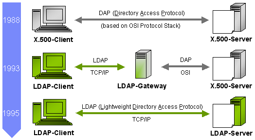
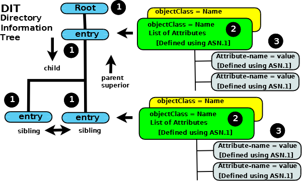

# Directory service basics

* TOC
{:toc}


### **Directory service**

A directory is a connected set of directory objects. A directory service is a service that provides operations for creating, adding, removing, and modifying the attributes associated with objects in a directory. 

The service is accessed through the JNDI interface.


**Directory Concepts**

Many naming services are extended with a directory service. A directory service associates names with objects and also allows such objects to have attributes.

A directory object (*directory entry*) represents an object in a computing environment.

**Attributes**

An attribute has an attribute identifier and a set of attribute values. An attribute identifier is a token that identifies an attribute independent of its values.

**Reverse lookup \*aka\* Searches**

Reverse Lookups in a directory service is known as a search. You can look up a directory object by supplying its name to the directory service.
When you search, you can supply not a name but a query consisting of a logical expression in which you specify the attributes that the object or objects must have.

The query is called a *search filter*. 

This style of searching is sometimes called *reverse lookup* or *content-based searching*.

**What about lookups?**

Since DirContext is derived from Context, it has all the operations corresponding to Context. You could lookup objects or subcontexts from a context.

Examples of Directory service providers:

- NT Domains: was developed by Microsoft to provide directory services for Windows machines prior to the release the LDAP-based Active Directory in Windows 2000.
- Domain Name System: (DNS), the first directory service on the Internet, which is still used everywhere today.
- Network Information Service: (NIS), was Sun Microsystems' implementation of a directory service for Unix network environments.
- LDAP: (Lightweight Directory Access Protocol), most commonly used protocol for any directory like services.


### Directory Context

Just like the Context object in a naming service we have a DirContext for directory services.

DirContext also behaves as a naming context by extending the Context interface. This means that any directory object can also provide a naming context. 

For example, a directory object for a person might contain attributes about that person as well as provide a context for naming objects, such as the person's printers and file system relative to that person directory object.

Discussions that follow will use **LDAP** as an example.


## Introduction to LDAP


LDAP is a advanced directory service provider (protocol **NOT** a product). It's more than just a service provider as you will see later.



LDAP originated from DAP(Directory Access Protocol) which was initially developed to maintain a network based directory for the email server.

LDAP protocol was later standardized in 1993 and LDAP specification came into being. The latest specification is Version 3, published as RFC 4511.

LDAP does not define how data is stored, only how it is accessed.

There are various implementations (products):

- OpenLDAP
- ApacheDS
- ActiveDirectory
- IBM Tivoli Directory Server

## LDAP data model

LDAP enabled directories use a data model that **represents** the data as a hierarchy of objects. This does not imply that LDAP is an object-oriented database. As pointed out above, LDAP itself is a protocol that allows access to an LDAP enabled service and does not define how the data is stored.

### Object Tree Structure (DIT)

Data is represented in an LDAP system as a hierarchy of objects, each of which is called an [entry](https://www.zytrax.com/books/ldap/apd/index.html#entry). 

The resulting tree structure is called a Directory Information Tree (DIT). 

The top of the tree is commonly called the [root](https://www.zytrax.com/books/ldap/apd/index.html#root) (a.k.a **base** or the **suffix**).

Each **entry** in the tree has one parent entry (object) and zero or more child entries (objects). Each child entry (object) is a sibling of its parent's other child entries.

Each entry is composed of (is an instance of) one or more [objectClasses](https://www.zytrax.com/books/ldap/apd/index.html#objectclass). 

**Objectclasses** contain zero or more [attributes](https://www.zytrax.com/books/ldap/apd/index.html#attributes). Attributes have names (and sometimes abbreviations or aliases) and typically contain data (at last!).

The characteristics (properties) of **objectClasses** and their **attributes** are described by [ASN.1](https://www.zytrax.com/books/ldap/apd/index.html#asn1) definitions.




**Summary:**

1. Each **Entry** (1) is composed of one or more **objectClasses** (2)
2. Each **objectClass** (2) has a name and is a container for attributes (its definition identifies the attributes it may or must contain)
3. Each **Attribute** (3) has a name, contains data, and is a member of one or more **objectClass(es)** (2)
4. When the DIT is populated each **entry** will be uniquely identified (relative to its parent entry) in the hierarchy by the data it contains (in its attributes which are contained in its objectClasses(es)).

### ObjectClasses

- Objectclasses are, essentially, containers for attributes and are described using [ASN.1 definitions](https://www.zytrax.com/books/ldap/ch3/#objectclasses). 

- Each **objectClass** has a unique name. There are a confusing number of pre-defined **objectclasses**, each of which contains bucket-loads of **attributes** suitable for almost all common LDAP implementations

- Objectclasses have three more characteristics:

  The objectclass defines whether an attribute member **MUST** (mandatory) be present or **MAY** (optional) be present.

  Each objectclass has a type which may be STRUCTURAL, AUXILIARY or ABSTRACT. At this stage it's enough to know that there must be one, and only one, STRUCTURAL **objectClass** in an **entry** and that there may be zero or more AUXILIARY objectClasses.

  An objectclass may be part of a hierarchy in which case it **inherits** all the characteristics of its parent objectclass(es) (including all its contained attributes).

**objectClasses** are containers and control what attributes can get added to each entry but otherwise tend to stay in the background as far as accessing and interrogating (searching) the DIT is concerned. Attributes and entries are the really visible elements.

[An incomplete browsable list of the most common **objectClasses** and their **attributes**](https://www.zytrax.com/books/ldap/ape/).

[More on objectClasses](https://www.zytrax.com/books/ldap/ch3/index.html#objectclasses) (a lot more) 

**Uniqueness:** Every name used in LDAP is unique. Each objectClass has a unique name, but it goes further than that. The unique objectClass name (or the name of any other LDAP thingy) is also a unique-in-LDAP name. 

For eg: There is an objectClass with the unique name of **person**, but it is also a unique-in-LDAP name. There is no attribute named **person** (or any other object type for that matter).

### Attributes

Each attribute has a <u>unique name (and shortform or alias)</u> and normally contains data. 

Attributes <u>are always associated with (are members of) one or more **ObjectClasses**</u>.

Attributes have a number of interesting characteristics:

1. All **attributes** are members of one, or more, **objectclass(es)**

2. Each **attribute** defines the [data type](https://www.zytrax.com/books/ldap/apa/types.html) (keyword is SYNTAX) that it may contain.

3. **Attributes** may be part of a hierarchy, in which case the child attribute inherits all the characteristics of the parent attribute. In the case of attributes a hierarchy is used to simplify and shorten the attribute definitions (in ASN.1) where many attributes share common properties such as maximum length or whether they are, or are not, case sensitive, and so on, it has no other significance.

4. **Attributes** can be optional (keyword is MAY) or mandatory (keyword is MUST) as described in the ASN.1 definitions. An **attribute** may be optional in one **objectclass** and mandatory in another. It is the **objectclass** which determines this property.

    [Try browsing here](https://www.zytrax.com/books/ldap/ape/index.html#attributes) to get a feel for this.

5. **Attributes** can be SINGLE or MULTI valued (as described in their [ASN.1 definitions](https://www.zytrax.com/books/ldap/ch3/#attributes)). 

6. **Attributes** have <u>names and sometimes an alias</u>, for example, the attribute with a name of **cn** is a member of the **objectClass** named **person** (and many others) and has an alias name of **commonName**. Either **commonName** or **cn** may be used to reference this **attribute**.

7. At <u>each level in the hierarchy the data contained in an **attribute** can be used to uniquely identify the **entry**</u>. It can be any **attribute** in the [entry](https://www.zytrax.com/books/ldap/apd/index.html#entry). It can even be a combination of two or more attributes.

   The **attribute** value(s) selected to contain the unique'ish data is sometimes called **the naming attribute(s) or the Relative Distinguished Name (RDN)** - but more on that stuff later in this section.


### Constructing and Navigating Object Tree (DIT) 

initial population of data is performed by adding entries (with their associated objectClasses and attributes) starting from the root of the DIT and progressing down the hierarchy. 

DIT is created/populated each entry will be uniquely identifiable (relative to its parent entry) in the hierarchy.

 To uniquely identify an entry we need to identify its data content.

This is done using an **attribute-name=value (or data)** format which, in the  LDAP terminology, is termed an Attribute Value Assertion (AVA).

For eg: a simple AVA like cn=John or commonName=John will be good enough to uniquely identify an entry. It is possible that cn=fred is not absolutely unique. Thus, we can choose to use a second AVA to ensure uniqueness. In this case we will keep our cn=John but add an AVA of [drink=tamarind juice](https://www.zytrax.com/books/ldap/ape/cosine.html#favouritedrink)

In this case the unique value would be written as cn=John+drink=tamarind juice. Bound to be unique.

#### Adding Entries

Adding entries may be done in a variety of ways, one of which is using **LDAP Data Interchange Files (LDIF)** . 

LDIFs are textual files that describe the tree hierarchy - the [Directory Information Tree (DIT)](https://www.zytrax.com/books/ldap/apd/index.html#dit) - and the data to be added to each attribute. The following is a simple example of an LDIF file which sets up a root DN (dc=example,dc=com) and adds a three child entries under a **people** entry.

```yaml
version: 1

## version not strictly necessary (and some implementations reject it) but generally good practice

## DEFINE DIT ROOT/BASE/SUFFIX ####
## uses RFC 2377 (domain name) format

## dcObject is an AUXILIARY objectclass and MUST
## have a STRUCTURAL objectclass (organization in this case)
# this is an ENTRY sequence and is preceded by a BLANK line

dn: dc=example,dc=com
dc: example
description: The best company in the whole world
objectClass: dcObject
objectClass: organization
o: Example, Inc.

## FIRST Level hierarchy - people 
# this is an ENTRY sequence and is preceded by a BLANK line

dn: ou=people, dc=example,dc=com
ou: people
description: All people in organisation
objectClass: organizationalUnit

## SECOND Level hierarchy - people entries 
# this is an ENTRY sequence and is preceded by a BLANK line

dn: cn=Robert Smith,ou=people,dc=example,dc=com
objectclass: inetOrgPerson
cn: Robert Smith
cn: Robert
sn: Smith
uid: rsmith
mail: robert@example.com
mail: r.smith@example.com
ou: sales

## SECOND Level hierarchy - people entries 
# this is an ENTRY sequence and is preceded by a BLANK line

dn: cn=Bill Smith,ou=people,dc=example,dc=com
objectclass: inetOrgPerson
cn: Bill Smith
cn: William
sn: Smith
uid: bsmith
mail: bill@example.com
mail: b.smith@example.com
ou: support

## SECOND Level hierarchy - people entries 
# this is an ENTRY sequence and is preceded by a BLANK line

dn: cn=John Smith,ou=people,dc=example,dc=com
objectclass: inetOrgPerson
cn: John Smith
sn: smith
uid: jsmith
mail: jim@example.com
mail: j.smith@example.com
ou: accounting
```

The lines in the above LDIF file beginning with **'dn:**' essentially tell the LDAP server how to structure or place the entry within the DIT. In general, it does not matter what attribute value is used for this purpose as long as the 'dn:' is unique. T

he above example has chosen to use "dn: cn=Robert Smith, ou=people, dc=example, dc=com" third entry in the LDIF file. It could equally have been, say, "dn: uid=rsmith, ou=people, dc=example, dc=com". 

LDAP searching can be used with any combination of attributes and can thus find entries irrespective of the 'dn:' value used to create it. 

However, if the <u>entry is going to be used for user authentication, say, logon or Single Sign-On type use, the **dn**:</u> <u>value becomes extremely important and defines the logon</u> (or Bind DN in the jargon) <u>identifie</u>r. This entry name is sometimes (especially in the context of LDAP used within Microsoft's AD) referred to as a **Principal DN** though this term is not used within the LDAP standards definitions.


#### Navigating Entries

Once the DIT tree is set up it should be possible to navigate the directory (read & search) for any writes or updates.

Note: The AVA which uniquely identifies an entry is termed the **Relative Distinguished Name** (RDN - Relative to its parent). The path from the root (a.k.a base or suffix) of the DIT to the entry is the sum of all the RDNs (joined by a , (comma) and in left to right order) is termed the **Distinguished Name** (DN).

To illustrate, in our example DIT the path from the root to the entry uniquely described by the AVA cn=Robert (RDN) would be written as **cn=Robert Smith,ou=people,dc=example,dc=com**.

Three additional points before you collapse from exhaustion.

Recall that we can use multiple AVAs to create a unique indentity so an RDN could comprise **cn=Robert Smith + uid=rsmith** (typically known as a multi-value RDN). Its equivalent DN would then be **cn=Robert Smith + uid=rsmith, ou=peope,dc=example, dc=com** (spaces or their absence between RDNs are not important).

The entry **dc=example, dc=com** apparently has two RDNs (dc=example and dc=com). This is a common and legitimate construct.

To navigate the DIT we can define a path (a DN) to the place where our data is (cn=Robert Smith, ou=people,dc=example, dc=com will take us to a unique entry) or we can define a path (a DN) to where we think our data is (say, ou=people,dc=example,dc=com) then search for the attribute=value or multiple attribute=value pairs to find our target entry (or entries). 


To know more about LDAP Referrals, Replication, objectSchemas, Attributes, etc. refer https://www.zytrax.com/books/ldap


## ApacheDS Ecosystem

ApacheDS 2.0 is an embeddable, extendable, standards compliant (adheres to all RFCs relevant to LDAPv3), modern LDAP server written entirely in Java, and available under the Apache Software License.

*Embeddable* means that it is possible to configure, start and stop ApacheDS from other Java components, especially application servers, and the server runs within the same VM.

 Nevertheless you also have the deployment option to run the server standalone.

There are other components that are optional and can be used along with ApacheDS like ApacheDS Studio, Fortress, etc.

### Installing ApacheDS

I would like to follow the binary standalone installation.

1. Download the binary
2. Open a terminal.
   Change to your downloads folder.
   Give execution rights to the installer (*chmod a+x apacheds-2.0.0.AM26-64bit.bin*).
   Run the installer (*./apacheds-2.0.0.AM26-64bit.bin*).


### Starting ApacheDS

1. Go to the installed directory
2. [Optional] Edit ApacheDS conf file 

 ```
 sudo vi /opt/apacheds-[version]/conf/wrapper.conf
 ```

3. [Optional] Add location of java:

 ```
 wrapper.java.command=/usr/bin/java
 ```

 *contains fully qualified location of target machine's java.*

4. Run `./bin/apacheds.sh start`

   ```bash
   base) INLM-JohnE:apacheds-2.0.0.AM26 johne$ ./bin/apacheds.sh start
   Using ADS_HOME:    /Users/johne/Documents/Servers/apacheds-2.0.0.AM26
   Using JAVA_HOME:   /Library/Java/JavaVirtualMachines/graalvm-ee-java11-19.3.2/Contents/Home
   
   Starting ApacheDS instance 'default'...
   ```

   

5. Install [Apache Directory Studio](http://directory.apache.org/studio/). (This is optional but will make your life a lot easier)


### Configuring ApacheDS and Studio

1. Create a connection

   - Setup connection (Note that I skipped "the setting of admin password")

     

     

   - Test connection

   - How to view all available objects and attributes within the LDAP Schema?

     Right click on connection ("local") and select Schema browser. Type in a object class to filter it out.

2. Create partitions

   **What are partitions?**

   In ApacheDS entries are stored in partitions. Each partition contains a complete entry tree, also referred to as a DIT.

    Multiple partitions may exist and the entry trees they contain are disconnected from each other, meaning that changes to entries in partition would never affect entries in partition B. 

   The entries in a particular partition are stored below some naming context called the partition suffix.

   The default implementation of partitions is based on JDBM B+Trees (but it's possible to add custom partition implementations). 

   The ApacheDS default configuration contains a a data partition with the suffix "dc=example,dc=com". The image below shows the suffixes of a freshly installed ApacheDS within Apache Directory Studio.

   

   The schema subsystem and ApacheDS itself store their information in special partitions, "ou=schema", "ou=config" and "ou=system" respectively.

   **Create partition**

   - Right click on a connection -> Open configuration

     This opens the server's configuration

   - Click advanced partions configuration and add.

     

   - As you can see, we have modified the ID and the Suffix, all the other parameters remaining to their default values.

     Notice the default objectclass (domain objectclass) used for top level entry and the other attributes generated.

     Save the configuration now, and restart the server and reopen the connection.

3. Adding entries

   The most commonly used methods are by loading a

   1. LDAP Data Interchange Format. IETF term for a textual format for loading (importing) and saving (exporting) entries into a LDAP enables directory.

      sample: https://directory.apache.org/apacheds/basic-ug/resources/apache-ds-tutorial.ldif

   2. Programmatically using a API provided by the LDAP product. In our case ApacheDS LDAP API is an ongoing effort to provide an enhanced LDAP API, as a replacement for JNDI and the existing LDAP API (jLdap and Mozilla LDAP API).

   3. Programmatically using JNDI

   4. Manually from Studio

   I will try option (d) first and later (c).

   

   Using Studio to add/modify entries:

   

   

   

   

    

4. Configuring entries in apacheds

   Though basic entries have been loaded in the above few things are missing:

   - userPassword attribute needs to be added
   - mail attribute needs to be added

   

   

### Adding Entries

The most commonly used methods are by loading a


1. LDAP Data Interchange Format. IETF term for a textual format for loading (importing) and saving (exporting) entries into a LDAP enables directory.
2. Programmatically using a API provided by the LDAP product. In our case ApacheDS LDAP API is an ongoing effort to provide an enhanced LDAP API, as a replacement for JNDI and the existing LDAP API (jLdap and Mozilla LDAP API).
3. Programmatically using JNDI


I'll try methods 1 and 3.

#### Method 1: Using IETF

Load a ldiff file using either command line or Directory Studio.

```shell
# sample.ldif
# create a entry under organization for all employees
dn: ou=employees,o=csRepository
objectclass: organizationalUnit
objectclass: top
ou: employees
```


#### Method 3: Using JNDI

Since we are focused on java, let's see how we do various operations through JNDI.

Both the JNDI and LDAP models define a hierarchical namespace in which you name objects. Each object in the namespace may have attributes that can be used to search for the object. At this high level, the two models are similar, so it is not surprising that the JNDI maps well to the LDAP.

You can think of an LDAP entry as a JNDI DirContext. Each LDAP entry contains a name and a set of attributes, as well as an optional set of child entries.


**Mapping JNDI methods to LDAP operations**


| Operation | What it does                                       | JNDI equivalent                                 |
| --------- | -------------------------------------------------- | ----------------------------------------------- |
| Search    | Search directory for matching directory entries    | DirContext.search()                             |
| Compare   | Compare directory entry to a set of attributes     | DirContext.search()                             |
| Add       | Add a new directory entry                          | DirContext.bind(),DirContext.createSubcontext() |
| Modify    | Modify a particular directory entry                | DirContext.modifyAttributes()                   |
| Delete    | Delete a particular directory entry                | Context.unbind(),Context.destroySubcontext()    |
| Rename    | Rename or modify the DN                            | Context.rename()                                |
| Bind      | Start a session with an LDAP server                | new InitialDirContext()                         |
| Unbind    | End a session with an LDAP server                  | Context.close()                                 |
| Lookup    | Find the object associated with a name             | Context.lookup()                                |
| Abandon   | Abandon an operation previously sent to the server | Context.close(),NamingEnumneration.close()      |
| Extended  | Extended operations command                        | LdapContext.extendedOperation()                 |


**Inital Steps:**

- Connect to the server

  To connect to the server, you must obtain a reference to an object that implements the DirContext interface. In most applications, this is done by using an InitialDirContext object that takes a Hashtable as an argument. The Hashtablecontains various entries, such as the hostname, port, and JNDI service provider classes to use:

  ```java
  //In the main() method of the program, create an initial directory context. 
  //This is similar to creating an initial context in the previous naming example, 
  //except that you use the constructor for InitialDirContext
  Hashtable env = new Hashtable();
  env.put(Context.INITIAL_CONTEXT_FACTORY, "com.sun.jndi.ldap.LdapCtxFactory");  
  env.put(Context.PROVIDER_URL, "ldap://localhost:10389/o=csRepository");
  DirContext ctx = new InitialDirContext(env);
  ```

- Authenticate to server

  In LDAP version 2, all clients had to authenticate while connecting, but version 3 defaults to anonymous and, if the default values are used, the connections are anonymous as well. LDAP servers maintain rights using access control lists (ACLs) that determine what particular access is available to an entry by an application. LDAP supports three different security types:

  \- Simple: Authenticates fast using plain text usernames and passwords.

  \- SSL: Authenticates with SSL encryption over the network.

  \- SASL: Uses MD5/Kerberos mechanisms. SASL is a simple authentication and security layer-based scheme

  ```java
  Hashtable env = new Hashtable();
  env.put(Context.INITIAL_CONTEXT_FACTORY, "com.sun.jndi.ldap.LdapCtxFactory");  
  env.put(Context.PROVIDER_URL, "ldap://localhost:10389/o=csRepository");
  env.put(Context.SECURITY_AUTHENTICATION,"simple");
  env.put(Context.SECURITY_PRINCIPAL,"cn=admin"); // specify the username
  env.put(Context.SECURITY_CREDENTIALS,"password"); // specify the password
  DirContext ctx = new InitialDirContext(env);
  ```


### Operations on LDAP

Note that the examples that follow doesn't use any authentication. All operations are done as anonymous user.


#### LDAP Operation: Read selected attributes

```java
import javax.naming.Context;
import javax.naming.NamingException;
import javax.naming.directory.Attributes;
import javax.naming.directory.DirContext;
import javax.naming.directory.InitialDirContext;

try {
 //In the main() method of the program, create an initial directory context. 
 //This is similar to creating an initial context in the previous naming example, 
 //except that you use the constructor for InitialDirContext
 Hashtable env = new Hashtable();
 env.put(Context.INITIAL_CONTEXT_FACTORY, "com.sun.jndi.ldap.LdapCtxFactory");   env.put(Context.PROVIDER_URL, "ldap://localhost:10389/o=csRepository");
 
 DirContext ctx = new InitialDirContext(env);
   
 // Ask for all attributes of the object 
    Attributes attrs = ctx.getAttributes("cn=John Eipe, ou=employees");
     
    // Find the surname attribute ("sn") and print it
    System.out.println("sn: " + attrs.get("sn").get());
    System.out.println("mail: " + attrs.get("mail").get());
 }catch(NamingException e){
  e.printStackTrace();
 }
```


#### LDAP Operation: Read all attributes


```java
import javax.naming.Context;
import javax.naming.NamingEnumeration;
import javax.naming.NamingException;
import javax.naming.directory.Attribute;
import javax.naming.directory.Attributes;
import javax.naming.directory.DirContext;
import javax.naming.directory.InitialDirContext;
.....
  try {
   //In the main() method of the program, create an initial directory context. 
   //This is similar to creating an initial context in the previous naming example, 
   //except that you use the constructor for InitialDirContext
   Hashtable env = new Hashtable();
   env.put(Context.INITIAL_CONTEXT_FACTORY,
       "com.sun.jndi.ldap.LdapCtxFactory");
   env.put(Context.PROVIDER_URL, "ldap://localhost:10389/o=csRepository");
 
   DirContext ctx = new InitialDirContext(env);
   
   // Ask for all attributes of the object 
      Attributes attrs = ctx.getAttributes("cn=John Eipe, ou=employees");
     
      // Iterate and print all values
      for (NamingEnumeration ae = attrs.getAll(); ae.hasMore();) {
          Attribute attr = (Attribute)ae.next();
          System.out.println("attribute: " + attr.getID());
          /* Print each value */
          for (NamingEnumeration e = attr.getAll(); e.hasMore();
        System.out.println("value: " + e.next()));
      }
  }catch(NamingException e){
   e.printStackTrace();
  }
......
```


#### LDAP Operation: Modify attributes

One way to modify the attributes of an object is to supply a list of modification requests ( ModificationItem). Each ModificationItem consists of a numeric constant indicating the type of modification to make and an Attribute describing the modification to make. Following are the three types of modifications:
ADD_ATTRIBUTE
REPLACE_ATTRIBUTE
REMOVE_ATTRIBUTE
Modifications are applied in the order in which they appear in the list. Either all of the modifications are executed, or none are.


```java
import java.util.Hashtable;
import javax.naming.Context;
import javax.naming.NamingException;
import javax.naming.directory.BasicAttribute;
import javax.naming.directory.DirContext;
import javax.naming.directory.InitialDirContext;
import javax.naming.directory.ModificationItem;
....
try {
 //In the main() method of the program, create an initial directory context. 
 //This is similar to creating an initial context in the previous naming example, 
 //except that you use the constructor for InitialDirContext
 Hashtable env = new Hashtable();
 env.put(Context.INITIAL_CONTEXT_FACTORY,
  "com.sun.jndi.ldap.LdapCtxFactory");
 env.put(Context.PROVIDER_URL, "ldap://localhost:10389/o=csRepository");

 DirContext ctx = new InitialDirContext(env);
 
 String dn = "cn=John Eipe, ou=employees";
 
 // Specify the changes to make
 ModificationItem[] mods = new ModificationItem[2];

 // Replace the "mail" attribute with a new value
 mods[0] = new ModificationItem(DirContext.REPLACE_ATTRIBUTE,
  new BasicAttribute("mail", "ldapemail@mail.com"));

 // Add an additional value to "telephonenumber"
 mods[1] = new ModificationItem(DirContext.ADD_ATTRIBUTE,
  new BasicAttribute("telephonenumber", "+918939302763"));

 // Perform the requested modifications on the named object
 ctx.modifyAttributes(dn, mods);
 
}catch(NamingException e){
 e.printStackTrace();
}
.....
```


Another way to make modifications is to use the overloaded method,

```java
void modifyAttributes(Name name,
int mod_op,
Attributes attrs)
throws NamingException
name - the name of the object whose attributes will be updated
mod_op - the modification operation, one of: ADD_ATTRIBUTE, REPLACE_ATTRIBUTE, REMOVE_ATTRIBUTE.
attrs - the attributes to be used for the modification; may not be null
```


#### LDAP Operation: Searching directory

The search functionality is like reverse lookup meaning, you can compose a query consisting of attributes of entries that you are seeking and submit that query to the directory. The directory then returns a list of entries that satisfy the query.

**Basic Search**

The simplest form of search requires that you specify the set of attributes that an entry must have and the name of the target context in which to perform the search.


```java
try {
 //In the main() method of the program, create an initial directory context. 
 //This is similar to creating an initial context in the previous naming example, 
 //except that you use the constructor for InitialDirContext
 Hashtable env = new Hashtable();
 env.put(Context.INITIAL_CONTEXT_FACTORY,
  "com.sun.jndi.ldap.LdapCtxFactory");
 env.put(Context.PROVIDER_URL, "ldap://localhost:10389/o=csRepository");

 DirContext ctx = new InitialDirContext(env);
 
 // Specify the attributes to match
 // Ask for objects that has a surname ("sn") attribute with 
 // the value "Jacky" and the "mail" attribute
 Attributes matchAttrs = new BasicAttributes(true); // ignore attribute name case
 matchAttrs.put(new BasicAttribute("sn", "Jacky"));
 matchAttrs.put(new BasicAttribute("mail"));

 // Search for objects that have those matching attributes
 NamingEnumeration answer = ctx.search("ou=employees", matchAttrs);
 
 while (answer.hasMore()) {
  SearchResult sr = (SearchResult)answer.next();
  System.out.println("Name: " + sr.getName());
  System.out.println("Email: "+ sr.getAttributes().get("mail"));
  
 }
}catch(NamingException e){
 e.printStackTrace();
}
```


Output:

Name: cn=Jack Sparrow
Email: mail: jacksparrow@gmail.com


**Search Filters**

In addition to specifying a search using a set of attributes, you can specify a search in the form of a search filter. A search filter is a search query expressed in the form of a logical expression. The syntax of search filters accepted by DirContext.search() is described in RFC 2254.


```java
try {
 //In the main() method of the program, create an initial directory context. 
 //This is similar to creating an initial context in the previous naming example, 
 //except that you use the constructor for InitialDirContext
 Hashtable env = new Hashtable();
 env.put(Context.INITIAL_CONTEXT_FACTORY,
  "com.sun.jndi.ldap.LdapCtxFactory");
 env.put(Context.PROVIDER_URL, "ldap://localhost:10389/o=csRepository");

 DirContext ctx = new InitialDirContext(env);
 
 // Create the default search controls
 SearchControls ctls = new SearchControls();

 // Specify the search filter to match
 // Ask for objects that have the attribute "sn" == "Jacky"
 // and the "mail" attribute
 String filter = "(&(sn=Jacky)(mail=*))";

 // Search for objects using the filter
 NamingEnumeration answer = ctx.search("ou=employees", filter, ctls);
 
 
 while (answer.hasMore()) {
  SearchResult sr = (SearchResult)answer.next();
  System.out.println("Name: " + sr.getName());
  System.out.println("Email: "+ sr.getAttributes().get("mail"));
  
 }
}catch(NamingException e){
 e.printStackTrace();
}
```


I get the same output as above.

**Quick Overview of Search Filter Syntax**

The search filter syntax is basically a logical expression in prefix notation (that is, the logical operator appears before its arguments). The following table lists the symbols used for creating filters.


| **Symbol** | **Description**                                              |
| ---------- | ------------------------------------------------------------ |
| &          | conjunction (i.e., *and* -- all in list must be true)        |
| \|         | disjunction (i.e., *or* -- one or more alternatives must be true) |
| !          | negation (i.e., *not* -- the item being negated must not be true) |
| =          | equality (according to the matching rule of the attribute)   |
| ~=         | approximate equality (according to the matching rule of the attribute) |
| >=         | greater than (according to the matching rule of the attribute) |
| <=         | less than (according to the matching rule of the attribute)  |
| =*         | presence (i.e., the entry must have the attribute but its value is irrelevant) |
| *          | wildcard (indicates zero or more characters can occur in that position); used when specifying attribute values to match |
| \          | escape (for escaping '*', '(', or ')' when they occur inside an attribute value) |


**Returning Selected Attributes**

The previous example returned all attributes associated with the entries that satisfy the specified filter. You can select the attributes to return by setting the search controls argument. You create an array of attribute identifiers that you want to include in the result and pass it to SearchControls.setReturningAttributes()

```java
// Specify the ids of the attributes to return
String[] attrIDs = {"sn", "telephonenumber", "golfhandicap", "mail"};
SearchControls ctls = new SearchControls();
ctls.setReturningAttributes(attrIDs);
//The entry does not have a "golfhandicap" attribute, so it is not returned when you perform search but this does //not cause any exception
```


**More about SearchControls**

You can use SearchControl to control other aspects of the search too.
Following are the available controls:


1. The attributes to return
2. The scope in which the search is to occur
3. The maximum number of entries to return
4. The maximum number of milliseconds to wait
5. Whether to return the Java object associated with the entry
6. Whether JNDI links are dereferenced during the search


**1. Specify attributes to return**

```java
// Specify the ids of the attributes to return
String[] attrIDs = {"sn", "telephonenumber", "golfhandicap", "mail"};
SearchControls ctls = new SearchControls();
ctls.setReturningAttributes(attrIDs);
//The entry does not have a "golfhandicap" attribute, so it is not returned when you perform search but this does //not cause any exception
```


**2. Specify the scope**

The default SearchControls specifies that the search is to be performed in the named context SearchControls.ONELEVEL_SCOPE. It searches only one level of the named context.


| Symbol | Description                                                  |
| ------ | ------------------------------------------------------------ |
| &      | conjunction (i.e., *and* -- all in list must be true)        |
| \|     | disjunction (i.e., *or* -- one or more alternatives must be true) |
| !      | negation (i.e., *not* -- the item being negated must not be true) |
| =      | equality (according to the matching rule of the attribute)   |
| ~=     | approximate equality (according to the matching rule of the attribute) |
| >=     | greater than (according to the matching rule of the attribute) |
| <=     | less than (according to the matching rule of the attribute)  |
| =*     | presence (i.e., the entry must have the attribute but its value is irrelevant) |
| *      | wildcard (indicates zero or more characters can occur in that position); used when specifying attribute values to match |
| \      | escape (for escaping '*', '(', or ')' when they occur inside an attribute value) |


`SUBTREE_SCOPE`Starts at the base entry; searches the base entry and everything below it`ONELEVEL_SCOPE`Searches only the entries below the base entry`OBJECT_SCOPE`Searches only the base entry; useful if you need to get attributes/value pair of just one entry

**Different levels of scope**


 **Figure 7. Searchbase: o=myserver.com **

**Scope=LDAP_SCOPE_SUBTREE**


 **Figure 7a. Searchbase: ou=people, o=myserver.com Scope=LDAP_SCOPE_ONE_LEVEL**


 **Figure 7b. Searchbase :uid=styagi,ou=people,o=myserver.com Scope= LDAP_SCOPE_ONE_LEVEL**


```java
try {
 //In the main() method of the program, create an initial directory context. 
 //This is similar to creating an initial context in the previous naming example, 
 //except that you use the constructor for InitialDirContext
 Hashtable env = new Hashtable();
 env.put(Context.INITIAL_CONTEXT_FACTORY,
   "com.sun.jndi.ldap.LdapCtxFactory");
  env.put(Context.PROVIDER_URL, "ldap://localhost:10389/o=csRepository");

 DirContext ctx = new InitialDirContext(env);
  
 // Specify the ids of the attributes to return
 String[] attrIDs = {"sn", "telephonenumber", "golfhandicap", "mail"};
 SearchControls ctls = new SearchControls();
 ctls.setReturningAttributes(attrIDs);
 ctls.setSearchScope(SearchControls.SUBTREE_SCOPE);

 // Specify the search filter to match
 // Ask for objects that have the attribute "sn" == "Jacky"
 // and the "mail" attribute
 String filter = "(&(sn=Jacky)(mail=*))";
j
 // Search the subtree for objects by using the filter
 NamingEnumeration answer = ctx.search("", filter, ctls);
  
  
 while (answer.hasMore()) {
     SearchResult sr = (SearchResult)answer.next();
   System.out.println("Name: " + sr.getName());
   System.out.println("Email: "+ sr.getAttributes().get("mail"));
   
  }
}catch(NamingException e){
 e.printStackTrace();
}
```


**3. Count Limit**

Sometimes, a query might produce too many answers and you want to limit the number of answers returned. You can do this by using the count limit search control.

```java
// Set the search controls to limit the count to 1
SearchControls ctls = new SearchControls();
ctls.setCountLimit(1);
```


**4. Time Limit**
A time limit on a search places an upper bound on the amount of time that the search operation will block waiting for the answers. This is useful when you don't want to wait too long for an answer.

```java
// Set the search controls to limit the time to 1 second (1000 ms)
SearchControls ctls = new SearchControls();
ctls.setTimeLimit(1000);
```


#### LDAP Operation: Creating sub-Context with attributes (aka LDAP entry)

Let's try to create a sub-context under "o=csRepository" called "Contractors".

```java
try {
 //In the main() method of the program, create an initial directory context. 
 //This is similar to creating an initial context in the previous naming example, 
 //except that you use the constructor for InitialDirContext
 Hashtable env = new Hashtable();
 env.put(Context.INITIAL_CONTEXT_FACTORY,
  "com.sun.jndi.ldap.LdapCtxFactory");
 env.put(Context.PROVIDER_URL, "ldap://localhost:10389/o=csRepository");

   // Create the initial context
 DirContext ctx = new InitialDirContext(env);

 // Create attributes to be associated with the new context
 Attributes attrs = new BasicAttributes(true); // case-ignore
 Attribute objclass = new BasicAttribute("objectclass");
 objclass.add("top");
 objclass.add("organizationalUnit");
 attrs.put(objclass);

 // Create the context
 Context result = ctx.createSubcontext("ou=Contractors", attrs);

 // Check that it was created by listing its parent
 NamingEnumeration list = ctx.list("");

 // Go through each item in list
 while (list.hasMore()) {
  NameClassPair nc = (NameClassPair)list.next();
  System.out.println(nc);
 }

 // Close the contexts when we're done
 result.close();
 ctx.close();
}catch(NamingException e){
 e.printStackTrace();
}
```


Output:

ou=Contractors: javax.naming.directory.DirContext
ou=employees: javax.naming.directory.DirContext

#### LDAP Operation: Dynamically bind a object to a name in DirContext

The LDAP directory server can act as a repository for Java objects. JNDI provides an object-oriented view of this directory, which means that Java objects can be added to and retrieved from the directory without the client needing to manage data representation issues.

Objects can be stored in three ways:

1. Store the Java objects themselves
2. Store a reference to the object
3. Store information as attributes


##### LDAP Operation: Store Java objects themselves

We proceed the same way we did for naming services.

We will instantiate and store Staff.


```java
import java.io.Serializable;
public class Staff implements Serializable {
String msg;
public void setMsg(String msg){
this.msg = msg;
}
public String toString() {
return msg;
}
}
```


Main code:


```java
try {
//In the main() method of the program, create an initial directory context. 
//This is similar to creating an initial context in the previous naming example, 
//except that you use the constructor for InitialDirContext
Hashtable env = new Hashtable();
env.put(Context.INITIAL_CONTEXT_FACTORY,
"com.sun.jndi.ldap.LdapCtxFactory");
env.put(Context.PROVIDER_URL, "ldap://localhost:10389/o=csRepository");

// Create the initial context
DirContext ctx = new InitialDirContext(env);

// Create attributes to be associated with the new context
Attributes attrs = new BasicAttributes(true); // case-ignore
Attribute objclass = new BasicAttribute("objectclass");
objclass.add("top");
objclass.add("organizationalUnit");
//use codebase if necessary
//Attribute codebase = new BasicAttributes("javaCodebase", locationtoclassfile);
//attrs.put(codebase);
attrs.put(objclass);

Staff staff = new Staff();
staff.setMsg("hello Staffs");

// Perform bind
ctx.bind("ou=Staff", staff, attrs);

// Check that it is bound
Staff obj = (Staff)ctx.lookup("ou=Staff");

System.out.println(obj);
ctx.close();
}catch(NamingException e){
e.printStackTrace();
}
```


Note each entry in DIT always has one parent entry (except for the DIT root) and zero or more child entries (objects).
An entry must comprise one (and only one) STRUCTURAL objectClass but may contain any number of AUXILIARY objectClasses.
The data content of an entry consist of one or more attributes one (or more) of which is (are) used as the naming attribute
(more correctly the RDN) to uniquely identify this object in the DIT.

So in this case,
I choose organizationalUnit as my STRUCTURAL objectClass, top as ABSTRACT objectClass and no auxillary objectClass.

You could select any STRUCTURAL, AUXILARY or ABSTRACT objectClasses as long as it's defined in the LDAP schema.

Use the Schema browser to verify/select.


Note that ou and objectClass are MUST attributes.
We need not specify an objectClass for builtin objectClasses. But we do specify ou while binding.

```
ctx.bind("ou=Staff", staff, attrs);
```


Output:

hello Staffs


When a serialized object is bound in the directory as shown in the previous example, applications that read the serialized object from the directory must have access to the class definitions necessary to deserialize the object. Alternatively, you can record a codebase with the serialized object in the directory, either when you bind the object or subsequently by adding an attribute by using DirContext.modifyAttributes().

You can use any attribute to record this codebase and have your application read that attribute from the directory and use it appropriately. Or you can use the "*javaCodebase*" attribute specified in RFC 2713.

In the latter case, Sun's LDAP service provider will automatically use the attribute to load the class definitions as needed. "*javaCodebase*" should contain the URL of a codebase directory or a JAR file. (Note that JAR files work only with the Java 2 platform). If the codebase contains more than one URL, then each URL must be separated by a space character.


##### LDAP Operation: Store a reference to object

We proceed the same way we did for naming service.

```java
package sample;
import javax.naming.NamingException;
import javax.naming.Reference;
import javax.naming.Referenceable;
import javax.naming.StringRefAddr;

public class Student implements Referenceable {
String msg;
public void setMsg(String msg){
this.msg = msg;
}
public Reference getReference() throws NamingException {
return new Reference(
Student.class.getName(), 
new StringRefAddr("msg", msg), 
StudentFactory.class.getName(),
null);          // factory location
}

public String toString() {
return msg;
}
}
```


Factory implementation:


```java
package sample;

import java.util.Hashtable;
import javax.naming.Context;
import javax.naming.Name;
import javax.naming.RefAddr;
import javax.naming.Reference;
import javax.naming.spi.ObjectFactory;

public class StudentFactory implements ObjectFactory {
public Object getObjectInstance(Object obj, Name name, Context ctx,
Hashtable env) throws Exception {
if (obj instanceof Reference) {
Reference ref = (Reference) obj;
if (ref.getClassName().equals(Student.class.getName())) {
RefAddr addr = ref.get("msg");
if (addr != null) {
Student s = new Student();
s.setMsg((String) addr.getContent());
return s;

}
}
}
return null;
}
}
```


Main code:

```java
try {
//In the main() method of the program, create an initial directory context. 
//This is similar to creating an initial context in the previous naming example, 
//except that you use the constructor for InitialDirContext
Hashtable env = new Hashtable();
env.put(Context.INITIAL_CONTEXT_FACTORY,
"com.sun.jndi.ldap.LdapCtxFactory");
env.put(Context.PROVIDER_URL, "ldap://localhost:10389/o=csRepository");

// Create the initial context
DirContext ctx = new InitialDirContext(env);

// Create attributes to be associated with the new context
Attributes attrs = new BasicAttributes(true); // case-ignore
Attribute objclass = new BasicAttribute("objectclass");
objclass.add("top");
objclass.add("organizationalUnit");
attrs.put(objclass);

Student student = new Student();
student.setMsg("hello World");

// Perform bind
ctx.bind("ou=Students", student, attrs);

// Check that it is bound
Student obj = (Student)ctx.lookup("ou=Students");

System.out.println(obj);

ctx.close();
}catch(NamingException e){
e.printStackTrace();
}
```


Output:

hello World


##### LDAP Operation: Store information as attributes

The last technique to store non-serializable and non-referenceable objects involves storing attributes rather than the object or a reference to the object. If the bound object implements the DirContext interface, the LDAP ADD operation extracts and stores the object's attributes.

This technique doesn't store the actual object, but rather stores the attributes inside that object.
Consider this User class,

```java
public class User {
 String employer;
 public User(String employer){
  this.employer = employer;
 }
}
```


To store a instance of User using this technique we make User a DirContext by implementing DirContext interface.

```java
public class User implements DirContext {
 String employer;
 Attributes myAttrs;

 public User(String employer){
    this.employer = employer;
    myAttrs = new BasicAttributes(true);
    Attribute objclass = new BasicAttribute("objectclass");
    objclass.add("organizationalUnit"); 
    objclass.add("top");
    objclass.add("extensibleObject");

   
    myAttrs.put(objclass);
        myAttrs.put("name", employer);
       
       
    }
 @Override
 public Attributes getAttributes(String name) throws NamingException {
  if (!name.equals("")) {
   throw new NameNotFoundException();
  }
  return (Attributes) myAttrs.clone();
 }
 @Override
 public Attributes getAttributes(Name name) throws NamingException {
  return getAttributes(name.toString());
 }
 @Override
 public Attributes getAttributes(String name, String[] ids)
   throws NamingException {
  if (!name.equals(""))
   throw new NameNotFoundException();
  Attributes answer = new BasicAttributes(true);
  Attribute target;
  for (int i = 0; i < ids.length; i++) {
   target = myAttrs.get(ids[i]);
   if (target != null) {
    answer.put(target);
   }
  }
  return answer;
 }
 @Override
 public Attributes getAttributes(Name name, String[] ids)
   throws NamingException {
  return getAttributes(name.toString(), ids);
 }
 // other methods
}
```

Note that we chose a AUXILARY object - "*extensibleObject*". ExtensibleObject gives you a whole range of attributes (almost all from LDAP schema) to create a custom Object of your taste. Note that I used a optional attribute "name" to store employer.


Now the factory implementation,

```java
public class UserFactory implements DirObjectFactory {

 public UserFactory() {
 }

 @SuppressWarnings("rawtypes")
 public Object getObjectInstance(Object obj, Name name, Context ctx,
   Hashtable env, Attributes inAttrs) throws Exception {
  System.out.println("UserFactory.getObjectInstance");
  if (obj instanceof DirContext) {
   try {
    Attribute dt;
    if (inAttrs != null && (dt = inAttrs.get("name")) != null) {
     String employer = (String) dt.get();
     return new User(employer);
    }
   } catch (NamingException e) {
    // debug
    System.err.println(e);
    e.printStackTrace();
   }
  }

  // return null to indicate other factories should be tried
  return null;
 }

 public Object getObjectInstance(Object obj, Name name, Context ctx,
   Hashtable env) throws Exception {
  return getObjectInstance(obj, name, ctx, env, null);
 }
}
```

And now the test class,

```java
try {
 //In the main() method of the program, create an initial directory context. 
 //This is similar to creating an initial context in the previous naming example, 
 //except that you use the constructor for InitialDirContext
 Hashtable env = new Hashtable();
 env.put(Context.INITIAL_CONTEXT_FACTORY,
  "com.sun.jndi.ldap.LdapCtxFactory");
 env.put(Context.PROVIDER_URL, "ldap://localhost:10389/o=csRepository");
 env.put(Context.OBJECT_FACTORIES, "sample.UserFactory");
 // Create the initial context
 DirContext ctx = new InitialDirContext(env);
 
 User usr = new User("Goro");
 ctx.rebind("ou=Kill Bill, ou=employees", null, usr.getAttributes(""));
 //Check that it is bound
 User obj = (User)ctx.lookup("ou=Kill Bill, ou=employees");

 System.out.println(obj);
 ctx.close();
}catch(NamingException e){
 e.printStackTrace();
}
```

Output:

UserFactory.getObjectInstance sample.User@4bd66d2femployer: Goro


#### LDAP Operation: Delete sub-Context (aka LDAP entry)

Context consists of a set of name-to-object bindings. The subcontext represents the context under that context in the LDAP tree. We can delete any bound objects by destroying the subcontext. The converse, however, is not true -- that is, creating a subcontext with theDirContext.createSubcontext() method doesn't add any objects.

The Context.unbind() method produces the same output, but also works under a clustered naming system in which a context from one naming system may be bound to a name in another.
The unbind() method succeeds in removing this foreign context. (A foreign context is by definition not a subcontext of the context in which it is bound). Deleting objects works only for leaves in the tree; if tried on a node, JNDI will throw a ContextNotEmptyException.


### State Factories

If object factories are used to convert objects from the service provider into Java objects then state factories are for converting java objects to objects for the underlying naming service or directory.

A service provider comes pre-configured with certain state factories and that's why we are able to store java objects into the naming/directory service.

Here is the working example from oracle tutorial.


```java
/**
  * This class is used by the custom state/object factories example.
  * It is represents a Person object, which is represented in
  * an LDAP directory using the following schema:
  * ( 2.5.6.6 NAME 'person' SUP top STRUCTURAL MUST ( sn $ cn )
  *   MAY ( userPassword $ telephoneNumber $ seeAlso $ description ) )
  */
public class Person {
 public String surname;
 public String commonName;
 public String passwd;
 public String phone;
 public String seeAlso;
 public String desc;

 public Person(String sn, String cn) {
  this(sn, cn, null, null, null, null);
 }

 public Person(String sn, String cn, String pw, String ph, String see,
   String d) {
  surname = sn;
  commonName = cn;
  passwd = pw;
  phone = ph;
  seeAlso = see;
  desc = d;
 }

 public String toString() {
  return "My name is " + surname + ", " + commonName + ".";
 }
}
```


DirObjectFactory implementation,


```java
import javax.naming.*;
import javax.naming.directory.*;
import javax.naming.spi.DirObjectFactory;
import java.util.Hashtable;

/**
 * This is an object factory that returns a Person object given an Attributes
 * containing a person object class.
 */
public class PersonObjectFactory implements DirObjectFactory {
 public PersonObjectFactory() {
 }

 // DirObjectFactory version
 public Object getObjectInstance(Object obj, Name name, Context ctx,
   Hashtable env, Attributes attrs) throws Exception {

  // Only interested in Attributes with person objectclass
  // System.out.println("object factory: " + attrs);
  Attribute oc = (attrs != null ? attrs.get("objectclass") : null);
  if (oc != null && oc.contains("person")) {
   Attribute attr;
   String passwd = null;

   // Extract password
   attr = attrs.get("userPassword");
   if (attr != null) {
    passwd = new String((byte[]) attr.get());
   }

   Person per = new Person(
     (String) attrs.get("sn").get(),
     (String) attrs.get("cn").get(),
     passwd,
     (attr = attrs.get("telephoneNumber")) != null ? (String) attr
       .get() : null,
     (attr = attrs.get("seealso")) != null ? (String) attr.get()
       : null,
     (attr = attrs.get("description")) != null ? (String) attr
       .get() : null);

   return per;
  }
  return null;
 }

 // ObjectFactory version
 public Object getObjectInstance(Object obj, Name name, Context ctx,
   Hashtable env) throws Exception {

  // Don't do anything if we can't see the attributes
  return null;
 }
}
```


DirStateFactory implementation,


```java
import javax.naming.*;
import javax.naming.directory.*;
import javax.naming.spi.DirStateFactory;
import java.util.Hashtable;

/**
 * This is a state factory that when given a Person object, returns an
 * Attributes representing the object.
 */
public class PersonStateFactory implements DirStateFactory {
 public PersonStateFactory() {
 }

 // DirStateFactory version
 public DirStateFactory.Result getStateToBind(Object obj, Name name,
   Context ctx, Hashtable env, Attributes inAttrs)
   throws NamingException {

  // Only interested in Person objects
  if (obj instanceof Person) {

   Attributes outAttrs;
   if (inAttrs == null) {
    outAttrs = new BasicAttributes(true);
   } else {
    outAttrs = (Attributes) inAttrs.clone();
   }

   // Set up object class
   if (outAttrs.get("objectclass") == null) {
    BasicAttribute oc = new BasicAttribute("objectclass", "person");
    oc.add("top");
    outAttrs.put(oc);
   }

   Person per = (Person) obj;
   // mandatory attributes
   if (per.surname != null) {
    outAttrs.put("sn", per.surname);
   } else {
    throw new SchemaViolationException("Person must have surname");
   }
   if (per.commonName != null) {
    outAttrs.put("cn", per.commonName);
   } else {
    throw new SchemaViolationException(
      "Person must have common name");
   }

   // optional attributes
   if (per.passwd != null) {
    outAttrs.put("userPassword", per.passwd);
   }
   if (per.phone != null) {
    outAttrs.put("telephoneNumber", per.phone);
   }
   if (per.seeAlso != null) {
    outAttrs.put("seeAlso", per.seeAlso);
   }
   if (per.desc != null) {
    outAttrs.put("description", per.desc);
   }

   // System.out.println("state factory: " + outAttrs);
   return new DirStateFactory.Result(null, outAttrs);
  }
  return null;
 }

 // StateFactory version
 public Object getStateToBind(Object obj, Name name, Context ctx,
   Hashtable env) throws NamingException {

  // non-Attributes version not relevant here
  return null;
 }
}
```


Test code,


```java
// Set up environment for creating initial context
Hashtable env = new Hashtable();
env.put(Context.INITIAL_CONTEXT_FACTORY,
  "com.sun.jndi.ldap.LdapCtxFactory");
env.put(Context.PROVIDER_URL, "ldap://localhost:10389/o=csRepository");
env.put(Context.OBJECT_FACTORIES, "sample.PersonObjectFactory");
env.put(Context.STATE_FACTORIES, "sample.PersonStateFactory");

try {
 // Create the initial context
 DirContext ctx = new InitialDirContext(env);

 // Create object to be bound
 Person john = new Person("Smith", "John Smith");

 // Perform bind
 ctx.rebind("cn=John Smith, ou=employees", john);

 // Read object back
 Person john2 = (Person) ctx.lookup("cn=John Smith, ou=employees");
 System.out.println(john2);

 // Close the context when we're done
 ctx.close();
} catch (NamingException e) {
 System.out.println("Operation failed: " + e);
}
```


Ouput:

My name is Smith, John Smith.


### Events and Listeners

A listener in the JNDI is represented by the NamingListener interface.

The NamingListener interface not only serves as the root interface but also specifies how a registered listener is to be notified of errors. It defines a single method: namingExceptionThrown(). This method is invoked by the service provider when an error occurs while the provider is collecting data for generating events that the listener is seeking. For example, the server might have gone offline or cannot collect any more data in that part of the directory.

NamespaceChangeListener handles events that affect the namespace, including the addition, removal, and renaming of an object.
ObjectChangeListener handles events that affect an object's contents, for example, if an object's binding has been replaced with another or one of an object's attributes has been removed or replaced.

Here is a sample from oracle tutorial:

```java
import javax.naming.event.NamespaceChangeListener;
import javax.naming.event.ObjectChangeListener;
import javax.naming.event.NamingEvent;
import javax.naming.event.NamingExceptionEvent;
import java.util.Hashtable;

/**
  * A sample NamespaceChangeListener and ObjectChangeListener 
  */
public class SampleListener 
implements NamespaceChangeListener, ObjectChangeListener {
    private String id;

    public SampleListener(String id) {
 this.id = id;
    }

    public void objectAdded(NamingEvent evt) {
 System.out.println(id + ">>> added: " + evt.getNewBinding());
    }
    public void objectRemoved(NamingEvent evt) {
 System.out.println(id + ">>> removed: " + evt.getOldBinding());
    }

    public void objectRenamed(NamingEvent evt) {
 System.out.println(id + ">>> renamed: " + evt.getNewBinding() + " from " +
     evt.getOldBinding());
    }

    public void objectChanged(NamingEvent evt) {
 System.out.println(id + ">>> object changed: " + evt.getNewBinding() +
     " from " + evt.getOldBinding());
    }

    public void namingExceptionThrown(NamingExceptionEvent evt) {
 System.out.println(id + ">>> SampleNCListener got an exception");
 evt.getException().printStackTrace();
    }
}
```


To receive event notifications, a listener registers with an event source.
In the JNDI, the event sources implement either the EventContext or EventDirContext interface. To get an event source, you must look it up using the naming/directory service. That is, you perform a lookup() on an object and then cast the result to an EventContext or EventDirContext. Whether a context supports either of these interfaces is optional. A context that supports neither does not support event notification.

Below is an example for registering Namespace change listener.


```java
import javax.naming.event.NamespaceChangeListener;
import javax.naming.event.NamingEvent;
import javax.naming.event.NamingExceptionEvent;
import java.util.Hashtable;

/**
  * A sample NamespaceChangeListener. 
  */
public class SampleNCListener implements NamespaceChangeListener {
    private String id;

    public SampleNCListener(String id) {
 this.id = id;
    }

    public void objectAdded(NamingEvent evt) {
 System.out.println(id + ">>> added: " + evt.getNewBinding());
    }
    public void objectRemoved(NamingEvent evt) {
 System.out.println(id + ">>> removed: " + evt.getOldBinding());
    }

    public void objectRenamed(NamingEvent evt) {
 System.out.println(id + ">>> renamed: " + evt.getNewBinding() + " from " +
     evt.getOldBinding());
    }

    public void namingExceptionThrown(NamingExceptionEvent evt) {
 System.out.println(id + ">>> SampleNCListener got an exception");
 evt.getException().printStackTrace();
    }
}
```


Test class,


```java
import javax.naming.*;
import javax.naming.event.*;
import java.util.Hashtable;

/**
  * Demonstrates how to register a namespace change listener.
*/
class RegNSChanges {
    public static void main(String[] args) {

 // Set up environment for creating initial context
 Hashtable env = new Hashtable(11);
 env.put(Context.INITIAL_CONTEXT_FACTORY, 
     "com.sun.jndi.ldap.LdapCtxFactory");
 env.put(Context.PROVIDER_URL, "ldap://localhost:389/o=JNDItutorial");

 try {
     // Get event context for registering listener
     EventContext ctx = (EventContext)
  (new InitialContext(env).lookup("ou=People"));

     // Create listener
     NamingListener listener = new SampleNCListener("nc1");

     // Register listener for namespace change events
     ctx.addNamingListener("ou=Objects,cn=Rosanna Lee", 
  EventContext.ONELEVEL_SCOPE, listener);

     // Create a separate to make some changes
     new Updater(env, "ou=Objects, cn=Rosanna Lee, ou=People").start();

     // Wait 1 minutes for listener to receive events
     try {
  Thread.sleep(60000);
     } catch (InterruptedException e) {
  System.out.println("sleep interrupted");
     }

     // Not strictly necessary if we're going to close context anyhow
     ctx.removeNamingListener(listener);

     // Close context when we're done
     ctx.close();

 } catch (NamingException e) {
     e.printStackTrace();
 }
    }

    /**
     * Helper thread that updates the namespace.
     */
    static class Updater extends Thread {
 private Hashtable env;
 private String target;

 Updater(Hashtable env, String target) {
     super();
     this.env = (Hashtable)env.clone();
     this.target = target;
     setDaemon(true);  // non-user thread
 }

 public void run() {
     try {
  // Get target context in which to make changes
  Context ctx = (Context)new InitialContext(env).lookup(target);

  // Add an entry to the namespace
  ctx.bind("cn=TestObject", "How are you?");

  // Rename entry 
  ctx.rename("cn=TestObject", "cn=TestingObj");

  // Remove entry
  ctx.unbind("cn=TestingObj");

  // Close context when we're done
  ctx.close();
     } catch (NamingException e) {
  System.out.println("Updater failed");
  e.printStackTrace(System.out);
     }
 }
    }
}
```


###  Real Time Scenario - Configuring LDAP authentication

How to authenticate a user by uid and password?

If you want to use simple binds with user DN and password within a Java component, in order to authenticate users programatically, in practice one problem arises: Most users do not know their DN. Therefore they will not be able to enter it.


It would be easier for a user if s/he only has to provide a short, unique ID and the password. And that's how most websites handle it.

Let's see how to authenticate a user who provides John Eipe/qwer1234 instead of cn=John Eipe, ou=employees, o=csRepository/qwer1234 with the help of ApacheDS.

ApacheDS site provides a simple algorithm that can be followed.

**Arguments**

- a attribute like cn or uid

- password proclaimed to be correct for the user

- Steps

- Bind to ApacheDS anonymously, or with the DN of a technical user. In both cases it must be possible to search the directory afterwards (authorization has to be configured that way)

- Perform a search operation with an appropriate filter to find the user entry for the given ID, in our case "(&(objectClass=organizationalPerson)(cn=John Eipe))"

- - If the search result is empty, the user does not exist -- terminate
  - If the search result contains more than one entry, the given ID is not unique, this is likely a data error within your directory

- Bind to ApacheDS with the DN of the entry found in the previous search, and the password provided as argument

- - If the bind operation fails, the password is wrong, and the result is false (not authenticated)
  - If the bind is successful, authenticate the user


```java
import java.util.Hashtable;
import javax.naming.Context;
import javax.naming.NamingEnumeration;
import javax.naming.NamingException;
import javax.naming.directory.DirContext;
import javax.naming.directory.InitialDirContext;
import javax.naming.directory.SearchControls;
import javax.naming.directory.SearchResult;

public class MainClass {
 @SuppressWarnings({ "unchecked", "rawtypes" })
 public static void main(String[] args) {
  // input
  String cn = "John Eipe";
  String password = "qwer1234";
  
  Hashtable env = new Hashtable();
  env.put(Context.INITIAL_CONTEXT_FACTORY,
    "com.sun.jndi.ldap.LdapCtxFactory");
  env.put(Context.PROVIDER_URL, "ldap://localhost:10389");
  env.put(Context.SECURITY_AUTHENTICATION, "simple");
  

  DirContext ctx = null;

  try {
   // Step 1: Bind anonymously
   ctx = new InitialDirContext(env);

   // Step 2: Search the directory
   String base = "o=csRepository";
   String filter = "(&(objectClass=person)(cn={0}))";
   SearchControls ctls = new SearchControls();
   ctls.setSearchScope(SearchControls.SUBTREE_SCOPE);
   ctls.setReturningAttributes(new String[0]);
   ctls.setReturningObjFlag(true);
   NamingEnumeration enm = ctx.search(base, filter, new String[] { cn }, ctls);

   String dn = null;

   if (enm.hasMore()) {
    SearchResult result = (SearchResult) enm.next();
    dn = result.getNameInNamespace();

    System.out.println("dn: " + dn);
   }

   if (dn == null || enm.hasMore()) {
    // uid not found or not unique
    throw new NamingException("Authentication failed");
   }

   // Step 3: Bind with found DN and given password
   ctx.addToEnvironment(Context.SECURITY_PRINCIPAL, dn);
   ctx.addToEnvironment(Context.SECURITY_CREDENTIALS, password);
   // Perform a lookup in order to force a bind operation with JNDI
   ctx.lookup(dn);
   System.out.println("Authentication successful");

   enm.close();
  } catch (NamingException e) {
   System.out.println(e.getMessage());
  } finally {
   try {
    ctx.close();
   } catch (NamingException e) {
    e.printStackTrace();
   }
  }
 }
}
```


Output:

dn: cn=John Eipe,ou=employees,o=csRepository
Authentication successful


### Authentication and Authorization mechanism


#### What is authentication?

Authentication is the process of determining whether someone (or something) in fact is what he/she/it asserts to be.
Within ApacheDS you will likely want to authenticate clients in order to check whether they are allowed to read, add or manipulate certain data stored within the directory. The latter, i.e. whether an authenticated client is permitted to do something, is deduced during authorization.
Quite often, the process of authentication is delegated to a directory service by other software components.

Because in doing so, authentication data (e.g. username, password) and authorization data (e.g. group relationships) are stored and managed centrally in the directory, and all connected software solutions benefit from it.

#### Authentication in LDAP

Different versions of the LDAP support different types of authentication. The LDAP v2 defines three types of authentication: anonymous, simple (clear-text password), and Kerberos v4.
The LDAP v3 supports anonymous, simple, and SASL authentication. SASL is the Simple Authentication and Security Layer (RFC 2222). It specifies a challenge-response protocol in which data is exchanged between the client and the server for the purposes of authentication and establishment of a security layer on which to carry out subsequent communication. By using SASL, the LDAP can support any type of authentication agreed upon by the LDAP client and server.

This lesson contains descriptions of how to authenticate by using anonymous, simple, and SASL authentication.

#### Specifying the Authentication Mechanism

The authentication mechanism is specified by using the Context.SECURITY_AUTHENTICATION environment property. The property may have one of the following values.

**sasl_mech**  A space-separated list of SASL mechanism names. Use one of the SASL mechanisms listed             (e.g., "CRAM-MD5" means to use the CRAM-MD5 SASL mechanism described in RFC 2195).
**none**      Use no authentication (anonymous)
**simple**     Use weak authentication (clear-text password)

##### The Default Mechanism

If the client does not specify any authentication environment properties, then the default authentication mechanism is "none". The client will then be treated as an anonymous client.

##### Anonymous Authentication

As just stated, the default authentication mechanism is "none" if no authentication environment properties have been set.
To explicitly set it

```java
// Use anonymous authentication
env.put(Context.SECURITY_AUTHENTICATION, "none");
```


##### Simple Authentication

Authentication via simple bind is widely used. The method is supported by ApacheDS 2.0 for all person entries stored within any partition, if they contain a password attribute.

How does it work?

An LDAP client provides the DN of a user entry and a password to the server, the parameters of the bind operation. ApacheDS checks whether the given password is the same as the one stored in the userpassword attribute of the given entry. If not, the bind operation fails (LDAP error code 49, LDAP_INVALID_CREDENTIALS), and the user is not authenticated.


```java
try {
 //In the main() method of the program, create an initial directory context. 
 //This is similar to creating an initial context in the previous naming example, 
 //except that you use the constructor for InitialDirContext
 Hashtable env = new Hashtable();
 env.put(Context.INITIAL_CONTEXT_FACTORY,
 "com.sun.jndi.ldap.LdapCtxFactory");
 env.put(Context.PROVIDER_URL, "ldap://localhost:10389/o=csRepository");
 env.put(Context.SECURITY_AUTHENTICATION, "simple");
 env.put(Context.SECURITY_PRINCIPAL, "cn=John Eipe, ou=employees, o=csRepository");
 env.put(Context.SECURITY_CREDENTIALS, "qwer1234");

 // Create the initial context
 DirContext ctx = new InitialDirContext(env);   
 NamingEnumeration enm = ctx.list("ou=employees");
 while (enm.hasMore()) {
  System.out.println(enm.next());
 }
 enm.close();
 ctx.close();
}catch(NamingException e){
 e.printStackTrace();
}
```


Note that not supplying the password or both will still authenticate you but providing a wrong username or password will throw javax.naming.AuthenticationException. Read my answer [here](http://stackoverflow.com/questions/22881112/simple-security-authentication-without-username-password-yields-results)


##### Using Different Authentication Information for a Context

If you want to use different authentication information for an existing context, then you can use Context.addToEnvironment() and Context.removeFromEnvironment() to update the environment properties that contain the authentication information. Subsequent invocations of methods on the context will use the new authentication information to communicate with the server.
The following example shows how the authentication information of a context is changed to "none" after the context has been created.


```java
.....
env.put(Context.SECURITY_AUTHENTICATION, "simple");
env.put(Context.SECURITY_PRINCIPAL, " cn=John Eipe, ou=employees, o=csRepository");
env.put(Context.SECURITY_CREDENTIALS, "qwre1234");
// Create the initial context
DirContext ctx = new InitialDirContext(env);

// ... do something useful with ctx
// Change to using no authentication
ctx.addToEnvironment(Context.SECURITY_AUTHENTICATION, "none");
// ... do something useful with ctx
```


#### What is authorization?

After authentication of a user or an application (or more generally an LDAP client) against the directory server (or attaining anonymous access respectively), certain LDAP operations will be granted or rejected, according to configuration and certain rules. This process of granting access is called authorization.

Authorization for directory operations is not strictly standardized in the LDAP world, RFC 2829 - Authentication Methods for LDAPdescribes various scenarios and concepts, but does not enforce a concrete implementation. Thus each product comes with its own authorization feature. So does ApacheDS. A powerful authorization subsystem is provided since version 0.9.3, but disabled as a default.

##### Group membership

In order to accomplish their authorization functionality, software components often take advantage of LDAP groups stored within the directory. groupOfNames and groupOfUniqueNames are common object classes for groups entries; they contain the DNs of their members (users, other groups) as attribute values.


Here is something important.

**Without access controls enabled all entries are accessible and alterable by all: even anonymous users.**
There are however some minimal built-in rules for protecting users and groups within the server without having to turn on the ACI subsystem.


1. Users cannot see other user entries under the 'ou=users,ou=system' entry. So placing new users there automatically protects them. Placing new users anywhere else exposes them.
2. Groups defined using groupOfNames or groupOfUniqueNames under the 'ou=groups,ou=system' are also protected from access or alteration by anyone other than the admin user. Again this protection is not allowed anywhere else but under these entries.


**But for advanced configurations we need to enable the ACI subsystem. This however shuts down access to everything by everyone except the admin user which bypasses the ACI subsystem.**
More about ACI for ApacheDS [here](http://directory.apache.org/apacheds/basic-ug/3.2-basic-authorization.html#enable-the-aci-subsystem)


##### SASL Authentication

SASL means Simple Authentication and Security Layer. It extends the Simple authentication, by allowing the LDAP server to authenticate the user by various mechanisms.

The LDAP v3 protocol uses the SASL to support pluggable authentication. This means that the LDAP client and server can be configured to negotiate and use possibly nonstandard and/or customized mechanisms for authentication, depending on the level of protection desired by the client and the server. The LDAP v2 protocol does not support the SASL.

Several SASL mechanisms are currently defined:


- "EXTERNAL", where authentication is implicit in the context (e.g., for protocols already using IPsec or TLS)
- "ANONYMOUS", for unauthenticated guest access
- "PLAIN", a simple cleartext password mechanism.
- "OTP", a one-time password mechanism. OTP obsoleted the SKEY Mechanism.
- "SKEY", an S/KEY mechanism.
- "CRAM-MD5", a simple challenge-response scheme based on HMAC-MD5.
- "DIGEST-MD5", partially HTTP Digest compatible challenge-response scheme based upon MD5. DIGEST-MD5 offered a data security layer.
- "SCRAM" (RFC 5802), modern challenge-response scheme based mechanism with channel binding support
- "NTLM", an NT LAN Manager authentication mechanism 
- "GSSAPI", for Kerberos V5 authentication via the GSSAPI. GSSAPI offers a data-security layer.
- "BROWSERID-AES128", for Mozilla Persona authentication
- "EAP-AES128", for GSS EAP authentication
- GateKeeper (& GateKeeperPassport), a challenge-response mechanism developed by Microsoft for MSN Chat


To view the full list of SASL mechanisms check [iana.org/sasl](http://www.iana.org/assignments/sasl-mechanisms/sasl-mechanisms.xhtml)

SASL Mechanisms Supported by LDAP Servers

Most of the existing SASL mechanisms are just either useless (PLAIN, ANONYMOUS) or too weak (DIGEST-MD5 or CRAM-MD5) to be used in a secured environment.

Suggested SASL mechanisms are **GSS**and **SCRAM**.


Here is a simple program for finding out the list of SASL mechanisms that an LDAP server supports.

```java
Hashtable env = new Hashtable();
env.put(Context.INITIAL_CONTEXT_FACTORY,
 "com.sun.jndi.ldap.LdapCtxFactory");
env.put(Context.PROVIDER_URL, "ldap://localhost:10389/o=csRepository");
DirContext ctx = new InitialDirContext(env);
// Read supportedSASLMechanisms from root DSE
Attributes attrs = ctx.getAttributes("ldap://localhost:10389", new String[]{"supportedSASLMechanisms"});
System.out.println(attrs);
```


Output:

{supportedsaslmechanisms=supportedSASLMechanisms: NTLM, DIGEST-MD5, GSS-SPNEGO, GSSAPI, SIMPLE, CRAM-MD5}


##### Specifying the Authentication Mechanism

To use a particular SASL mechanism, you specify its Internet Assigned Numbers Authority (IANA)-registered mechanism name in the Context.SECURITY_AUTHENTICATION environment property. You can also specify a list of mechanisms for the LDAP provider to try. This is done by specifying an ordered list of space-separated mechanism names. The LDAP provider will use the first mechanism for which it finds an implementation.

Here's an example that asks the LDAP provider to try to get the implementation for the DIGEST-MD5 mechanism and if that's not available, use the one for GSSAPI.

```java
env.put(Context.SECURITY_AUTHENTICATION, "DIGEST-MD5 GSSAPI");
```

You might get this list of authentication mechanisms from the user of your application. Or you might get it by asking the LDAP server, via a call similar to that shown previously.

The LDAP service provider that comes with JDK 1.7 has built-in support for the Plain, External, Digest-MD5, CRAM-MD5 and GSSAPI (Kerberos v5) SASL mechanisms.


##### Using Policies to Filter the Selection of Authentication Mechanisms

The previous example that showed how to select an authentication mechanism can be refined by specifying policies that restrict the selection of authentication mechanisms. This can be used by an application or system to specify general characteristics of the acceptable authentication mechanisms without explicitly naming them, and allows the list of explicit mechanism names to be supplied orthogonally.

Here is a list of environment properties used to filter the selection of authentication mechanisms. Each property's value is either "true" or "false". If a property is absent, then the resulting mechanism need not have that characteristic (that is, the value is effectively "false").


1. javax.security.sasl.policy.forward
   Specifies that the selected SASL mechanism must support forward secrecy between sessions. This means that breaking into one session will not automatically provide information for breaking into future sessions.
2. javax.security.sasl.policy.credentials
   Specifies that the selected SASL mechanism must require client credentials.
3. javax.security.sasl.policy.noplaintext
   Specifies that the selected SASL mechanism must not be susceptible to simple plain passive attacks.
4. javax.security.sasl.policy.noactive
   Specifies that the selected SASL mechanism must not be susceptible to active (non-dictionary) attacks. The mechanism might require mutual authentication as a way to prevent active attacks.
5. javax.security.sasl.policy.nodictionary
   Specifies that the selected SASL mechanism must not be susceptible to passive dictionary attacks.
6. javax.security.sasl.policy.noanonymous
   Specifies that the selected SASL mechanism must not accept anonymous logins.


Here is a table that shows the characteristics of the various SASL mechanisms as described by the policy properties. The numbers in the table headings identify the policy properties. A check mark indicates that the mechanism exhibits that characteristic.

Here is a modification of the previous example.

```java
env.put("javax.security.sasl.policy.noactive", "true");
env.put(Context.SECURITY_AUTHENTICATION, "DIGEST-MD5 GSSAPI");
```

By adding the policy environment property, the DIGEST-MD5 mechanism will not be selected even if its implementation is available because the "*javax.security.sasl.policy.noactive*" property prohibits it from being selected.


| Mechanism/Policy     | 1    | 2    | 3    | 4    | 5    | 6    |
| -------------------- | ---- | ---- | ---- | ---- | ---- | ---- |
| EXTERNAL             |      |      |     |     |     |      |
| GSSAPI (Kerberos v5) |      |      |     |     |      |     |
| DIGEST-MD5           |      |      |     |      |      |     |
| CRAM-MD5             |      |      |     |      |      |     |
| PLAIN                |      |      |      |      |      |     |
| ANONYMOUS            |      |      |     |      |      |      |


Here is a modification of the previous example.

```java
env.put("javax.security.sasl.policy.noactive", "true");
env.put(Context.SECURITY_AUTHENTICATION, "DIGEST-MD5 GSSAPI");
```

By adding the policy environment property, the DIGEST-MD5 mechanism will not be selected even if its implementation is available because the "*javax.security.sasl.policy.noactive*" property prohibits it from being selected.

**Specifying the "Bind" Distinguished Name**

SASL authentication consists of the client and the server exchanging SASL messages embedded inside LDAP "bind" requests and responses. The "bind" request contains a name field, which is the DN of the directory object that the client wishes to authenticate as. For SASL authentication, the authentication identity, which might not even be a DN, is typically embedded within the credentials that are exchanged with the server. The name field is therefore left unset for SASL authentication.

**Specifying Input for the Authentication Mechanism**

Some mechanisms, such as External, require no additional input--the mechanism name alone is sufficient for the authentication to proceed.
Most other mechanisms require some additional input. Depending on the mechanism, the type of input might vary. Following are some common inputs required by mechanisms.
Authentication id: The identity of the entity performing the authentication.
Authorization id : The identity of the entity for which access control checks should be made if the authentication succeeds.
Authentication credentials: For example, a password or a key.

The authentication and authorization ids might differ if the program (such as a proxy server) is authenticating on behalf of another entity. The authentication id is specified by using the Context.SECURITY_PRINCIPAL environment property. It is of type java.lang.String.
The password/key of the authentication id is specified by using the Context.SECURITY_CREDENTIALS environment property. It is of type java.lang.String, char array (char[]), or byte array (byte[]). If the password is a byte array, then it is transformed into a char array by using an UTF-8 encoding.
If the "java.naming.security.sasl.authorizationId" property has been set, then its value is used as the authorization ID. Its value must be of type java.lang.String. By default, the empty string is used as the authorization ID, which directs the server to derive an authorization ID from the client's authentication credentials.

**Specifying the Quality of Protection**

In additional to authentication, some SASL mechanisms support integrity and privacy protection of the communication channel after successful authentication. With integrity protection, subsequent LDAP requests and responses are protected against tampering. With privacy protection, subsequent LDAP requests and responses are encrypted and therefore protected against unintended monitoring. Privacy protection automatically entails integrity protection. These different types of protection are referred to as the quality of protection (qop). It is negotiated between the client and server during the authentication phase of the SASL exchange. If the client and server cannot negotiate a common qop, then the SASL authentication fails.

You use the "javax.security.sasl.qop" environment property to specify the client's preferred qop. The value of this property is a comma-separated list of qop values, the order of which specifies the preference order. There are three possible qop values, as listed in the following table.


| Token       | Description                                          |
| ----------- | ---------------------------------------------------- |
| `auth`      | Authentication only                                  |
| `auth-int`  | Authentication with integrity protection             |
| `auth-conf` | Authentication with integrity and privacy protection |


If you do not specify this property, it defaults to "auth".

**Specifying the Encryption Strength for Privacy Protection**

Some SASL mechanisms support the use of different privacy protection strengths--that is, different ciphers and key lengths used for encryption. The protection strength determines how easily the encryption code can be cracked. The Java SASL API broadly categorizes privacy protection strengths into low, medium, and high. The mapping of these categories into specific ciphers and key lengths are SASL mechanism-specific. The ciphers, key lengths or other means of strength specification are negotiated between the client and server during the authentication phase of the SASL exchange. If the client and server cannot negotiate a common strength, then the SASL authentication fails.

You use the "javax.security.sasl.strength" environment property to specify the client's preferred privacy protection strength. The value of this property is a comma-separated list of strength values, the order of which specifies the preference order. The three possible strength values are "low", "medium", and "high". If you do not specify this property, then it defaults to "high,medium,low". This property is ignored by SASL mechanisms that do not support privacy protection.

**Specifying the Maximum Receive Buffer Size**

If a client is using a SASL mechanism that supports integrity or privacy protection, then it must negotiate with the server their respective receive buffer sizes.
You use the "javax.security.sasl.maxbuffer" environment property to specify the client's maximum receive buffer size. The value of this property is the string representation of an integer that specifies the maximum size of the receive buffer in bytes. If you do not specify this property, it defaults to a SASL mechanism-specific size. This property is ignored by SASL mechanisms that do not support integrity or privacy protection.

**Specifying Mutual Authentication**

When you think of authentication, you typically think of the process by which you verify your identity to the LDAP server. For some applications, it is equally important that the LDAP server's identity be verified. The process by which both parties participating in the exchange authenticate each other is referred to as mutual authentication.
You use the "javax.security.sasl.server.authentication" environment property to indicate that you want mutual authentication. The value of this property is either "true" or "false".

**Digest-MD5 Authentication**

It is based on the HTTP Digest Authentication. In Digest-MD5, the LDAP server sends data that includes various authentication options that it is willing to support plus a special token to the LDAP client. The client responds by sending an encrypted response that indicates the authentication options that it has selected. The response is encrypted in such a way that proves that the client knows its password. The LDAP server then decrypts and verifies the client's response.

Changing the security authentication alone will not suffice.

```java
env.put(Context.SECURITY_AUTHENTICATION, "DIGEST-MD5");
env.put(Context.SECURITY_PRINCIPAL, "cn=John Eipe, ou=employees, o=csRepository");
env.put(Context.SECURITY_CREDENTIALS, "qwer1234");
```


You will be welcomed by

> INVALID_CREDENTIALS: DIGEST-MD5: digest response format violation. Mismatched URI: ldap/localhost; expecting: ldap/ldap.example.com]


Change the password to use MD5.


If you are using Kerberos server then you need to add realm.

A realm defines the namespace from which the authentication entity (the value of the Context.SECURITY_PRINCIPAL property) is selected. A server might have multiple realms.
In Digest-MD5 authentication, you must authenticate to a specific realm. You may use the following authentication environment property to specify the realm.

```java
env.put(Context.SECURITY_AUTHENTICATION, "DIGEST-MD5");
env.put(Context.SECURITY_PRINCIPAL, "cn=John Eipe, ou=employees, o=csRepository");
env.put(Context.SECURITY_CREDENTIALS, "qwer1234");
env.put("java.naming.security.sasl.realm", "example.com");
```

example.com is the default realm created in ApacheDS.


**Specifying Quality of protection (QOP)**

The Digest-MD5 SASL mechanism also supports the establishment of a negotiated security layer after successful authentication. The security layer can perform integrity and privacy protection. The security layer is specified by the quality of protection (qop), which is negotiated with the server during authentication. You specify the qops that your application can tolerate, listing the most desirable qop first.

```java
env.put(Context.SECURITY_AUTHENTICATION, "DIGEST-MD5");
env.put(Context.SECURITY_PRINCIPAL, "cn=John Eipe, ou=employees, o=csRepository");
env.put(Context.SECURITY_CREDENTIALS, "qwer1234");
env.put("java.naming.security.sasl.realm", "example.com");

// Request integrity protection
env.put("javax.security.sasl.qop", "auth-int");
```


Digest-MD5 supports five different ciphers for privacy protection. The cipher selected is negotiated between the client and server during authentication. These five ciphers are mapped to the "high", "medium", and "low" settings defined for the"javax.security.sasl.strength" environment property. Here is a table that lists the ciphers, their mappings and descriptions.


| Cipher        | QOP Mapping | Description                                                  |
| ------------- | ----------- | ------------------------------------------------------------ |
| RC4 (40 bit)  | low         | The RC4 cipher with 40 bit key.                              |
| RC4 (56 bit)  | medium      | The RC4 cipher with 56 bit key.                              |
| RC4 (128 bit) | high        | The RC4 cipher with 128 bit key.                             |
| DES           | medium      | The Data Encryption Standard (DES) cipher in cipher block chaining (CBC) mode with a 56 bit key. |
| Triple DES    | high        | The "triple DES" cipher in CBC mode with EDE with the same key for each E stage (aka "two keys mode") for a total key length of 112 bits. |


Links and references used:

GSS: http://docs.oracle.com/javase/jndi/tutorial/ldap/security/gssapi.html
SASL: https://directory.apache.org/apacheds/advanced-ug/4.1.2-sasl-authn.html
SASL Guide: http://docs.oracle.com/javase/7/docs/technotes/guides/security/sasl/sasl-refguide.html
SSL vs SASL: http://stackoverflow.com/questions/11347304/security-authentication-ssl-vs-sasl

http://www.zytrax.com/books/ldap/
http://docs.oracle.com/javase/tutorial/jndi/ldap/authentication.html
http://docs.oracle.com/javase/tutorial/jndi/ldap/jndi.html
http://publib.boulder.ibm.com/tividd/td/IBMDS/guide322/en_US/HTML/Guide.html
https://today.java.net/pub/a/today/2006/04/18/ldaptemplate-java-ldap-made-simple.html
http://www.javaworld.com/article/2076073/java-web-development/ldap-and-jndi--together-forever.html?page=3
http://svn.apache.org/repos/asf/directory/apacheds/trunk/core-integ/src/test/java/org/apache/directory/server/core/jndi/
http://directory.apache.org/apacheds/basic-ug/2.3-introducing-schema.html