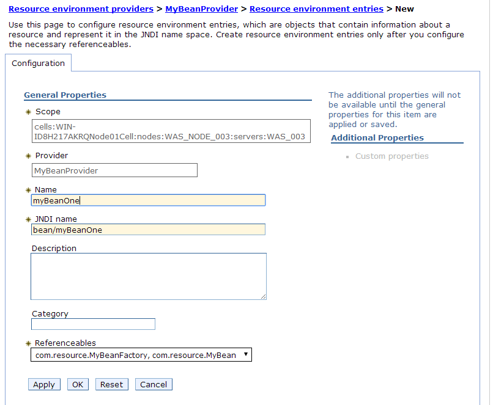

# JNDI - Naming & Directory Service

[TOC]


## Introduction to JNDI

Understanding the key terminologies will help to understand how JNDI works

**Naming Service**

A fundamental facility in any computing system is the naming service--the means by which names are associated with objects and objects are found based on their names. When using almost any computer program or system, you are always naming one object or another. For example,
To access a file in the computer, you must supply its name.

A naming service's primary function is to map people-friendly names to objects, such as addresses, identifiers, or objects typically used by computer programs. For example, the Internet Domain Name System (DNS) maps machine names (such as www.sun.com) to IP addresses (such as 192.9.48.5). A file system maps a filename (for example, c:\bin\autoexec.bat) to a file handle that a program can use to access the contents of the file.


**Naming Convention**

To look up an object in a naming system, you supply it the name of the object. The naming system determines the syntax that the name must follow. This syntax is sometimes called the naming system's naming convention.


**Bindings**

The association of a name with an object is called a binding. For example, a file name is bound to a file.


**References and Addresses**

Depending on the naming service, some objects cannot be stored directly; that is, a copy of the object cannot be placed inside the naming service. Instead, they must be stored by reference.
A reference is information about how to access an object.
A file object, for example, is accessed using a file reference, also called a file handle.


**Context**

A context is **<u>a set of name-to-object bindings</u>**. Every context has an associated naming convention. A context provides a lookup (resolution) operation that returns the object and may provide operations such as those for binding names, unbinding names, and listing bound names. More about Context later.


**Concept of Naming Systems and Namespaces**

> A naming system is a connected set of contexts of the same type (they have the same naming convention) and provides a common set of operations.
> A naming system provides a naming service to its customers for performing naming-related operations.

A naming service is accessed through its own interface.

For example,

- the DNS offers a naming service that maps machine names to IP addresses.
- LDAP offers a naming service that maps LDAP names to LDAP entries.
- file system offers a naming service that maps filenames to files and directories.

> A namespace is the set of names in a naming system. 

For example, the UNIX file system has a namespace consisting of all of the names of files and directories in that file system. The DNS namespace contains names of DNS domains and entries. The LDAP namespace contains names of LDAP entries.


**Directory Service**

Many naming services are extended with a directory service. 

A directory service associates names with objects and also allows such objects to have attributes. 

Thus, you not only can look up an object by its name but also get the object's attributes or search for the object based on its attributes.


**JDNI**

The <u>Java Naming and Directory Interface (JNDI) is an application programming interface (API)</u> that provides naming and directory functionality to applications written using the JavaTM programming language.


Note that when we casually say JNDI or JNDI API we mean all the 3 together: **JNDI API, Naming Manager, JNDI SPI**.

The orange blocks that you see are the service providers. We would need individual service provider for each service.
For eg: To connect to LDAP server using JNDI calls we would need a LDAP service provider.

1. **JNDI API, Naming Manager, JNDI SPI **
   This is part of JDK (1.3 and higher)

2. **Service Provider Driver**
   A service provider is software that maps the JNDI SPI calls to actual calls on the naming or directory server. 

   In the terminology of client/server software, the JNDI & the Service Provider are the client (called the JNDI client) and the naming/directory server is the server.

   The Java SDK, v1.3 comes with a set of service providers for LDAP, COS naming, and the RMI registry. 

   The initial examples in this tutorial uses File System service provider because of it's simplicity though it does not come as part of the SDK but could be downloaded from java archives [here](http://www.oracle.com/technetwork/java/javasebusiness/downloads/java-archive-downloads-java-plat-419418.html).

   

3. **Naming/Directory server**
   This is the software or server that provides the real service. For eg: In case of LDAP, there would be a LDAP server that we communicate using JDNI.
   When using the file system service provider, you don't need to set up a server because you can use your local file system as the server.


## JNDI using a simple Service Provider

If you hadn't downloaded the File System service provider, please do so. Read [Prerequisites](https://notes-from-a-dev.blogspot.com/2014/03/jndi-using-simple-service-provider.html)

Before performing any operation on a naming or directory service, you need to acquire an initial context--the starting point into the namespace. This is because all methods on naming and directory services are performed relative to some context. To get an initial context, you must follow these steps.

**1. Select the service provider of the corresponding service you want to access.**

You can specify the service provider to use for the initial context by creating a set of environment properties (a Hashtable) and adding the name of the service provider class to it.
To specify the file system service provider from Sun Microsystems, you would write code that like the following.

```java
Hashtable env = new Hashtable();
env.put(Context.INITIAL_CONTEXT_FACTORY, 
 "com.sun.jndi.fscontext.RefFSContextFactory");
```

You can use application resource files, or system properties, or applet parameters to specify environment properties.

**What if you use more than one of these mechanisms at the same time?**
Answer is [here](http://docs.oracle.com/javase/jndi/tutorial/beyond/env/context.html).


**2. Specify any configuration that the initial context needs.**

You specify any additional information the service provider needs by adding it to the same Hashtable.
For example, suppose that the program is using the LDAP service provider. This provider requires that the program specify the location of the LDAP server, as
well as user identity information. To provide this information, you would write code that looks as follows.

```java
env.put(Context.PROVIDER_URL, "ldap://ldap.wiz.com:389");
env.put(Context.SECURITY_PRINCIPAL, "joeuser");
env.put(Context.SECURITY_CREDENTIALS, "joepassword");
```


**3. Call the InitialContext constructor.**

Context object is the door of your client program to interact with the NamingManager and the NamingManager looks for configuration and setup information in the context object.

```java
Context ctx = new InitialContext(env);
```

Once you have a initialContext, you can do operations on it, the most common for a naming service being lookup().

```java
Object obj = ctx.lookup("report.txt");
```

Instead of getting a single object at a time, as with Context.lookup(), you can list an entire context by using a single operation, list().

```java
NamingEnumeration list = ctx.list("awt");

while (list.hasMore()) {
    NameClassPair nc = (NameClassPair)list.next();
    System.out.println(nc);
}
```


Let's run a sample.

Create a java application and add *fscontext.jar* and *providerutil.jar* (downloaded previously) to it's build path.
If you miss this, you will get

```
Exception in thread "main" javax.naming.NoInitialContextException: Need to specify class name in environment or system property, or as an applet parameter, or in an application resource file: java.naming.factory.initial
```


Create a Folder and few files. I created folder *temp* on my Desktop with 2 text files, *a.txt* and *b.txt* within it.

If you check out the file system service provider documentation, you will see that the service provider actually contains 

2 Provider (classes).

- The first class handles accessing the file system. Lookup() operations are handled by this provider.
- The second class handles storage of Java objects. Bind() operations are handled by this provider.


Let's try out few JNDI operations using the file system SP:

```java
package com.sample;

import java.io.File;
import java.util.Hashtable;

import javax.naming.Context;
import javax.naming.InitialContext;
import javax.naming.NameClassPair;
import javax.naming.NamingEnumeration;
import javax.naming.NamingException;

public class TestJDNI {

 public static void main(String[] args) throws NamingException {
  Hashtable<String, String> env = new Hashtable<String, String>(2);
  env.put(Context.INITIAL_CONTEXT_FACTORY,
    "com.sun.jndi.fscontext.RefFSContextFactory");

  Context ctx = new InitialContext(env);
  
  File obj = (File) ctx.lookup("C:/Users/eIPe/Desktop/temp/a.txt");
  
  System.out.println("File: " + obj.getName() + " exists? "
    + obj.exists());

  NamingEnumeration<?> list = ctx.list("C:/Users/eIPe/Desktop/temp");
  System.out.println("Contents in /temp directory");
  while (list.hasMore()) {
   NameClassPair nc = (NameClassPair) list.next();
   System.out.println(nc);
  }

 }
}
```


Output:

```
File: a.txt exists? true
Contents in /temp directory
a.txt: java.io.File
b.txt: java.io.File
```


## Bindings and lookups

Let's try to create a new (name-object) binding and then refer it using lookup.
According to the JNDI specification, service providers are encouraged (but not required) to support object storage in one of the following formats:

- Serialized data
- Reference
- Attributes (in a directory context)


First 2 are applicable to naming & directory services and the last one only for directory services.


## The IntialContext

### Concept of Context

But firstly, the **Context**.

JNDI represents a context in a naming system using the *javax.naming.Context* interface. This is the key interface for interacting with naming services. 

A Context knows about its set of bindings in the naming system, but little else. It contains methods for examining and updating these bindings.

A Context instance is not guaranteed to be synchronized against concurrent access by multiple threads. Threads that need to access a single Context instance concurrently should synchronize amongst themselves and provide the necessary locking.

JNDI applications need a way to communicate various preferences and properties that define the environment in which naming and directory services are accessed. For example, a context might require specification of security credentials in order to access the service. Another context might require that server configuration information be supplied. These are referred to as the environment of a context.

The Context interface provides methods for retrieving and updating this environment.

These could be specified through

- Application Resource Files
- System Properties
- Applet Parameters


More about these [here](http://docs.oracle.com/javase/jndi/tutorial/beyond/env/source.html)

### InitialContext

The javax.naming.InitialContext class <u>implements the Context interface and serves as our entry point to a naming system</u>.

The initial context implementation <u>is determined at runtime</u>.

The default policy uses the environment property *java.naming.factory.initial*, which contains the class name of the initial context factory. An exception to this policy is made when resolving URL strings, as described [here](http://docs.oracle.com/javase/7/docs/api/javax/naming/InitialContext.html).

**What happens when we do not supply a factory class name for InitialContext constructor?**

```java
Context initctx = new InitialContext();
```

InitialContext object is created <u>using the default implementation</u> found in the JDK itself.
Note that without specifying the mandatory INITIAL_CONTEXT_FACTORY environment property for this context it's useless.

For eg:

```java
try {
    Context initCxt = new InitialContext();
    } catch (NamingException e) {
        e.printStackTrace();
    }
```


Works fine. No errors. But

```java
try {
    Context initCxt = new InitialContext();
    Object obj = initCxt.lookup(""); //or any operation
    } catch (NamingException e) {
        e.printStackTrace();
    }
```


Throws,

```
javax.naming.NoInitialContextException: Need to specify class name in environment or system property, or as an applet parameter, or in an application resource file: java.naming.factory.initial
```

When a factory class is specified as we saw in the examples before, the initialContext object is created by calling `getInitialContext()` on the factory class instance.

Here is a short sneak peek into the JNDI/JDK source code,

```java
//javax.naming.spi.NamingManager
public static Context getInitialContext(Hashtable env)
 throws NamingException {
 InitialContextFactory factory;

 InitialContextFactoryBuilder builder = getInitialContextFactoryBuilder();
 if (builder == null) {
  // No factory installed, use property
  // Get initial context factory class name

  String className = env != null ?
   (String)env.get(Context.INITIAL_CONTEXT_FACTORY) : null;
  if (className == null) {
   NoInitialContextException ne = new NoInitialContextException(
    "Need to specify class name in environment or system " +
    "property, or as an applet parameter, or in an " +
    "application resource file:  " +
    Context.INITIAL_CONTEXT_FACTORY);
   throw ne;
  }

  try {
   factory = (InitialContextFactory)
    helper.loadClass(className).newInstance();
  } catch(Exception e) {
   .....
  }
 } else {
  factory = builder.createInitialContextFactory(env);
 }
 return factory.getInitialContext(env);
}
```


This now explains why we got an exception.

What happens when we run

```
Context initctx = new InitialContext();
```

in a container like tomcat?

Tomcat provides a JNDI InitialContext implementation instance for each web application running under it.

You might be wondering what is the default environment settings used by this context. Well, let's try to printout from within a servlet.

```java
Context initCxt = new InitialContext();
Hashtable<?, ?> enviProps = initCxt.getEnvironment();
Enumeration enumKey = enviProps.keys();
while(enumKey.hasMoreElements()) {
 String key = (String) enumKey.nextElement();
 String val = (String) enviProps.get(key);
 System.out.println(key+" ::: "+val);
}
```


Output:

```
java.naming.factory.initial ::: org.apache.naming.java.javaURLContextFactory
java.naming.factory.url.pkgs ::: org.apache.naming
```


Note that java.naming.factory.initial is INITIAL_CONTEXT_FACTORY and java.naming.factory.url.pkgs is URL_PKG_PREFIXES.

Who supplied these jndi properties?

Well, tomcat specified these as system properties when it started the JRE.
Let's print the system properties and confirm it.

```java
Properties sysProps = System.getProperties();
Enumeration keys = sysProps.keys();
while (keys.hasMoreElements()) {
 String key = (String) keys.nextElement();
 String value = (String) sysProps.get(key);
 System.out.println(key + ": " + value);
}
```


You will find these,

```
java.naming.factory.url.pkgs: org.apache.naming
java.naming.factory.initial: org.apache.naming.java.javaURLContextFactory
```

Note that **javaURLContextFactory** is the Context factory for the **"java:**" namespace.
To my knowledge tomcat doesn't provide any other namespaces whereas application servers like websphere does. 

Checkout [this](http://www.developers-notebook.info/2014/07/jndi-namespace-in-websphere.html) for websphere.

Here is a short sneak peek into tomcat source code,

```java
/**
 * Context factory for the "java:" namespace.
 **/
public class javaURLContextFactory
    implements ObjectFactory, InitialContextFactory {
 /**
     * Initial context.
     */
    protected static volatile Context initialContext = null;
 public static final String MAIN = "initialContext";
 /**
     * Get a new (writable) initial context.
     */
    @Override
    public Context getInitialContext(Hashtable environment)
        throws NamingException {
        if (initialContext == null) {
            synchronized(javaURLContextFactory.class) {
                if (initialContext == null) {
                    initialContext = new NamingContext(
                            (environment, MAIN);
                }
            }
        }
        return initialContext;
    }
}

/**
 * Catalina JNDI Context implementation.
 *
 * @author Remy Maucherat
 */
public class NamingContext implements Context {

    /**
     * Bindings in this Context.
     */
    protected HashMap bindings;
    /**
     * Name of the associated Catalina Context.
     */
    protected String name;
    /**
     * Environment.
     */
    protected Hashtable env;
 
    /**
     * Builds a naming context using the given environment.
     */
    public NamingContext(Hashtable env, String name) 
        throws NamingException {
        this.bindings = new HashMap();
        this.env = new Hashtable();
        this.name = name;
        // Populating the environment hashtable
        if (env != null ) {
            Enumeration envEntries = env.keys();
            while (envEntries.hasMoreElements()) {
                String entryName = envEntries.nextElement();
                addToEnvironment(entryName, env.get(entryName));
            }
        }
    }
}
```


### Bind and lookup serialized data - tomcat service provider

The most obvious approach to storing an object in a directory is to store the serialized representation of an object. The only requirement is that the object's class implement the Serializable interface.

When an object is serialized, its state becomes transformed into a stream of bytes. The service provider takes the stream of bytes and stores it in the directory. When a client looks up the object, the service provider reconstructs it from the stored data.

Let's try creating a binding at root context in our servlet.


```
protected void doGet(HttpServletRequest request,
 HttpServletResponse response) throws ServletException, IOException {
try {
 Context initCxt = new InitialContext();
 initCxt.bind("foo", new String("bar")); //String is a class that implements Serializable
 System.out.println(initCxt.lookup("foo"));

} catch (NamingException e) {
 e.printStackTrace();
}
}
```


Output:

bar


Let's try creating a sub-context also.


```java
protected void doGet(HttpServletRequest request,
 HttpServletResponse response) throws ServletException, IOException {
try {
 Context initCxt = new InitialContext();
 initCxt.createSubcontext("private:");
 initCxt.createSubcontext("private:objects");
 initCxt.rebind("private:objects/foo", "bar");
 System.out.println(initCxt.lookup("private:objects/foo"));

} catch (NamingException e) {
 e.printStackTrace();
}
}
```


Output:

bar


Hurray!!!!!

Let's try doing a custom object


```java
public class MyBean {
 private String foo = "Default Foo";
 private int bar = 0;
 public String getFoo() {
  return (this.foo);
 }
 public void setFoo(String foo) {
  this.foo = foo;
 }
 public int getBar() {
  return (this.bar);
 }
 public void setBar(int bar) {
  this.bar = bar;
 }
 @Override
 public String toString() {
  return "MyBean [foo=" + foo + ", bar=" + bar + "]";
 }
}

protected void doGet(HttpServletRequest request,
  HttpServletResponse response) throws ServletException, IOException {
 System.out.println("doGet");
 try {
    Context initCxt =  new InitialContext();
    MyBean myb = new MyBean();
    myb.setBar(123);
    initCxt.bind("mybean", myb);
    MyBean obj = (MyBean) initCxt.lookup("mybean");
    System.out.println(obj);

 } catch (NamingException e) {
  e.printStackTrace();
 }
} 
```


Output:

MyBean [foo=Default Foo, bar=123]


Hurray!!! It wasn't even serializable but still tomcat's intialContext implementation let us store it.

Let's try doing the same under a sub-tree (sub-context).


```java
initContext = new InitialContext(env);
Context ctx = (Context) initContext.lookup("java:comp/env");
ctx.rebind("java:comp/env/foo", "bar");
System.out.println(initContext.lookup("java:comp/env/foo"));
```


This will never work. You will be welcomed by this exception

`javax.naming.OperationNotSupportedException: Context is read only`


Why does this happen?

Why doesn't tomcat's InitalContext implementation let us modify it's context?

The J2EE spec answers why we get this exception.

*The container must ensure that the application component instances have only read access to their naming context. The container must throw the javax.naming.OperationNotSupportedException from all the methods of the javax.naming.Context interface that modify the environment naming context and its subcontexts.*

If you think about it, it will make sense. JNDI was brought into containers to make objects available before the application starts. If we are creating and binding it, right from our programs then why JNDI?, we could have simply instantiated "foo" like any other object.
Also because the Tomcat JNDI registry is primarily used for configuration information, the ability to add/update entries could potentially cause trouble.

So, the tomcat's jndi implementation lets users to create a new bindings only from the root context and not from existing sub-contexts(or trees) like *java:comp/env* which are protected.

Only place I could think of where JNDI context creation/modification could be put to use is Junit Tests.

Here is a java program,


```java
public class MainClass {
 public static void main(String[] args) {
  Context initContext = null;
  try {
   Hashtable env = new Hashtable();
   env.put(Context.INITIAL_CONTEXT_FACTORY, "org.apache.naming.java.javaURLContextFactory");
   env.put(Context.URL_PKG_PREFIXES, "org.apache.naming");
   initContext = new InitialContext(env);

   initContext.createSubcontext("java:");
   initContext.createSubcontext("java:comp");
   initContext.createSubcontext("java:comp/env");
   initContext.rebind("java:comp/env/foo", "bar");
   System.out.println(initContext.lookup("java:comp/env/foo")); //output: bar 
  }catch(NamingException e){
   e.printStackTrace(System.out);
  }
 }
}
```


Note that I had to include, catalina.jar and tomcat-juli.jar from tomcat(installation path)/bin.

### Binding and lookup - references - tomcat service provider


Sometimes it's not appropriate (or possible) to serialize an object. If the object provides a service on a network, for example, it doesn't make sense to store the state of the object itself. We're interested in the information necessary to find and communicate with the object.

An example is a connection to an external resource (one outside the scope of the Java Virtual Machine) such as a database or file. It clearly doesn't make sense to try to store the database or the file itself in the JNDI service. Instead, we want to store the information necessary to reconstruct the connection.

So, the programmer should store a reference to that object instead. JNDI's javax.naming.Reference class records address information about objects not directly bound to the naming service.
The reference to an object contains the following information:

- The class name of the referenced object
- A vector of javax.naming.RefAddr objects that represents the addresses
- The name and location of the object factory to use during reconstruction


The *javax.naming.RefAddr* abstract class contains information indicating the ways in which you can contact the object (e.g., via a location in memory, a lookup on another machine, etc.) or recreate it with the same state. The class defines an association between content and type. The content (an object) stores information required to rebuild the object and the type (a string) identifies the purpose of the content.

RefAddr also overrides the java.lang.Object.equals() and java.lang.Object.hashcode() methods to ensure that two references are equal if the content and type are equal. RefAddr has two concrete subclasses:
*javax.naming.StringRefAddr*, which stores strings and
*javax.naming.BinaryRefAddr*, which stores an array of bytes.

Then, we must write a class that implements the JNDI service provider *javax.naming.spi.ObjectFactory* inteface.
Every time your web application calls lookup() on a context entry that is bound to this factory (assuming that the factory is configured with singleton="false"), the getObjectInstance() method is called, with the following arguments:

- Object obj - The (possibly null) object containing location or reference information that can be used in creating an object. For Tomcat, this will always be an object of type javax.naming.Reference, which contains the class name of this factory class, as well as the configuration properties (from the for the web application) to use in creating objects to be returned.
- Name name - The name to which this factory is bound relative to nameCtx, or null if no name is specified.
- Context nameCtx - The context relative to which the name parameter is specified, or null if name is relative to the default initial context.
- Hashtable environment - The (possibly null) environment that is used in creating this object. This is generally ignored in Tomcat object factories.


Let's try to do it programmatically by creating a binding at root context in our servlet (Note that tomcat's initContext doesn't let you modify existing subcontexts dynamically).

We write a bean class "MyBean".


```java
import javax.naming.NamingException;
import javax.naming.Reference;
import javax.naming.Referenceable;
import javax.naming.StringRefAddr;

public class MyBean implements Referenceable{

 private String foo = "Default Foo";
 private int bar = 0;

 public String getFoo() {
  return (this.foo);
 }
 public void setFoo(String foo) {
  this.foo = foo;
 }
 public int getBar() {
  return (this.bar);
 }
 public void setBar(int bar) {
  this.bar = bar;
 }
 @Override
 public String toString() {
  return "MyBean [foo=" + foo + ", bar=" + bar + "]";
 }

 public Reference getReference() throws NamingException{
   String classname = MyBean.class.getName();
   StringRefAddr barref = new StringRefAddr("bar", Integer.toString(bar));
   StringRefAddr fooref = new StringRefAddr("foo", foo);
  
   String classfactoryname=MyBeanFactory.class.getName();
   Reference ref = new Reference(classname,classfactoryname,null);
   ref.add(barref);
   ref.add(fooref);
   return ref;
  }
}
```


We write the Factory class that helps to recreate "MyBean" objects from the Reference stored in context.


```java
import java.util.Enumeration;
import java.util.Hashtable;

import javax.naming.Context;
import javax.naming.Name;
import javax.naming.NamingException;
import javax.naming.RefAddr;
import javax.naming.Reference;
import javax.naming.spi.ObjectFactory;

import sample.bean.MyBean;

public class MyBeanFactory implements ObjectFactory {

  public Object getObjectInstance(Object obj,
   Name name, Context nameCtx, Hashtable environment)
   throws NamingException {
   System.out.println("MyBeanFactory.getObjectInstance()");
   // Acquire an instance of our specified bean class
   MyBean bean = new MyBean();

   // Customize the bean properties from our attributes
   Reference ref = (Reference) obj;
   Enumeration addrs = ref.getAll();
   while (addrs.hasMoreElements()) {
    RefAddr addr = (RefAddr) addrs.nextElement();
    String attrName = addr.getType();
    String value = (String) addr.getContent();
    if (attrName.equals("foo")) {
     bean.setFoo(value);
    } else if (attrName.equals("bar")) {
     try {
      bean.setBar(Integer.parseInt(value)+100); //changed 
     } catch (NumberFormatException e) {
      throw new NamingException("Invalid 'bar' value " + value);
     }
    }
   }

 // Return the customized instance
 return (bean);
  }
}
```


In the servlet,


```java
protected void doGet(HttpServletRequest request,
  HttpServletResponse response) throws ServletException, IOException {
System.out.println("doGet");
try {
  Hashtable<String, String> env = new Hashtable<String, String>(1);
    env.put(Context.OBJECT_FACTORIES, "sample.bean.factory.MyBeanFactory");
    Context initCxt =  new InitialContext(env);
    initCxt.rebind("mybean", new MyBean());
    MyBean obj = (MyBean) initCxt.lookup("mybean");
    System.out.println(obj);
 } catch (NamingException e) {
  e.printStackTrace();
 }
}
```


Output:

doGet
MyBeanFactory.getObjectInstance()
MyBean [foo=Default Foo, bar=100]


### How JNDI works in Tomcat

Tomcat provides a JNDI InitialContext implementation instance for each web application running under it.

Using this initalContext object we traverse into the JNDI namespace,

```java
Context ctx = intctx.lookup("java:comp/env");
```

#### Java:comp

Why **java:comp**?

Quoting JNDI Docs:

> The JNDI does not define any naming policy on its own. However, one important platform that does define a limited set of naming policies for using the JNDI is the J2EE specification. It defines a logical namespace that application components (such as EJBs, servlets, and JSps) can use to name resources, components, and other data.

J2EE specification requires that the namespace be provided to a component by its container, the entity that executes the component.

The specification states that the containers must provide the minimum, java: namespace and it's child namespaces with the below naming convention:

**java:comp**
The name *comp* is short for component. *java:comp* is bound to a subtree reserved for component related bindings.

**java:comp/env**
The subcontext *java:comp/env* is reserved for the component's environment-related bindings, usually defined by its deployment descriptor(web.xml file).
*env* is short for environment.

The J2EE recommends (but does not require) the following structure for the *env* namespace.

| JNDI Subcontext        | Resource Manager Type (Connection Factory Type)              |
| ---------------------- | ------------------------------------------------------------ |
| java:comp/env/ejb      | Enterprise JavaBeansTM are placed under the "ejb" subtree.   |
| java:comp/env/jdbc     | For JDBC dataSource references (javax.sql.DataSource)        |
| java:comp/env/jms      | For JMS connection factories (javax.jms.TopicConnectionFactory/ javax.jms.QueueConnectionFactory) |
| java:comp/env/mail     | For Java mail connection factories (javax.mail.Session)      |
| java:comp/env/url      | For URL connection factories (java.net.URL)                  |
| java:comp/env/eis      | For Enterprise information system (javax.resource.cci.ConnectionFactory |
| java:comp/env/eis/JAXR | Not sure, maybe for JAX-RPC connections for EIS (javax.xml.registry.ConnectionFactory) |


#### Resource Factories

A factory is an object that creates other objects on demand. A resource factory creates resource objects, such as beans, database connections or message service connections.
Resource factories are not needed for wrapper classes but when it comes to user defined beans or database connections we need to specify the factory class. The container needs this information to create the requested object.

In the upcoming examples you will notice that we specify the Resource Factory type in web.xml.

Other namespaces optional for a container are:

| JNDI Subcontext                              |
| -------------------------------------------- |
| java:comp/UserTransaction                    |
| java:comp/EJBContext                         |
| java:comp/ORB                                |
| java:comp/TransactionSynchronizationRegistry |


The new J2EE 6 specification adds new namespaces:
**java:global, java:app, and java:module**.

To know the differences between each checkout this [sof](http://stackoverflow.com/questions/7458114) answer.

#### Printing JNDI tree

Let's check what are the namespaces available under tomcat's jndi initalContext. We print the JNDI tree by calling InitalContext's list() method iteratively.

```java
protected void doGet(HttpServletRequest request, HttpServletResponse response) throws ServletException, IOException {
 System.out.println("doGet");
 Context initialContext;
 try {
  initialContext = new InitialContext();
  findSubContexts(initialContext, "java:");

 } catch (NamingException e) {
  System.out.println("Oh no, this shouldn't happen");
  e.printStackTrace(System.out);
 } catch (Exception e) {
 }

private void findSubContexts(Context initialContext,
  String name) {
 NameClassPair ncp = null;
 try {
  NamingEnumeration ne = initialContext.list(name);
  while (ne.hasMoreElements()) {
   ncp = (NameClassPair) ne.nextElement();
   System.out.println(name+" ::: "+ncp.getName());
   findSubContexts(initialContext, name + "/" + ncp.getName());
  }
 } catch (NamingException e) {
  System.out.println("No names bound under : "+name);
  //System.out.println(e.getMessage());
 }
}
```


Output:

```
java: --> comp
java:/comp --> UserTransaction
No names bound under : java:/comp/UserTransaction
java:/comp --> env
java:/comp/env --> isConnected
No names bound under : java:/comp/env/isConnected
java:/comp --> Resources
java:/comp/Resources --> META-INF
java:/comp/Resources/META-INF --> MANIFEST.MF
java:/comp/Resources --> WEB-INF
java:/comp/Resources/WEB-INF --> classes
java:/comp/Resources/WEB-INF/classes --> sample
java:/comp/Resources/WEB-INF/classes/sample --> SampleServlet.class
java:/comp/Resources/WEB-INF/classes/sample --> bean
java:/comp/Resources/WEB-INF/classes/sample/bean --> MyBean.class
java:/comp/Resources/WEB-INF/classes/sample/bean --> factory
java:/comp/Resources/WEB-INF/classes/sample/bean/factory --> MyBeanFactory.class
java:/comp/Resources/WEB-INF --> lib
java:/comp/Resources/WEB-INF --> web.xml
java:/comp/Resources --> index.html
```


The Java EE standard also defines the xml elements for the deployment descriptor (web.xml) to define java:comp/env bindings. 

The containers sees to it that any bindings defined in web.xml are created, initialized and available (through lookups) before the container starts the web application/component.

Note: Guess you noticed the inner namespaces (java:/comp/Resources/...) created for every file and folder in the deployment. This availablility of runtime resources through JNDI makes a lot of things possible.

```java
import org.apache.naming.resources.FileDirContext;
...
FileDirContext value = (FileDirContext)  initialContext.lookup ("java:/comp/Resources/WEB-INF/classes/sample/bean/factory");
```


## Why JNDI in Containers


### Why we need JNDI in containers or application servers?

Here are few benefits I could think of:

- We can configure and share objects and resources across multiple applications (but only within the same EAR, using the java:global) using the same JNDI name.
  Note:
  \- only within specific servlet; limited to strings
  \- only within that web application; limited to strings

  In general, lookups of objects in the JNDI java: namespace are required to return a new instance of the requested object every time. Exceptions are allowed for the following(this is from J2EE spec):

  - The container knows the object is immutable (for example, objects of type
    java.lang.String), or knows that the application can’t change the state of the
    object.
  - The object is defined to be a singleton, such that only one instance of the object may exist in the JVM.
  - The name used for the lookup is defined to return an instance of the object that
    might be shared. The name java:comp/ORB is such a name.

- JNDI's object-storage capabilities allow it to play the role of resource administrator in your distributed applications and to provide simple, manageable object persistence. In recognition of its potential, the architects of key Java technologies such as JDBC and EJB built JNDI into their specifications.

- JNDI is very helpful when you move an application between environments: development to integration to test to production. If you configure each app server to use the same JNDI name, you can have different databases in each environment and not have to change your code.


## Configuring and using JNDI resources in Tomcat (or any) container

In a container/server we define/reference resource in the JNDI context by specifying it in the deployment descriptors.

In Java EE, there are two types of deployment descriptors:

- java EE deployment descriptors  

* runtime deployment descriptors

The Java EE deployment descriptors are defined by the language(J2EE) specification, whereas the runtime descriptors are defined by the vendor of each container implementation.

For example, the web.xml file is a standard Java EE deployment descriptor, specified in the Java Servlet specification, but the context.xml or server.xml files in Tomcat's conf directory are specific to the container, in this case Tomcat.

As we have seen before, JNDI name lookup's happen within a specific naming context.

The InitialContext is configured as a web application is initially deployed, and is made available to web application components (for read-only access). All configured entries and resources are placed in the java:comp/env portion of the JNDI namespace.

According to the JNDI specification, service providers are encouraged (but not required) to support object storage in one of the following formats:

- Serialized data (using env-entry)
- Reference (using resource-ref and resource-env-ref)
- Attributes (in a directory context)


First 2 are applicable to naming and directory services and the last one only for directory services.

### Using env-entry in Tomcat

In most of the applications, environment specific configurations are store in either a properties file or in web.xml.

Advantages of using env-entries are:

- You don't have to create a properties file since you specify it in web.xml.
- Env-entries are initialized automatically when the application starts.
- Env-entries are available through JNDI.


Disadvantages:

- You have to write xml(not as easy as properties).
- Cannot use custom classes (possible using resource-env-ref)
- Values are tightly bound within the web app (Using resource-env-ref values are specified outside)


Java EE 6 supported types are limited to the following:


1. java.lang.String
2. java.lang.Integer
3. java.lang.Short
4. java.lang.Float
5. java.lang.Double
6. java.lang.Byte
7. java.lang.Character
8. java.lang.Boolean
9. java.lang.Class
10. java.lang.Enum (any enum)


Let's try to store a variable "isConnected" with a boolean value.

Declare in your web application's web.xml:


```xml
<env-entry>
<description>Sample env entry</description>
<env-entry-name>isConnected</env-entry-name>
<env-entry-type>java.lang.Boolean</env-entry-type><!--order matters -->
<env-entry-value>true</env-entry-value>
</env-entry>
```


And in your java code,

```java
try {
 Context initCxt =  new InitialContext();
 Boolean isConn =  (Boolean)initCxt.lookup("java:comp/env/isConnected");
 System.out.println(isConn.toString());
 // one could use relative names into the sub-context
 Context envContext = (Context) initCxt.lookup("java:comp/env");
 Boolean isConn2 = (Boolean)envContext.lookup("isConnected");
 System.out.println(isConn2.toString());
} catch (NamingException e) {
 e.printStackTrace();
}
```


Output:

```
true
```


### Using resource-env-ref in Tomcat

We will try to bind and lookup a custom bean using resource-env-ref configuration.

Let's write our beans first.

```java
package sample.bean;

public class MyBean {

 private String foo = "Default Foo";
 private int bar = 0;

 public String getFoo() {
  return (this.foo);
 }
 public void setFoo(String foo) {
  this.foo = foo;
 }
 public int getBar() {
  return (this.bar);
 }
 public void setBar(int bar) {
  this.bar = bar;
 }
 @Override
 public String toString() {
  return "MyBean [foo=" + foo + ", bar=" + bar + "]";
 }
}
```


Declare in your web application's web.xml:


```xml
<resource-env-ref>
  <description>Object factory for MyBean instances</description>
  <resource-env-ref-name>bean/MyBeanFactory</resource-env-ref-name>
  <resource-env-ref-type>sample.bean.MyBean</resource-env-ref-type>
</resource-env-ref>
```


Note the convention used here for ref names.
bean/[a factory name for bean] (bean/MyBeanFactory) rather than bean/[bean name] (bean/MyBean).

Like I mentioned before, you need to specify the resource factory to be used, since containers make the resource available before the application starts.
Tomcat provides resource factories for common usages.
For bean creation we used, org.apache.naming.factory.BeanFactory.

Add the below entry in the tomcat's context.xml found under [tomcat_installation]/conf/context.xml.

```xml
<resource name="bean/MyBeanFactory" auth="Container" type="sample.bean.MyBean" factory="org.apache.naming.factory.BeanFactory"  bar="23"/>
```

If you had given the option to use workspace metadata while adding the server to eclipse. To check double click the server, which opens its configuration screen.


If this is the case then you need to modify context.xml available under Servers Folder inside your workspace.


And here goes our servlet code,


```java
try {
   Context initCxt =  new InitialContext();
   // one could use relative names into the sub-context
   Context envContext = (Context) initCxt.lookup("java:comp/env");
   MyBean myBean2 = (MyBean)envContext.lookup("bean/MyBeanFactory");
   // or we could do it in a single line
   // MyBean myBean =  (MyBean)initCxt.lookup("java:comp/env/bean/MyBeanFactory");
   // System.out.println(myBean.toString());
   System.out.println(myBean2.toString());
} catch (NamingException e) {
 	e.printStackTrace();
}      
}
```

Output:

```
MyBean [foo=Default Foo, bar=23]
```


### Using resource-env-ref and custom factory class in Tomcat

Read about referenceables and object factory [here](https://docs.oracle.com/javase/jndi/tutorial/objects/storing/reference.html).

We write a bean class "MyBean" that implements Referenceable.

```java
import javax.naming.NamingException;
import javax.naming.Reference;
import javax.naming.Referenceable;
import javax.naming.StringRefAddr;

public class MyBean implements Referenceable{

 private String foo = "Default Foo";
 private int bar = 0;

 public String getFoo() {
  return (this.foo);
 }
 public void setFoo(String foo) {
  this.foo = foo;
 }
 public int getBar() {
  return (this.bar);
 }
 public void setBar(int bar) {
  this.bar = bar;
 }
 @Override
 public String toString() {
  return "MyBean [foo=" + foo + ", bar=" + bar + "]";
 }

 public Reference getReference() throws NamingException{
  String classname = MyBean.class.getName();
  StringRefAddr barref = new StringRefAddr("bar", Integer.toString(bar));
  StringRefAddr fooref = new StringRefAddr("foo", foo);

  String classfactoryname=MyBeanFactory.class.getName();
  Reference ref = new Reference(classname,classfactoryname,null);
  ref.add(barref);
  ref.add(fooref);
  return ref;
 }
}
```


We write the Factory class that helps to recreate "MyBean" objects from the Reference stored in context.


```java
import java.util.Enumeration;
import java.util.Hashtable;

import javax.naming.Context;
import javax.naming.Name;
import javax.naming.NamingException;
import javax.naming.RefAddr;
import javax.naming.Reference;
import javax.naming.spi.ObjectFactory;

import sample.bean.MyBean;

public class MyBeanFactory implements ObjectFactory {

 public Object getObjectInstance(Object obj,
  Name name, Context nameCtx, Hashtable environment)
  throws NamingException {
  System.out.println("MyBeanFactory.getObjectInstance()");
  // Acquire an instance of our specified bean class
  MyBean bean = new MyBean();

  // Customize the bean properties from our attributes
  Reference ref = (Reference) obj;
  Enumeration addrs = ref.getAll();
  while (addrs.hasMoreElements()) {
   RefAddr addr = (RefAddr) addrs.nextElement();
   String attrName = addr.getType();
   String value = (String) addr.getContent();
   if (attrName.equals("foo")) {
    bean.setFoo(value);
   } else if (attrName.equals("bar")) {
    try {
     bean.setBar(Integer.parseInt(value)+100); //changed 
    } catch (NumberFormatException e) {
     throw new NamingException("Invalid 'bar' value " + value);
    }
   }
  }
  // Return the customized instance
  return (bean);
 }
}
```


No changes needs to be made to web.xml if you had run the previous example, else add the below entries in web.xml


```java
<resource-env-ref>
    <description>Object factory for MyBean instances</description>
    <resource-env-ref-name>bean/MyBeanFactory</resource-env-ref-name>
    <resource-env-ref-type>sample.bean.MyBean</resource-env-ref-type>
</resource-env-ref>
```


Similarly, to change tomcat's resource factory add/modify this entry in context.xml.


```java
<resource name="bean/MyBeanFactory" auth="Container" type="sample.bean.MyBean" factory="sample.bean.factory.MyBeanFactory" bar="23"/>
```


Servlet code:

```java
try {
 Context initCxt =  new InitialContext();
 // one could use relative names into the sub-context
 Context envContext = (Context) initCxt.lookup("java:comp/env");
 MyBean myBean2 = (MyBean)envContext.lookup("bean/MyBeanFactory");
 // or we could do it in a single line
 //        MyBean myBean =  (MyBean)initCxt.lookup("java:comp/env/bean/MyBeanFactory");
 //        System.out.println(myBean.toString());
 System.out.println(myBean2.toString());
} catch (NamingException e) {
 e.printStackTrace();
}      
```


Output:

```
MyBeanFactory.getObjectInstance()
MyBean [foo=Default Foo, bar=123]
```


### Difference between env-entry, resource-ref and resource-env-ref

I couldn't honestly find a better explanation from anywhere other than the Tomcat's documentation.

**env-entry** - Environment entry, a single-value parameter that can be used to configure how the application will operate.

**resource-ref** - Resource reference, which is typically to an object factory for resources such as a JDBC DataSource, a JavaMail Session, or custom object factories configured into Tomcat. 

**resource-env-ref** - Resource environment reference, a new variation of resource-ref added in Servlet 2.4 that is simpler to configure for resources that do not require authentication information. 


### Tomcat and context.xml

We have web.xml. Why then context.xml? Wait... there is server.xml too.

Let me take the approach used in tomcat's documentation itself.

**What defines a web application?**

Servlet Specification (version 2.2 or later) states that anything that follows the folder structure as specified in the spec and comes (optional) bundled as Web Application Archive (WAR) file.

For every web application, a context is defined by the container.

For eg:
When I deployed a web application project named "Sample" on tomcat (using eclipse).
I see

```xml
<context 
docBase="Sample" 
path="/Sample" 
reloadable="true" 
source="org.eclipse.jst.jee.server:Sample"
/>
```

in server.xml.


By default, the context path takes the same values as the project name. So to hit the servlet we have been using the following URL

*http://localhost:8081/Sample/SampleServlet*

which is of the form

`http://{host}:{port}/{context path to application}/{resource}`


The container checks the incoming HTTP request and maps the request URI against the context path of each defined context.
For eg: Changing it to

```xml
<context 
docBase="Sample" 
path="/MyApp" 
reloadable="true" 
source="org.eclipse.jst.jee.server:Sample"
/>
```

and restarting the server. Now, *http://localhost:8081/MyApp/SampleServlet* works.

You may define as many Context elements as you wish.


```xml
<context 
docBase="Sample" 
path="/Sample" 
reloadable="true" 
source="org.eclipse.jst.jee.server:Sample"
/>
<context 
docBase="Sample" 
path="/SampleApp" 
reloadable="true" 
source="org.eclipse.jst.jee.server:Sample"
/>
```


Note: Changing it using the project settings of Eclipse didn't work for me. Not sure why.


It is **NOT** recommended to place elements directly in the server.xml file.

This is because it makes modifying the Context configuration more invasive since the main conf/server.xml file cannot be reloaded without restarting Tomcat.

Individual Context elements may be explicitly defined:

- In an individual file at */META-INF/context.xml* inside the application files.
- In individual files (with a ".xml" extension) in the *$CATALINA_BASE/conf/[enginename]/[hostname]/* directory. The context path and version will be derived from the base name of the file (the file name less the .xml extension). This file will always take precedence over any context.xml file packaged in the web application's META-INF directory.
- Inside a Host element in the main conf/server.xml.

Let's experiment.

Create context.xml in *WebContent/WEB-INF.*
Add the same entry we saw in server.xml. (remove from server.xml)

```xml
<?xml version="1.0" encoding="UTF-8"?> <context docBase="Sample" path="/Sample" reloadable="true" source="org.eclipse.jst.jee.server:Sample" /> 
```

Restart server. (No more restarts when you change contexts)

You can configure named values that will be made visible to the web application as servlet context initialization parameters by nesting elements inside this element.

For example, In my server.xml,

```xml
<context docBase="Sample"  path="/Sample"  reloadable="true"  source="org.eclipse.jst.jee.server:Sample" > 		<parameter name="foo" value="bar" override="false"/> 
</context>
```

And then in my servlet code,
` System.out.println(getServletContext().getInitParameter("foo")); `

This is equivalent to the inclusion of the following element in the web application deployment descriptor (/WEB-INF/web.xml)

```xml
<context-param> 
  <param-name>foo</param-name>
  <param-value>bar</param-value> 
</context-param>
```

Only use of these seems to define a default value and control permission of the web application to override it.

You can configure named values that will be made visible to the web application as environment entry resources, by nesting entries inside this element.
For example:

```xml
<context 
     docBase="Sample" 
     path="/Sample" 
     reloadable="true" 
     source="org.eclipse.jst.jee.server:Sample"
    >
<environment name="isConnected" value="true" type="java.lang.Boolean" override="false"/>
</Context>
```

And in servlet (like always):

```java
Context initCxt =  new InitialContext();
Boolean isConn =  (Boolean)initCxt.lookup("java:comp/env/isConnected");
System.out.println(isConn.toString());
```

Since this is not a tutorial on tomcat and rather on JNDI, so I wouldn't go into the details of what can be done inside context. Check out [tomcat-doc](http://tomcat.apache.org/tomcat-7.0-doc/config/context.html)


### Using resource-ref for DataSource Lookups in Tomcat

Let's try this on a web (say, ProductApp) application.

**1. Install Your JDBC Driver**

Use of the JDBC Data Sources JNDI Resource Factory requires that you make an appropriate JDBC driver available to both Tomcat internal classes and to your web application. This is most easily accomplished by adding the driver's JAR file(s) into the {tomcat installation}/lib directory, which makes the driver available both to the resource factory and to your application.

**2. Configure resource factory in server.xml**

If you had removed ProductApp from the server, again run/add it to tomcat server so that we have the Context entries in server.xml as follows,

Add element to the required contexts.

```xml
<context docBase="ProductApp" path="/ProductApp" reloadable="true" source="org.eclipse.jst.jee.server:ProductApp">
 <resource auth="Container" 
 driverClassName="oracle.jdbc.OracleDriver" 
 maxActive="8" 
 maxIdle="4" 
 name="jdbc/ ProductDB " 
 username="SYSTEM"
 password="password" 
 type="javax.sql.DataSource" 
 url="jdbc:oracle:thin:@localhost:1521:XE" 
 />
</context>
```


Commonly used configuration properties for Tomcat's standard data source resource factory (org.apache.tomcat.dbcp.dbcp.BasicDataSourceFactory) are as follows:

- driverClassName - Fully qualified Java class name of the JDBC driver to be used.
- username - Database username to be passed to our JDBC driver.
- password - Database password to be passed to our JDBC driver.
- url - Connection URL to be passed to our JDBC driver. (For backwards compatibility, the property driverName is also recognized.)
- initialSize - The initial number of connections that will be created in the pool during pool initialization. Default: 0
- maxActive - The maximum number of connections that can be allocated from this pool at the same time. Default: 8
- minIdle - The minimum number of connections that will sit idle in this pool at the same time. Default: 0
- maxIdle - The maximum number of connections that can sit idle in this pool at the same time. Default: 8
- maxWait - The maximum number of milliseconds that the pool will wait (when there are no available connections) for a connection to be returned before throwing an exception. Default: -1 (infinite)

**3. Declare JNDI name in web.xml**

By convention, all such names should resolve to the jdbc subcontext (relative to the standard java:comp/env naming context that is the root of all provided resource factories. A typical web.xml entry might look like this:

```xml
<resource-ref>
  <description>
    Resource reference to a factory for java.sql.Connection instances that may be used for talking to a particular database that is configured in the Context configuration for the web application.
  </description>
  <res-ref-name> jdbc/ProductDB </res-ref-name>
  <res-type> javax.sql.DataSource </res-type>
  <res-auth> Container </res-auth>
</resource-ref>
```


We have the below servlet code that accesses the DataSource from JNDI lookup.

```java
package com.prodapps;

import java.io.IOException;
import java.sql.Connection;
import java.sql.SQLException;
import java.sql.Statement;

import javax.naming.Context;
import javax.naming.InitialContext;
import javax.naming.NamingException;
import javax.servlet.RequestDispatcher;
import javax.servlet.ServletException;
import javax.servlet.annotation.WebServlet;
import javax.servlet.http.HttpServlet;
import javax.servlet.http.HttpServletRequest;
import javax.servlet.http.HttpServletResponse;
import javax.sql.DataSource;

/**
 * Servlet implementation class ProductServlet
 */

@WebServlet(description = "This is primary product servlet", urlPatterns = { "/ProductServlet" })
public class ProductServlet extends HttpServlet {

 private static final long serialVersionUID = 1L;
 static DataSource dataSource;   

    public ProductServlet() {
        super();
    }

    @Override
    public void init() throws ServletException {
     super.init();
     try {
           Context initCxt =  new InitialContext();
           Context envContext = (Context) initCxt.lookup("java:comp/env");
           dataSource = (DataSource)envContext.lookup("jdbc/ProductDB");
       } catch (NamingException e) {
           e.printStackTrace();
       }
    }
    
    
 @Override
 public void destroy() {
  super.destroy();
 }
 
 
 protected void doGet(HttpServletRequest request, HttpServletResponse response) throws ServletException, IOException {
  System.out.println("doGet");
  response.setContentType(request.getContentType());
  String caseID = request.getParameter("caseID");
  Connection conn = null;
  
  try {
   conn = createConnection();
   conn.setAutoCommit(false);
   
   if(caseID.equals("1")){
    Statement stmt = conn.createStatement();
    stmt.executeUpdate("insert into products values('3','apple')");
    System.out.println("3");
    try {
     Thread.sleep(100);
    } catch (InterruptedException e) {
     System.out.println("interrupted");
    }
    stmt.executeUpdate("insert into products values('4','apple')");
    System.out.println("4");
    try {
     Thread.sleep(10);
    } catch (InterruptedException e) {
     System.out.println("interrupted");
    }
    conn.commit();
    stmt.close();
   }else{
    Statement stmt = conn.createStatement();
    stmt.executeUpdate("insert into products values('5','apple')");
    System.out.println("5");
    try {
     Thread.sleep(1000);
    } catch (InterruptedException e) {
     System.out.println("interrupted");
    }
    
    stmt.executeUpdate("insert into products values('6','apple')");
    System.out.println("6");
    try {
     Thread.sleep(10);
    } catch (InterruptedException e) {
     System.out.println("interrupted");
    }
    conn.rollback();
    stmt.close();
   }
   RequestDispatcher dispatch = request.getRequestDispatcher("/index.jsp");
   dispatch.forward(request, response);
  } catch (SQLException e) {
   e.printStackTrace();
  }finally {
   closeConnection(conn);
  }
  
 }

 public Connection createConnection() throws SQLException {
  Connection conn = null;
  try {
    conn = dataSource.getConnection();
  } catch (SQLException e) {
   e.printStackTrace();
  }
  return conn;
 }
 
 public void closeConnection(Connection conn){
  if(conn!=null){
   try {
    conn.close();
   } catch (SQLException e) {
    e.printStackTrace();
   }
  }
 }
}
```


We hit the urls
*http://localhost:8081/ProductApp/ProductServlet?caseID=2*
and
*http://localhost:8081/ProductApp/ProductServlet?caseID=1*
simultaneously.

Output:

```
doGet
5
doGet
3
4
6
```

To read more on JNDI Datasources specific to tomcat: [TomcatDocs](http://tomcat.apache.org/tomcat-7.0-doc/jndi-resources-howto.html#JDBC_Data_Sources)


### Websphere and JNDI


JNDI namespaces available within Websphere:

**java: namespace**

The java: name space of a J2EE application is accessible only by that application. It is not accessible outside of that application.

You need to invoke a NameServer MBean (from websphere scripting tool) to dump the java: name space for any J2EE application running in that same server process. Look [here ](http://wpcertification.blogspot.in/2009/09/accessing-java-namespace.html)and [here](http://www-01.ibm.com/support/knowledgecenter/ssw_i5_54/rzatz/jndidumploc.htm)


**local: namespace**

This name space has the URL scheme of local: and is used by the container to bind objects locally instead of through the name server. The local: name space contains references to enterprise beans with local interfaces. There is only one local: name space in a server process. You can dump the local: name space by invoking the NameServer MBean associated with that server process. Look [here](http://www-01.ibm.com/support/knowledgecenter/SSCKBL_8.5.5/com.ibm.websphere.nd.multiplatform.doc/ae/tnam_dump_utility_java_local.html) and [here](http://www-01.ibm.com/support/knowledgecenter/ssw_i5_54/rzatz/jndidumploc.htm)


**server: namespace**

It is possible to dump the server namespace using NameServer MBean as described [here](http://www-01.ibm.com/support/knowledgecenter/ssw_i5_54/rzatz/jndidumploc.htm)

But there are 3 different ways this could be accessed.

1. Invoking the name space dump tool
   For more look [here](http://publib.boulder.ibm.com/infocenter/wsdoc400/v6r0/index.jsp?topic=/com.ibm.websphere.iseries.doc/info/ae/ae/rnam_dump_utility_java_local.html)
2. Invoking the com.ibm.websphere.naming.DumpNameSpace programmatically
3. ```java
   try {
    Context initctx = new InitialContext();
    DumpNameSpace dump = new DumpNameSpace();
    dump.generateDump(initctx);
   } catch (NamingException e) {
    e.printStackTrace();
   }
   ```

4. Output:

5. ```verilog
   4/14 19:56:57:878 IST] 000008a0 SystemOut     O =============================================================================
   [7/4/14 19:56:57:878 IST] 000008a0 SystemOut     O Name Space Dump
   [7/4/14 19:56:57:879 IST] 000008a0 SystemOut     O    Starting context: (top)=WIN-RANE51IRK16Node01Cell/nodes/WIN-RANE51IRK16Node01/servers/server1
   [7/4/14 19:56:57:879 IST] 000008a0 SystemOut     O    Time of dump: Fri Jul 04 19:56:57 IST 2014
   [7/4/14 19:56:57:879 IST] 000008a0 SystemOut     O =============================================================================
   [7/4/14 19:56:57:879 IST] 000008a0 SystemOut     O  
   [7/4/14 19:56:57:879 IST] 000008a0 SystemOut     O  
   [7/4/14 19:56:57:879 IST] 000008a0 SystemOut     O =============================================================================
   [7/4/14 19:56:57:879 IST] 000008a0 SystemOut     O Beginning of Name Space Dump
   [7/4/14 19:56:57:879 IST] 000008a0 SystemOut     O =============================================================================
   [7/4/14 19:56:57:879 IST] 000008a0 SystemOut     O  
   [7/4/14 19:56:57:879 IST] 000008a0 SystemOut     O     1 (top)                                              
   [7/4/14 19:57:00:438 IST] 000008a0 SystemOut     O     2 (top)/jta                                          javax.naming.Context
   [7/4/14 19:57:00:439 IST] 000008a0 SystemOut     O     3 (top)/jta/usertransaction                          java.lang.Object
   [7/4/14 19:57:00:439 IST] 000008a0 SystemOut     O     4 (top)/cell                                         javax.naming.Context
   [7/4/14 19:57:00:439 IST] 000008a0 SystemOut     O     5 (top)/Increment                                    com.ibm.defaultapplication.IncrementHome
   [7/4/14 19:57:00:439 IST] 000008a0 SystemOut     O     6 (top)/tm                                           javax.naming.Context
   [7/4/14 19:57:00:440 IST] 000008a0 SystemOut     O ASYN0069E: TimerManager default is being looked up without using resource reference. 
   [7/4/14 19:57:00:440 IST] 000008a0 TimerManagerF E   ASYN0069E: TimerManager default is being looked up without using resource reference. 
   [7/4/14 19:57:00:444 IST] 000008a0 SystemOut     O     7 (top)/tm/default                                   com.ibm.ws.asynchbeans.timer.TimerManagerImpl
   [7/4/14 19:57:00:444 IST] 000008a0 SystemOut     O     8 (top)/eis                                          javax.naming.Context
   [7/4/14 19:57:00:446 IST] 000008a0 SystemOut     O     9 (top)/eis/DefaultDatasource_CMP                    javax.resource.cci.ConnectionFactory
   [7/4/14 19:57:00:447 IST] 000008a0 SystemOut     O    10 (top)/servername                                   java.lang.String
   [7/4/14 19:57:00:447 IST] 000008a0 SystemOut     O    11 (top)/UserRegistry                                 com.ibm.websphere.security._UserRegistry_Stub
   [7/4/14 19:57:00:447 IST] 000008a0 SystemOut     O    12 (top)/AdminUserRegistry                            com.ibm.websphere.security._UserRegistry_Stub
   [7/4/14 19:57:00:447 IST] 000008a0 SystemOut     O    13 (top)/thisNode                                     javax.naming.Context
   [7/4/14 19:57:00:447 IST] 000008a0 SystemOut     O    14 (top)/services                                     javax.naming.Context
   [7/4/14 19:57:00:447 IST] 000008a0 SystemOut     O    15 (top)/services/cache                               javax.naming.Context
   [7/4/14 19:57:00:448 IST] 000008a0 SystemOut     O    16 (top)/services/cache/distributedmap                com.ibm.websphere.cache.DistributedObjectCache
   [7/4/14 19:57:00:448 IST] 000008a0 SystemOut     O    17 (top)/services/extensionregistry                   javax.naming.Context
   [7/4/14 19:57:00:449 IST] 000008a0 SystemOut     O    18 (top)/services/extensionregistry/global            com.ibm.wkplc.extensionregistry.ExtensionRegistryProxy
   [7/4/14 19:57:00:449 IST] 000008a0 SystemOut     O    19 (top)/com                                          javax.naming.Context
   [7/4/14 19:57:00:449 IST] 000008a0 SystemOut     O    20 (top)/com/ibm                                      javax.naming.Context
   [7/4/14 19:57:00:450 IST] 000008a0 SystemOut     O    21 (top)/com/ibm/websphere                            javax.naming.Context
   [7/4/14 19:57:00:450 IST] 000008a0 SystemOut     O    22 (top)/com/ibm/websphere/ejbquery                   javax.naming.Context
   [7/4/14 19:57:00:451 IST] 000008a0 SystemOut     O    23 (top)/com/ibm/websphere/ejbquery/Query             com.ibm.websphere.ejbquery.QueryHome
   [7/4/14 19:57:00:451 IST] 000008a0 SystemOut     O    24 (top)/com/ibm/websphere/scheduler                  javax.naming.Context
   [7/4/14 19:57:00:451 IST] 000008a0 SystemOut     O    25 (top)/com/ibm/websphere/scheduler/calendar         javax.naming.Context
   [7/4/14 19:57:00:451 IST] 000008a0 SystemOut     O    26 (top)/com/ibm/websphere/scheduler/calendar/DefaultUserCalendarHome
   [7/4/14 19:57:00:452 IST] 000008a0 SystemOut     O    26                                                    com.ibm.websphere.scheduler.UserCalendarHome
   [7/4/14 19:57:00:452 IST] 000008a0 SystemOut     O    27 (top)/jdbc                                         javax.naming.Context
   [7/4/14 19:57:00:454 IST] 000008a0 SystemOut     O    28 (top)/jdbc/DefaultEJBTimerDataSource               javax.resource.cci.ConnectionFactory
   [7/4/14 19:57:00:454 IST] 000008a0 SystemOut     O    29 (top)/wm                                           javax.naming.Context
   [7/4/14 19:57:00:460 IST] 000008a0 SystemOut     O    30 (top)/wm/ard                                       com.ibm.websphere.asynchbeans.WorkManager
   [7/4/14 19:57:00:460 IST] 000008a0 SystemOut     O    31 (top)/wm/default                                   com.ibm.websphere.asynchbeans.WorkManager
   [7/4/14 19:57:00:460 IST] 000008a0 SystemOut     O    32 (top)/DefaultDatasource                            javax.resource.cci.ConnectionFactory
   [7/4/14 19:57:00:460 IST] 000008a0 SystemOut     O    33 (top)/com.ibm.websphere.ejbcontainer               javax.naming.Context
   [7/4/14 19:57:00:461 IST] 000008a0 SystemOut     O    34 (top)/com.ibm.websphere.ejbcontainer/DefaultApplication
   [7/4/14 19:57:00:461 IST] 000008a0 SystemOut     O    34                                                    javax.naming.Context
   [7/4/14 19:57:00:462 IST] 000008a0 SystemOut     O    35 (top)/com.ibm.websphere.ejbcontainer/DefaultApplication/Increment.jar
   [7/4/14 19:57:00:462 IST] 000008a0 SystemOut     O    35                                                    javax.naming.Context
   [7/4/14 19:57:00:462 IST] 000008a0 SystemOut     O    36 (top)/com.ibm.websphere.ejbcontainer/DefaultApplication/Increment.jar/EJBFactory
   [7/4/14 19:57:00:462 IST] 000008a0 SystemOut     O    36                                                    com.ibm.websphere.ejbcontainer.EJBFactory
   [7/4/14 19:57:00:462 IST] 000008a0 SystemOut     O    37 (top)/com.ibm.websphere.ejbcontainer/DefaultApplication/EJBFactory
   [7/4/14 19:57:00:462 IST] 000008a0 SystemOut     O    37                                                    com.ibm.websphere.ejbcontainer.EJBFactory
   [7/4/14 19:57:00:462 IST] 000008a0 SystemOut     O    38 (top)/com.ibm.websphere.ejbcontainer/ivtApp        javax.naming.Context
   [7/4/14 19:57:00:463 IST] 000008a0 SystemOut     O    39 (top)/com.ibm.websphere.ejbcontainer/ivtApp/EJBFactory
   [7/4/14 19:57:00:463 IST] 000008a0 SystemOut     O    39                                                    com.ibm.websphere.ejbcontainer.EJBFactory
   [7/4/14 19:57:00:463 IST] 000008a0 SystemOut     O    40 (top)/com.ibm.websphere.ejbcontainer/ivtApp/ivtEJB.jar
   [7/4/14 19:57:00:463 IST] 000008a0 SystemOut     O    40                                                    javax.naming.Context
   [7/4/14 19:57:00:463 IST] 000008a0 SystemOut     O    41 (top)/com.ibm.websphere.ejbcontainer/ivtApp/ivtEJB.jar/EJBFactory
   [7/4/14 19:57:00:464 IST] 000008a0 SystemOut     O    41                                                    com.ibm.websphere.ejbcontainer.EJBFactory
   [7/4/14 19:57:00:464 IST] 000008a0 SystemOut     O    42 (top)/com.ibm.websphere.ejbcontainer/SchedulerCalendars
   [7/4/14 19:57:00:464 IST] 000008a0 SystemOut     O    42                                                    javax.naming.Context
   [7/4/14 19:57:00:464 IST] 000008a0 SystemOut     O    43 (top)/com.ibm.websphere.ejbcontainer/SchedulerCalendars/EJBFactory
   [7/4/14 19:57:00:464 IST] 000008a0 SystemOut     O    43                                                    com.ibm.websphere.ejbcontainer.EJBFactory
   [7/4/14 19:57:00:464 IST] 000008a0 SystemOut     O    44 (top)/com.ibm.websphere.ejbcontainer/SchedulerCalendars/Calendars.jar
   [7/4/14 19:57:00:464 IST] 000008a0 SystemOut     O    44                                                    javax.naming.Context
   [7/4/14 19:57:00:464 IST] 000008a0 SystemOut     O    45 (top)/com.ibm.websphere.ejbcontainer/SchedulerCalendars/Calendars.jar/EJBFactory
   [7/4/14 19:57:00:464 IST] 000008a0 SystemOut     O    45                                                    com.ibm.websphere.ejbcontainer.EJBFactory
   [7/4/14 19:57:00:465 IST] 000008a0 SystemOut     O    46 (top)/com.ibm.websphere.ejbcontainer/ManagementEJB javax.naming.Context
   [7/4/14 19:57:00:465 IST] 000008a0 SystemOut     O    47 (top)/com.ibm.websphere.ejbcontainer/ManagementEJB/mejb.jar
   [7/4/14 19:57:00:465 IST] 000008a0 SystemOut     O    47                                                    javax.naming.Context
   [7/4/14 19:57:00:465 IST] 000008a0 SystemOut     O    48 (top)/com.ibm.websphere.ejbcontainer/ManagementEJB/mejb.jar/EJBFactory
   [7/4/14 19:57:00:465 IST] 000008a0 SystemOut     O    48                                                    com.ibm.websphere.ejbcontainer.EJBFactory
   [7/4/14 19:57:00:465 IST] 000008a0 SystemOut     O    49 (top)/com.ibm.websphere.ejbcontainer/ManagementEJB/EJBFactory
   [7/4/14 19:57:00:466 IST] 000008a0 SystemOut     O    49                                                    com.ibm.websphere.ejbcontainer.EJBFactory
   [7/4/14 19:57:00:466 IST] 000008a0 SystemOut     O    50 (top)/com.ibm.websphere.ejbcontainer/query         javax.naming.Context
   [7/4/14 19:57:00:466 IST] 000008a0 SystemOut     O    51 (top)/com.ibm.websphere.ejbcontainer/query/querybean.jar
   [7/4/14 19:57:00:466 IST] 000008a0 SystemOut     O    51                                                    javax.naming.Context
   [7/4/14 19:57:00:467 IST] 000008a0 SystemOut     O    52 (top)/com.ibm.websphere.ejbcontainer/query/querybean.jar/EJBFactory
   [7/4/14 19:57:00:467 IST] 000008a0 SystemOut     O    52                                                    com.ibm.websphere.ejbcontainer.EJBFactory
   [7/4/14 19:57:00:467 IST] 000008a0 SystemOut     O    53 (top)/com.ibm.websphere.ejbcontainer/query/EJBFactory
   [7/4/14 19:57:00:467 IST] 000008a0 SystemOut     O    53                                                    com.ibm.websphere.ejbcontainer.EJBFactory
   [7/4/14 19:57:00:467 IST] 000008a0 SystemOut     O    54 (top)/SecurityServer                               com.ibm.ws.security.server._SecurityServer_Stub
   [7/4/14 19:57:00:467 IST] 000008a0 SystemOut     O    55 (top)/ejb                                          javax.naming.Context
   [7/4/14 19:57:00:467 IST] 000008a0 SystemOut     O    56 (top)/ejb/ivtEJBObject                             com.ibm.websphere.ivt.ivtEJB.ivtEJBHome
   [7/4/14 19:57:00:467 IST] 000008a0 SystemOut     O    57 (top)/ejb/mgmt                                     javax.naming.Context
   [7/4/14 19:57:00:468 IST] 000008a0 SystemOut     O    58 (top)/ejb/mgmt/MEJB                                javax.management.j2ee.ManagementHome
   [7/4/14 19:57:00:468 IST] 000008a0 SystemOut     O  
   [7/4/14 19:57:00:468 IST] 000008a0 SystemOut     O =============================================================================
   [7/4/14 19:57:00:468 IST] 000008a0 SystemOut     O End of Name Space Dump
   [7/4/14 19:57:00:468 IST] 000008a0 SystemOut     O =============================================================================
   [7/4/14 19:57:00:468 IST] 000008a0 SystemOut     O  
   ```

6. Programmatically traverse the whole namespace.
7. The previous method only displays the top level objects. Note that some to these objects are again sub-contexts(objects of type Context) that means it again as a hierarchy beneath it. To get the whole hierarchy,

8. ```java
   private static String previousPath="";
   
   protected void doGet(HttpServletRequest request,
     HttpServletResponse response) throws ServletException, IOException {
    try {
     Context initctx = new InitialContext();
     printBindings(initctx.listBindings(""));
    } catch (NamingException e) {
     e.printStackTrace();
    }
   
   }
   
   static void printBindings(NamingEnumeration bl) {
    if (bl == null)
     System.out.println("No items in list");
    else {
     try {
      while (bl.hasMore()) { 
       try {
        Binding b = (Binding) bl.next();
        System.out.println(b.getName() + "=: " + b.getObject());
        Context subContext = (b.getObject() instanceof Context ? (Context)b.getObject() : null); 
        if(subContext!=null) {
         findSubContexts(subContext, b.getName());
         System.out.println();
        }
       } catch(NameNotFoundException e){
        System.out.println("No names bound under this");
        System.out.println();
       }
      }
     
     }catch (NamingException e) {
      e.printStackTrace();
     } 
    }
   }
   
   static void findSubContexts(Context context, String name) {
    NameClassPair ncp = null;
    try {
     NamingEnumeration ne = context.list(name);
     while (ne.hasMoreElements()) {
      ncp = (NameClassPair) ne.nextElement();
      System.out.println(name + " ::: " + ncp.getName());
      if(previousPath.contains("/"+ncp.getName())){
                                   //this is needed as there are cross references within the tree and would cause indefinite loops
       System.out.println(">> Loop found");
       continue;
      }
      previousPath = name + "/" + ncp.getName();
      findSubContexts(context, name + "/" + ncp.getName());
     }
    } catch (NamingException e) {
     System.out.println("No names bound under : " + name);
     System.out.println();
    }
   }
   ```

9. ```verilog
   [7/6/14 13:47:38:616 IST] 00000023 SystemOut     O (top) UserRegistry == IOR:00bdbdbd0000003d524d493a636f6d2e69626d2....
   [7/6/14 13:47:38:616 IST] 00000023 SystemOut     O (top) tm == com.ibm.ws.naming.jndicos.CNContextImpl@2be85387[WIN-RANE51IRK16Node01Cell/nodes/WIN-RANE51IRK16Node01/servers/server1/tm]
   [7/6/14 13:47:38:616 IST] 00000023 SystemOut     O Fetching subContexts:
   [7/6/14 13:47:38:616 IST] 00000023 SystemOut     O No names bound under : tm
   [7/6/14 13:47:38:616 IST] 00000023 SystemOut     O 
   [7/6/14 13:47:38:616 IST] 00000023 SystemOut     O 
   [7/6/14 13:47:38:616 IST] 00000023 SystemOut     O (top) jta == com.ibm.ws.naming.jndicos.CNContextImpl@4f2d096e[WIN-RANE51IRK16Node01Cell/nodes/WIN-RANE51IRK16Node01/servers/server1/jta]
   [7/6/14 13:47:38:616 IST] 00000023 SystemOut     O Fetching subContexts:
   [7/6/14 13:47:38:617 IST] 00000023 SystemOut     O No names bound under : jta
   [7/6/14 13:47:38:617 IST] 00000023 SystemOut     O 
   [7/6/14 13:47:38:617 IST] 00000023 SystemOut     O 
   [7/6/14 13:47:38:617 IST] 00000023 SystemOut     O (top) AdminUserRegistry == IOR:00bdbdbd0000003d524d493a636f6d2e6962....
   [7/6/14 13:47:38:617 IST] 00000023 SystemOut     O (top) eis == com.ibm.ws.naming.jndicos.CNContextImpl@a06625f9[WIN-RANE51IRK16Node01Cell/nodes/WIN-RANE51IRK16Node01/servers/server1/eis]
   [7/6/14 13:47:38:617 IST] 00000023 SystemOut     O Fetching subContexts:
   [7/6/14 13:47:38:617 IST] 00000023 SystemOut     O No names bound under : eis
   [7/6/14 13:47:38:617 IST] 00000023 SystemOut     O 
   [7/6/14 13:47:38:617 IST] 00000023 SystemOut     O 
   [7/6/14 13:47:38:617 IST] 00000023 SystemOut     O (top) services == com.ibm.ws.naming.jndicos.CNContextImpl@aa4fd79b[WIN-RANE51IRK16Node01Cell/nodes/WIN-RANE51IRK16Node01/servers/server1/services]
   [7/6/14 13:47:38:618 IST] 00000023 SystemOut     O Fetching subContexts:
   [7/6/14 13:47:38:618 IST] 00000023 SystemOut     O No names bound under : services
   [7/6/14 13:47:38:618 IST] 00000023 SystemOut     O 
   [7/6/14 13:47:38:618 IST] 00000023 SystemOut     O 
   [7/6/14 13:47:38:618 IST] 00000023 SystemOut     O (top) servername == server1
   [7/6/14 13:47:38:618 IST] 00000023 SystemOut     O (top) jdbc == com.ibm.ws.naming.jndicos.CNContextImpl@258db8cf[WIN-RANE51IRK16Node01Cell/nodes/WIN-RANE51IRK16Node01/servers/server1/jdbc]
   [7/6/14 13:47:38:618 IST] 00000023 SystemOut     O Fetching subContexts:
   [7/6/14 13:47:38:618 IST] 00000023 SystemOut     O No names bound under : jdbc
   [7/6/14 13:47:38:618 IST] 00000023 SystemOut     O 
   [7/6/14 13:47:38:619 IST] 00000023 SystemOut     O 
   [7/6/14 13:47:38:619 IST] 00000023 SystemOut     O (top) ejb == com.ibm.ws.naming.jndicos.CNContextImpl@64856169[WIN-RANE51IRK16Node01Cell/nodes/WIN-RANE51IRK16Node01/servers/server1/ejb]
   [7/6/14 13:47:38:619 IST] 00000023 SystemOut     O Fetching subContexts:
   [7/6/14 13:47:38:619 IST] 00000023 SystemOut     O No names bound under : ejb
   ....
   this goes on for another 4000 lines.
   ....
   ```


### Using env-entry in Websphere

Same as tomcat (see above).

You will be able to check the configured env-entries through admin console.


### Using resource-env-ref in Websphere

This is explained in detail here: [IBM TechArticle](https://www.ibm.com/developerworks/websphere/library/techarticles/0611_totapally/0611_totapally.html)

But the example here follows on how to do it for a bean like this,

```java
public class MyBean {
   //default values 
   private String foo = "Default Foo";
   private int bar = 0;
   private int qux = 123;
}
```

Like we did for tomcat, we modify the bean to implement Referenceable.

Create a utility project in eclipse. And create the following classes.

**MyBean.java**

```java
package com.resource;

import javax.naming.NamingException;
import javax.naming.Reference;
import javax.naming.Referenceable;
import javax.naming.StringRefAddr;

    public class MyBean implements Referenceable {

    private String foo = "Default Foo";
    private int bar = 0;
    private int qux = 123;


    public Reference getReference() throws NamingException {
        String classname = MyBean.class.getName();
        StringRefAddr barref = new StringRefAddr("bar", Integer.toString(bar));
        StringRefAddr fooref = new StringRefAddr("foo", foo);
        StringRefAddr quxref = new StringRefAddr("qux", Integer.toString(qux));
        String classfactoryname = MyBeanFactory.class.getName();
        Reference ref = new Reference(classname, classfactoryname, null);
        ref.add(barref);
        ref.add(fooref);
        return ref;
    }

    //getters and setters

    @Override
        public String toString() {
        return "MyBean [foo=" + foo + ", bar=" + bar + ", qux=" + qux + "]";
        }
    }
```


**MyBeanFactory.java**

```java
package com.resource;

import java.util.Enumeration;
import java.util.Hashtable;
import javax.naming.spi.ObjectFactory;
import javax.naming.Context;
import javax.naming.Name;
import javax.naming.NamingException;
import javax.naming.RefAddr;
import javax.naming.Reference;

public class MyBeanFactory implements ObjectFactory {
 private static MyBean bean = null;

 public Object getObjectInstance(Object object, Name name, Context nameCtx,
   Hashtable environment) throws NamingException {
  if (bean == null) {
   bean = new MyBean();
   Reference ref = (Reference) object;
   Enumeration addrs = ref.getAll();
   while (addrs.hasMoreElements()) {
    RefAddr addr = (RefAddr) addrs.nextElement();
    String attrName = addr.getType();
    String value = (String) addr.getContent();
    if (attrName.equals("foo")) {
     bean.setFoo(value);
    } else if (attrName.equals("bar")) {
     try {
      bean.setBar(Integer.parseInt(value) + 100); // changed
     } catch (NumberFormatException e) {
      throw new NamingException("Invalid 'bar' value "
        + value);
     }
    }else if (attrName.equals("qux")) {
     try {
      bean.setBar(Integer.parseInt(value)); 
     } catch (NumberFormatException e) {
      throw new NamingException("Invalid 'qux' value "
        + value);
     }
    }
   }
  }
  return bean;
 }
}
```


Build and export the project.

Lets follow steps highlighted in the above article.

**1. Create a shared library**


Note that I had renamed the jar and placed it in E:\resourceFiles.

**2. Create a resource environment provider**


**3. Create a referenceable object**


**4. Create resource environment entries**



**5. Create custom properties**


Restart your server.

If something went wrong in the configuration you will be notified in console. Watch out for Error code CWNEN004*E.
Eg:

com.ibm.wsspi.injectionengine.InjectionException: CWNEN0044E: A resource reference binding could not be found for the following resource references [bean/myBeanOne], defined for the JNDITest component.


If it is successful you will get

ResourceMgrIm I WSVR0049I: Binding myBeanOne as bean/myBeanOne


**6. Create resource environment reference within the Web module**

In your project's web.xml add the below resource-env-entry,

```xml
<resource-env-ref>
    <description>Object factory for MyBean instances</description>
    <resource-env-ref-name>ref/bean/myBeanOne</resource-env-ref-name>
    <resource-env-ref-type>com.resource.MyBean</resource-env-ref-type>
</resource-env-ref>
```


In ibm-web-bnd.xml specify the binding to the real jndi resource.

```xml
<resource-env-ref name="ref/bean/myBeanOne" binding-name="bean/myBeanOne" />
```


**7. Refer or retrive the resource in your code**

```java
Context initCxt = new InitialContext();
// one could use relative names into the sub-context
Context envContext = (Context) initCxt.lookup("java:comp/env");
MyBean myBean1 = (MyBean) envContext.lookup("ref/bean/myBeanOne");
System.out.println("bean value:");
System.out.println(myBean1.toString());
```


If the configuration is wrong or missed then while the application is being deployed you will probably get an error like the one below.

```
ResourceProce W CWNEN0046W: The com.resource.MyBean type specified on the resource-ref, resource-env-ref, or message-destination-ref with the ref/bean/myBeanOne name in the JNDITest.war module could not be loaded. Compatibility type checking will not be performed for this resource reference.
```


**8. Add runtime reference to the resource jar.**
This could be done either from the admin console while the application is being deployed or even after that.


Since I mostly run the application directly from Eclipse/RAD. I prefer adding any dependent modules to the EAR's deployment assembly. RightClick EAR or WAR project -> Select Deployment assembly.


If all is well, deploy and start the application.

Output:

```
MyBean [foo=This is good, bar=12, qux=123]
```


### Using resource-ref for DataSource Lookups in Websphere

In admin console of websphere,
Resources -> JDBC -> JDBC providers


Note that the ojdbc6.jar jar is searched relative to the path location specified in variable ORACLE_JDBC_DRIVER_PATH.

Click finish.

Check if ORACLE_JDBC_DRIVER_PATH is set correctly.


Create Datasource

In admin console browse to,
Resources -> JDBC -> Datasources.


Frame the jdbc connection url based on the type of driver you use.
For Oracle java thin driver,
`jdbc:oracle:thin:@[host]:[port]:[sid]`


If you already have configured authentication details select it here. Else we will do it later.

Click finish and save.

Select the Datasource -> JAAS-J2C authentication data


Once saved select these in data source configuration page.


Check the logs to verify if binding is successful.

```
WSVR0049I: Binding Oracle datasource as jdbc/xe
```


Also test the connection from the admin console to verify if the datasource is able to communicate with DB.

Add Configuration in your application

In web.xml

```xml
<resource-ref>
    <description />
    <res-ref-name>ref/jdbc/xe</res-ref-name>
    <res-type>javax.sql.DataSource</res-type>
    <res-auth>Container</res-auth>
    <res-sharing-scope>Shareable</res-sharing-scope>
</resource-ref>
```


In ibm-web-bnd.xml

```xml
<resource-ref name="ref/jdbc/xe" binding-name="jdbc/xe" />
```


In servlet code,

```java
Context initCxt = new InitialContext();
Context envContext = (Context) initCxt.lookup("java:comp/env");
DataSource dataSource = (DataSource) envContext.lookup("ref/jdbc/xe");
Connection conn =dataSource.getConnection();
Statement stmt = conn.createStatement();
//this query will work on all as it's an internal table
ResultSet rs = stmt.executeQuery("select count(*) from help"); 
String totalentries = null;
while(rs.next()){
    totalentries = rs.getString(1);
}
System.out.println(totalentries);
```


Notice the logs for codes starting in **DSRA82**.

Output:

```
SystemOut O 980
```


## Writing a custom JNDI service provider


Detailed explanation is given [here](http://docs.oracle.com/javase/jndi/tutorial/provider/index.html).
What follows is a short summary.


**Considerations**

When writing a service provider, you must keep in mind certain rules on how to treat incoming parameters and outgoing return values. Not only do these rules affect the correctness of the service provider and ultimately the correctness of the program that uses it, but they also have security implications.


- Parameters Are Owned by the Caller - a provider must not modify it’s input parameters instead the objects should be cloned.
- Parameters Are Valid Only During Invocation - a service provider must not maintain any pointers to (mutable) parameters beyond the method invocation.
- Return Values Are Owned by the Caller - when a service provider returns a (mutable) object to the caller, it should give up ownership of the object.


**Context Implementations**

The JNDI defines the Context(in the API reference documentation) interface and subinterfaces to which a service provider must implement. Thread-safety with respect to concurrent access is an implementation issue. However, the JNDI does make some common sense recommendations on what the API user and service provider should expect.


- Access to a single Context instance must be synchronized.
- Access to separate Context instances need not be synchronized, even when the separate Context instances are seemingly related.


The oracle tutorial has explanation on writing the individual components nevertheless here is the code I successfully ran.


```java
import javax.naming.*;
import javax.naming.spi.*;
import java.util.*;

/**
 * A sample service provider that implements a hierarchical namespace in memory.
 */

public class HierCtx implements Context {
 protected Hashtable myEnv;
 protected Hashtable bindings = new Hashtable(11);
 protected final static NameParser myParser = new HierParser();
 protected HierCtx parent = null;
 protected String myAtomicName = null;

 HierCtx(Hashtable inEnv) {
  myEnv = (inEnv != null) ? (Hashtable) (inEnv.clone()) : null;
 }

 protected HierCtx(HierCtx parent, String name, Hashtable inEnv,
   Hashtable bindings) {
  this(inEnv);
  this.parent = parent;
  myAtomicName = name;
  this.bindings = (Hashtable) bindings.clone();
 }

 protected Context createCtx(HierCtx parent, String name, Hashtable inEnv) {
  return new HierCtx(parent, name, inEnv, new Hashtable(11));
 }

 protected Context cloneCtx() {
  return new HierCtx(parent, myAtomicName, myEnv, bindings);
 }

 /**
  * Utility method for processing composite/compound name.
  * 
  * @param name
  *            The non-null composite or compound name to process.
  * @return The non-null string name in this namespace to be processed.
  */
 protected Name getMyComponents(Name name) throws NamingException {
  if (name instanceof CompositeName) {
   if (name.size() > 1) {
    throw new InvalidNameException(name.toString()
      + " has more components than namespace can handle");
   }

   // Turn component that belongs to us into compound name
   return myParser.parse(name.get(0));
  } else {
   // Already parsed
   return name;
  }
 }

 public Object lookup(String name) throws NamingException {
  return lookup(new CompositeName(name));
 }

 public Object lookup(Name name) throws NamingException {
  if (name.isEmpty()) {
   // Asking to look up this context itself. Create and return
   // a new instance with its own independent environment.
   return cloneCtx();
  }

  // Extract components that belong to this namespace
  Name nm = getMyComponents(name);
  String atom = nm.get(0);
  Object inter = bindings.get(atom);

  if (nm.size() == 1) {
   // Atomic name: Find object in internal data structure
   if (inter == null) {
    throw new NameNotFoundException(name + " not found");
   }

   // Call getObjectInstance for using any object factories
   try {
    return NamingManager.getObjectInstance(inter,
      new CompositeName().add(atom), this, myEnv);
   } catch (Exception e) {
    NamingException ne = new NamingException(
      "getObjectInstance failed");
    ne.setRootCause(e);
    throw ne;
   }
  } else {
   // Intermediate name: Consume name in this context and continue
   if (!(inter instanceof Context)) {
    throw new NotContextException(atom + " does not name a context");
   }

   return ((Context) inter).lookup(nm.getSuffix(1));
  }
 }

 public void bind(String name, Object obj) throws NamingException {
  bind(new CompositeName(name), obj);
 }

 public void bind(Name name, Object obj) throws NamingException {
  if (name.isEmpty()) {
   throw new InvalidNameException("Cannot bind empty name");
  }

  // Extract components that belong to this namespace
  Name nm = getMyComponents(name);
  String atom = nm.get(0);
  Object inter = bindings.get(atom);

  if (nm.size() == 1) {
   // Atomic name: Find object in internal data structure
   if (inter != null) {
    throw new NameAlreadyBoundException("Use rebind to override");
   }

   // Call getStateToBind for using any state factories
   obj = NamingManager.getStateToBind(obj,
     new CompositeName().add(atom), this, myEnv);

   // Add object to internal data structure
   bindings.put(atom, obj);
  } else {
   // Intermediate name: Consume name in this context and continue
   if (!(inter instanceof Context)) {
    throw new NotContextException(atom + " does not name a context");
   }
   ((Context) inter).bind(nm.getSuffix(1), obj);
  }
 }

 public void rebind(String name, Object obj) throws NamingException {
  rebind(new CompositeName(name), obj);
 }

 public void rebind(Name name, Object obj) throws NamingException {
  if (name.isEmpty()) {
   throw new InvalidNameException("Cannot bind empty name");
  }

  // Extract components that belong to this namespace
  Name nm = getMyComponents(name);
  String atom = nm.get(0);

  if (nm.size() == 1) {
   // Atomic name

   // Call getStateToBind for using any state factories
   obj = NamingManager.getStateToBind(obj,
     new CompositeName().add(atom), this, myEnv);

   // Add object to internal data structure
   bindings.put(atom, obj);
  } else {
   // Intermediate name: Consume name in this context and continue
   Object inter = bindings.get(atom);
   if (!(inter instanceof Context)) {
    throw new NotContextException(atom + " does not name a context");
   }
   ((Context) inter).rebind(nm.getSuffix(1), obj);
  }
 }

 public void unbind(String name) throws NamingException {
  unbind(new CompositeName(name));
 }

 public void unbind(Name name) throws NamingException {
  if (name.isEmpty()) {
   throw new InvalidNameException("Cannot unbind empty name");
  }

  // Extract components that belong to this namespace
  Name nm = getMyComponents(name);
  String atom = nm.get(0);

  // Remove object from internal data structure
  if (nm.size() == 1) {
   // Atomic name: Find object in internal data structure
   bindings.remove(atom);
  } else {
   // Intermediate name: Consume name in this context and continue
   Object inter = bindings.get(atom);
   if (!(inter instanceof Context)) {
    throw new NotContextException(atom + " does not name a context");
   }
   ((Context) inter).unbind(nm.getSuffix(1));
  }
 }

 public void rename(String oldname, String newname) throws NamingException {
  rename(new CompositeName(oldname), new CompositeName(newname));
 }

 public void rename(Name oldname, Name newname) throws NamingException {
  if (oldname.isEmpty() || newname.isEmpty()) {
   throw new InvalidNameException("Cannot rename empty name");
  }

  // Extract components that belong to this namespace
  Name oldnm = getMyComponents(oldname);
  Name newnm = getMyComponents(newname);

  // Simplistic implementation: support only rename within same context
  if (oldnm.size() != newnm.size()) {
   throw new OperationNotSupportedException(
     "Do not support rename across different contexts");
  }

  String oldatom = oldnm.get(0);
  String newatom = newnm.get(0);

  if (oldnm.size() == 1) {
   // Atomic name: Add object to internal data structure
   // Check if new name exists
   if (bindings.get(newatom) != null) {
    throw new NameAlreadyBoundException(newname.toString()
      + " is already bound");
   }

   // Check if old name is bound
   Object oldBinding = bindings.remove(oldatom);
   if (oldBinding == null) {
    throw new NameNotFoundException(oldname.toString()
      + " not bound");
   }

   bindings.put(newatom, oldBinding);
  } else {
   // Simplistic implementation: support only rename within same
   // context
   if (!oldatom.equals(newatom)) {
    throw new OperationNotSupportedException(
      "Do not support rename across different contexts");
   }

   // Intermediate name: Consume name in this context and continue
   Object inter = bindings.get(oldatom);
   if (!(inter instanceof Context)) {
    throw new NotContextException(oldatom
      + " does not name a context");
   }
   ((Context) inter).rename(oldnm.getSuffix(1), newnm.getSuffix(1));
  }
 }

 public NamingEnumeration list(String name) throws NamingException {
  return list(new CompositeName(name));
 }

 public NamingEnumeration list(Name name) throws NamingException {
  if (name.isEmpty()) {
   // listing this context
   return new ListOfNames(bindings.keys());
  }

  // Perhaps 'name' names a context
  Object target = lookup(name);
  if (target instanceof Context) {
   return ((Context) target).list("");
  }
  throw new NotContextException(name + " cannot be listed");
 }

 public NamingEnumeration listBindings(String name) throws NamingException {
  return listBindings(new CompositeName(name));
 }

 public NamingEnumeration listBindings(Name name) throws NamingException {
  if (name.isEmpty()) {
   // listing this context
   return new ListOfBindings(bindings.keys());
  }

  // Perhaps 'name' names a context
  Object target = lookup(name);
  if (target instanceof Context) {
   return ((Context) target).listBindings("");
  }
  throw new NotContextException(name + " cannot be listed");
 }

 public void destroySubcontext(String name) throws NamingException {
  destroySubcontext(new CompositeName(name));
 }

 public void destroySubcontext(Name name) throws NamingException {
  if (name.isEmpty()) {
   throw new InvalidNameException(
     "Cannot destroy context using empty name");
  }

  // Simplistic implementation: not checking for nonempty context first
  // Use same implementation as unbind
  unbind(name);
 }

 public Context createSubcontext(String name) throws NamingException {
  return createSubcontext(new CompositeName(name));
 }

 public Context createSubcontext(Name name) throws NamingException {
  if (name.isEmpty()) {
   throw new InvalidNameException("Cannot bind empty name");
  }

  // Extract components that belong to this namespace
  Name nm = getMyComponents(name);
  String atom = nm.get(0);
  Object inter = bindings.get(atom);

  if (nm.size() == 1) {
   // Atomic name: Find object in internal data structure
   if (inter != null) {
    throw new NameAlreadyBoundException("Use rebind to override");
   }

   // Create child
   Context child = createCtx(this, atom, myEnv);

   // Add child to internal data structure
   bindings.put(atom, child);

   return child;
  } else {
   // Intermediate name: Consume name in this context and continue
   if (!(inter instanceof Context)) {
    throw new NotContextException(atom + " does not name a context");
   }
   return ((Context) inter).createSubcontext(nm.getSuffix(1));
  }
 }

 public Object lookupLink(String name) throws NamingException {
  return lookupLink(new CompositeName(name));
 }

 public Object lookupLink(Name name) throws NamingException {
  return lookup(name);
 }

 public NameParser getNameParser(String name) throws NamingException {
  return getNameParser(new CompositeName(name));
 }

 public NameParser getNameParser(Name name) throws NamingException {
  // Do lookup to verify name exists
  Object obj = lookup(name);
  if (obj instanceof Context) {
   ((Context) obj).close();
  }
  return myParser;
 }

 public String composeName(String name, String prefix)
   throws NamingException {
  Name result = composeName(new CompositeName(name), new CompositeName(
    prefix));
  return result.toString();
 }

 public Name composeName(Name name, Name prefix) throws NamingException {
  Name result;

  // Both are compound names, compose using compound name rules
  if (!(name instanceof CompositeName)
    && !(prefix instanceof CompositeName)) {
   result = (Name) (prefix.clone());
   result.addAll(name);
   return new CompositeName().add(result.toString());
  }

  // Simplistic implementation: do not support federation
  throw new OperationNotSupportedException(
    "Do not support composing composite names");
 }

 public Object addToEnvironment(String propName, Object propVal)
   throws NamingException {
  if (myEnv == null) {
   myEnv = new Hashtable(5, 0.75f);
  }
  return myEnv.put(propName, propVal);
 }

 public Object removeFromEnvironment(String propName) throws NamingException {
  if (myEnv == null)
   return null;

  return myEnv.remove(propName);
 }

 public Hashtable getEnvironment() throws NamingException {
  if (myEnv == null) {
   // Must return non-null
   return new Hashtable(3, 0.75f);
  } else {
   return (Hashtable) myEnv.clone();
  }
 }

 public String getNameInNamespace() throws NamingException {
  HierCtx ancestor = parent;

  // No ancestor
  if (ancestor == null) {
   return "";
  }

  Name name = myParser.parse("");
  name.add(myAtomicName);

  // Get parent's names
  while (ancestor != null && ancestor.myAtomicName != null) {
   name.add(0, ancestor.myAtomicName);
   ancestor = ancestor.parent;
  }

  return name.toString();
 }

 public String toString() {
  if (myAtomicName != null) {
   return myAtomicName;
  } else {
   return "ROOT CONTEXT";
  }
 }

 public void close() throws NamingException {
 }

 // Class for enumerating name/class pairs
 class ListOfNames implements NamingEnumeration {
  protected Enumeration names;

  ListOfNames(Enumeration names) {
   this.names = names;
  }

  public boolean hasMoreElements() {
   try {
    return hasMore();
   } catch (NamingException e) {
    return false;
   }
  }

  public boolean hasMore() throws NamingException {
   return names.hasMoreElements();
  }

  public Object next() throws NamingException {
   String name = (String) names.nextElement();
   String className = bindings.get(name).getClass().getName();
   return new NameClassPair(name, className);
  }

  public Object nextElement() {
   try {
    return next();
   } catch (NamingException e) {
    throw new NoSuchElementException(e.toString());
   }
  }

  public void close() {
  }
 }

 // Class for enumerating bindings
 class ListOfBindings extends ListOfNames {

  ListOfBindings(Enumeration names) {
   super(names);
  }

  public Object next() throws NamingException {
   String name = (String) names.nextElement();
   Object obj = bindings.get(name);

   try {
    obj = NamingManager.getObjectInstance(obj,
      new CompositeName().add(name), HierCtx.this,
      HierCtx.this.myEnv);
   } catch (Exception e) {
    NamingException ne = new NamingException(
      "getObjectInstance failed");
    ne.setRootCause(e);
    throw ne;
   }

   return new Binding(name, obj);
  }
 }

 static HierCtx testRoot;
 static {
  try {
   testRoot = new HierCtx(null);

   Context a = testRoot.createSubcontext("a");
   Context b = a.createSubcontext("b");
   Context c = b.createSubcontext("c");

   testRoot.createSubcontext("x");
   testRoot.createSubcontext("y");
  } catch (NamingException e) {
  }
 }

 public static Context getStaticNamespace(Hashtable env) {
  return testRoot;
 }

 public static void main(String[] args) {
  try {
   Context ctx = new HierCtx(null);

   Context a = ctx.createSubcontext("a");
   Context b = a.createSubcontext("b");
   Context c = b.createSubcontext("c");

   System.out.println(c.getNameInNamespace());

   System.out.println(ctx.lookup(""));
   System.out.println(ctx.lookup("a"));
   System.out.println(ctx.lookup("b.a"));
   System.out.println(a.lookup("c.b"));
  } catch (NamingException e) {
   e.printStackTrace();
  }
 }
}

class HierParser implements NameParser {

 private static final Properties syntax = new Properties();
 static {
  syntax.put("jndi.syntax.direction", "right_to_left");
  syntax.put("jndi.syntax.separator", ".");
  syntax.put("jndi.syntax.ignorecase", "false");
  syntax.put("jndi.syntax.escape", "\\");
  syntax.put("jndi.syntax.beginquote", "'");
 }

 public Name parse(String name) throws NamingException {
  return new CompoundName(name, syntax);
 }
}
```